# Graphity Version History — synthetic / ubuntu-ryzen-9950x

Benchmarked versions: `1.0`, `2.0.0`, `2.1.0`, `2.2.0`, `2.3.0`, `2.4.0`, `3.0.0`. Peer libraries are left out on purpose: they are re-measured per run, so a moving peer column would say nothing about Graphity. For the comparison against them see [`synthetic-ubuntu-ryzen-9950x-peers.md`](synthetic-ubuntu-ryzen-9950x-peers.md).

Versions `1.0`, `2.0.0`, `2.1.0`, `2.2.0` report the mean over all measurement windows; the later ones a near-best window (`Estimate` below), which comes out a few percent faster for unchanged code.

Version `2.4.0` has no numbers for Build: the benchmark failed in that run.

```
Profile:      synthetic
Timestamp:    2026-10-31 05:43:55
JDK:          OpenJDK 64-Bit Server VM 25.0.2 (Amazon.com Inc.)
OS:           Ubuntu 25.10, kernel 6.17.0-41-generic (amd64)
CPU:          AMD Ryzen 9 9950X 16-Core Processor (32 logical cores)
RAM:          89.7 GiB
Estimate:     near-best window - 3rd-fastest of 15 or more, 2nd-fastest of 5 or more
Revisions:    2, the report combines runs of different states
              3.0.0 (682 cases)
              2.3.0 (602 cases)
Memory:       revision not recorded per row
```

## Contents

- [1 Performance](#1-performance)
  - [1.1 Build](#11-build)
  - [1.2 Out-adjacency traversal (outNodes, no algorithm)](#12-out-adjacency-traversal-outnodes-no-algorithm)
  - [1.3 In-adjacency traversal (inNodes, no algorithm)](#13-in-adjacency-traversal-innodes-no-algorithm)
  - [1.4 SCC](#14-scc)
  - [1.5 WCC](#15-wcc)
  - [1.6 CCs](#16-ccs)
  - [1.7 Condense](#17-condense)
  - [1.8 TopOrder](#18-toporder)
  - [1.9 TopOrderAndLevels](#19-toporderandlevels)
  - [1.10 BackEdges](#110-backedges)
  - [1.11 EdgeTypes](#111-edgetypes)
  - [1.12 Reorder (DFS-preorder) cost](#112-reorder-dfs-preorder-cost)
  - [1.13 BiAdjacency (in-adjacency) cost](#113-biadjacency-in-adjacency-cost)
  - [1.14 Dominators](#114-dominators)
  - [1.15 Dominance frontiers](#115-dominance-frontiers)
  - [1.16 Iterated dominance frontier (build + one query per variable)](#116-iterated-dominance-frontier-build--one-query-per-variable)
  - [1.17 Loops](#117-loops)
  - [1.18 Ancestry of the dominator tree](#118-ancestry-of-the-dominator-tree)
  - [1.19 PreorderAncestry of the dominator tree](#119-preorderancestry-of-the-dominator-tree)
- [2 Memory Footprint](#2-memory-footprint)
  - [2.1 Total Graph Size](#21-total-graph-size)
  - [2.2 Bytes per Element  `totalBytes / (Nodes + Edges)`](#22-bytes-per-element--totalbytes--nodes--edges)
- [3 Allocations](#3-allocations)
  - [3.1 Build](#31-build)
  - [3.2 SCC](#32-scc)
  - [3.3 WCC](#33-wcc)
  - [3.4 CCs](#34-ccs)
  - [3.5 Condense](#35-condense)
  - [3.6 TopOrder](#36-toporder)
  - [3.7 TopOrderAndLevels](#37-toporderandlevels)
  - [3.8 BackEdges](#38-backedges)
  - [3.9 EdgeTypes](#39-edgetypes)
  - [3.10 Dominators](#310-dominators)
  - [3.11 Dominance frontiers](#311-dominance-frontiers)
  - [3.12 Iterated dominance frontier (build + one query per variable)](#312-iterated-dominance-frontier-build--one-query-per-variable)
  - [3.13 Loops](#313-loops)
  - [3.14 Ancestry of the dominator tree](#314-ancestry-of-the-dominator-tree)
  - [3.15 PreorderAncestry of the dominator tree](#315-preorderancestry-of-the-dominator-tree)

## 1 Performance

Times (ms/op, lower is better) and throughput (op/s, higher is better) for each algorithm and graph size. Non-baseline cells show the factor relative to **Graphity 3.0.0**, or the newest version present in a table it is missing from (= 100% in the throughput table).

### 1.1 Build

#### Times @ 10k nodes (ms/op, lower is better)

| Shape | Graphity 1.0 | Graphity 2.0.0 | Graphity 2.1.0 | Graphity 2.2.0 | Graphity 2.3.0 | Graphity 3.0.0 |
|---|---:|---:|---:|---:|---:|---:|
| Path<br><sub>10k nodes, 10k edges</sub> | 0.083 ms (1.0×) | 0.082 ms (1.0×) | 0.083 ms (1.0×) | 0.083 ms (1.0×) | 0.083 ms (1.0×) | 0.086 ms |
| Path shfld.<br><sub>10k nodes, 10k edges</sub> | 0.083 ms (1.0×) | 0.082 ms (0.9×) | 0.084 ms (1.0×) | 0.084 ms (1.0×) | 0.084 ms (1.0×) | 0.087 ms |
| Tree<br><sub>10k nodes, 10k edges</sub> | 0.092 ms (1.0×) | 0.092 ms (1.0×) | 0.093 ms (1.0×) | 0.093 ms (1.0×) | 0.093 ms (1.0×) | 0.095 ms |
| GNP sparse<br><sub>10k nodes, 30k edges</sub> | 0.164 ms (0.8×) | 0.162 ms (0.8×) | 0.163 ms (0.8×) | 0.163 ms (0.8×) | 0.171 ms (0.8×) | 0.209 ms |
| GNP dense<br><sub>10k nodes, 299.6k edges</sub> | 1.597 ms (1.0×) | 1.573 ms (0.9×) | 1.581 ms (0.9×) | 1.650 ms (1.0×) | 1.569 ms (0.9×) | 1.673 ms |
| GNP dense shfld.<br><sub>10k nodes, 299.6k edges</sub> | 1.572 ms | 1.546 ms | 1.623 ms | 1.614 ms | — | — |
| Chain of cliques<br><sub>10k nodes, 310.8k edges</sub> | 1.550 ms (0.9×) | 1.588 ms (1.0×) | 1.587 ms (1.0×) | 1.622 ms (1.0×) | 1.600 ms (1.0×) | 1.667 ms |
| Chain of cliques shfld.<br><sub>10k nodes, 310.8k edges</sub> | 1.551 ms (0.9×) | 1.553 ms (0.9×) | 1.634 ms (1.0×) | 1.650 ms (1.0×) | 1.606 ms (1.0×) | 1.638 ms |

#### Throughput @ 10k nodes (op/s, higher is better)

| Shape | Graphity 1.0 | Graphity 2.0.0 | Graphity 2.1.0 | Graphity 2.2.0 | Graphity 2.3.0 | Graphity 3.0.0 |
|---|---:|---:|---:|---:|---:|---:|
| Path<br><sub>10k nodes, 10k edges</sub> | 12 048 op/s (104%) | 12 195 op/s (105%) | 12 048 op/s (104%) | 12 048 op/s (104%) | 12 048 op/s (104%) | 11 628 op/s |
| Path shfld.<br><sub>10k nodes, 10k edges</sub> | 12 048 op/s (105%) | 12 195 op/s (106%) | 11 905 op/s (104%) | 11 905 op/s (104%) | 11 905 op/s (104%) | 11 494 op/s |
| Tree<br><sub>10k nodes, 10k edges</sub> | 10 870 op/s (103%) | 10 870 op/s (103%) | 10 753 op/s (102%) | 10 753 op/s (102%) | 10 753 op/s (102%) | 10 526 op/s |
| GNP sparse<br><sub>10k nodes, 30k edges</sub> | 6 098 op/s (127%) | 6 173 op/s (129%) | 6 135 op/s (128%) | 6 135 op/s (128%) | 5 848 op/s (122%) | 4 785 op/s |
| GNP dense<br><sub>10k nodes, 299.6k edges</sub> | 626.2 op/s (105%) | 635.7 op/s (106%) | 632.5 op/s (106%) | 606.1 op/s (101%) | 637.3 op/s (107%) | 597.7 op/s |
| GNP dense shfld.<br><sub>10k nodes, 299.6k edges</sub> | 636.1 op/s | 646.8 op/s | 616.1 op/s | 619.6 op/s | — | — |
| Chain of cliques<br><sub>10k nodes, 310.8k edges</sub> | 645.2 op/s (108%) | 629.7 op/s (105%) | 630.1 op/s (105%) | 616.5 op/s (103%) | 625.0 op/s (104%) | 599.9 op/s |
| Chain of cliques shfld.<br><sub>10k nodes, 310.8k edges</sub> | 644.7 op/s (106%) | 643.9 op/s (105%) | 612.0 op/s (100%) | 606.1 op/s (99.3%) | 622.7 op/s (102%) | 610.5 op/s |

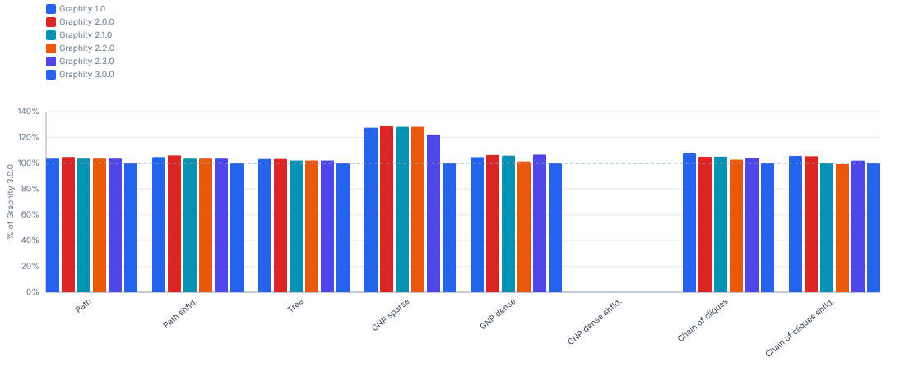

#### Times @ 100k nodes (ms/op, lower is better)

| Shape | Graphity 1.0 | Graphity 2.0.0 | Graphity 2.1.0 | Graphity 2.2.0 | Graphity 2.3.0 | Graphity 3.0.0 |
|---|---:|---:|---:|---:|---:|---:|
| Path<br><sub>100k nodes, 100k edges</sub> | 0.686 ms (1.0×) | 0.680 ms (1.0×) | 0.695 ms (1.0×) | 0.696 ms (1.0×) | 0.693 ms (1.0×) | 0.677 ms |
| Path shfld.<br><sub>100k nodes, 100k edges</sub> | 0.687 ms (0.9×) | 0.682 ms (0.9×) | 0.694 ms (0.9×) | 0.698 ms (0.9×) | 0.695 ms (0.9×) | 0.781 ms |
| Tree<br><sub>100k nodes, 100k edges</sub> | 1.093 ms (1.0×) | 1.091 ms (1.0×) | 1.100 ms (1.0×) | 1.111 ms (1.0×) | 1.101 ms (1.0×) | 1.099 ms |
| GNP sparse<br><sub>100k nodes, 300k edges</sub> | 2.249 ms (0.8×) | 2.257 ms (0.8×) | 2.218 ms (0.8×) | 2.274 ms (0.8×) | 2.278 ms (0.8×) | 2.687 ms |
| GNP dense<br><sub>100k nodes, 3M edges</sub> | 17.27 ms (1.0×) | 16.93 ms (1.0×) | 17.11 ms (1.0×) | 17.48 ms (1.0×) | 17.57 ms (1.0×) | 17.75 ms |
| GNP dense shfld.<br><sub>100k nodes, 3M edges</sub> | 16.99 ms | 16.74 ms | 17.28 ms | 17.50 ms | — | — |
| Chain of cliques<br><sub>100k nodes, 3.1M edges</sub> | 16.96 ms (1.0×) | 16.82 ms (1.0×) | 17.11 ms (1.0×) | 17.45 ms (1.0×) | 17.14 ms (1.0×) | 17.30 ms |
| Chain of cliques shfld.<br><sub>100k nodes, 3.1M edges</sub> | 17.04 ms (1.0×) | 16.06 ms (0.9×) | 17.09 ms (1.0×) | 16.96 ms (1.0×) | 17.10 ms (1.0×) | 17.26 ms |

#### Throughput @ 100k nodes (op/s, higher is better)

| Shape | Graphity 1.0 | Graphity 2.0.0 | Graphity 2.1.0 | Graphity 2.2.0 | Graphity 2.3.0 | Graphity 3.0.0 |
|---|---:|---:|---:|---:|---:|---:|
| Path<br><sub>100k nodes, 100k edges</sub> | 1 458 op/s (98.7%) | 1 471 op/s (99.6%) | 1 439 op/s (97.4%) | 1 437 op/s (97.3%) | 1 443 op/s (97.7%) | 1 477 op/s |
| Path shfld.<br><sub>100k nodes, 100k edges</sub> | 1 456 op/s (114%) | 1 466 op/s (115%) | 1 441 op/s (113%) | 1 433 op/s (112%) | 1 439 op/s (112%) | 1 280 op/s |
| Tree<br><sub>100k nodes, 100k edges</sub> | 914.9 op/s (101%) | 916.6 op/s (101%) | 909.1 op/s (99.9%) | 900.1 op/s (98.9%) | 908.3 op/s (99.8%) | 909.9 op/s |
| GNP sparse<br><sub>100k nodes, 300k edges</sub> | 444.6 op/s (119%) | 443.1 op/s (119%) | 450.9 op/s (121%) | 439.8 op/s (118%) | 439.0 op/s (118%) | 372.2 op/s |
| GNP dense<br><sub>100k nodes, 3M edges</sub> | 57.90 op/s (103%) | 59.06 op/s (105%) | 58.44 op/s (104%) | 57.19 op/s (102%) | 56.93 op/s (101%) | 56.33 op/s |
| GNP dense shfld.<br><sub>100k nodes, 3M edges</sub> | 58.85 op/s | 59.74 op/s | 57.87 op/s | 57.16 op/s | — | — |
| Chain of cliques<br><sub>100k nodes, 3.1M edges</sub> | 58.96 op/s (102%) | 59.46 op/s (103%) | 58.45 op/s (101%) | 57.32 op/s (99.2%) | 58.35 op/s (101%) | 57.79 op/s |
| Chain of cliques shfld.<br><sub>100k nodes, 3.1M edges</sub> | 58.70 op/s (101%) | 62.28 op/s (107%) | 58.52 op/s (101%) | 58.97 op/s (102%) | 58.48 op/s (101%) | 57.94 op/s |

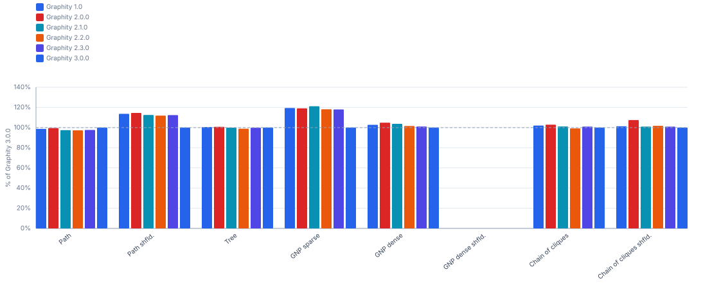

#### Times @ 1M nodes (ms/op, lower is better)

| Shape | Graphity 2.0.0 | Graphity 2.1.0 | Graphity 2.2.0 | Graphity 2.3.0 | Graphity 3.0.0 |
|---|---:|---:|---:|---:|---:|
| GNP sparse<br><sub>1M nodes, 3M edges</sub> | 22.97 ms (0.9×) | 23.63 ms (0.9×) | 24.02 ms (0.9×) | 27.59 ms (1.1×) | 25.90 ms |
| GNP dense<br><sub>1M nodes, 30M edges</sub> | 170.6 ms (0.9×) | 167.8 ms (0.9×) | 181.1 ms (1.0×) | 169.7 ms (0.9×) | 182.4 ms |
| GNP dense shfld.<br><sub>1M nodes, 30M edges</sub> | 167.6 ms | 166.8 ms | 169.9 ms | — | — |
| Chain of cliques<br><sub>1M nodes, 31.1M edges</sub> | 173.2 ms (1.0×) | 169.5 ms (0.9×) | 167.1 ms (0.9×) | 166.0 ms (0.9×) | 179.7 ms |

#### Throughput @ 1M nodes (op/s, higher is better)

| Shape | Graphity 2.0.0 | Graphity 2.1.0 | Graphity 2.2.0 | Graphity 2.3.0 | Graphity 3.0.0 |
|---|---:|---:|---:|---:|---:|
| GNP sparse<br><sub>1M nodes, 3M edges</sub> | 43.54 op/s (113%) | 42.31 op/s (110%) | 41.63 op/s (108%) | 36.24 op/s (93.9%) | 38.60 op/s |
| GNP dense<br><sub>1M nodes, 30M edges</sub> | 5.862 op/s (107%) | 5.959 op/s (109%) | 5.522 op/s (101%) | 5.893 op/s (107%) | 5.482 op/s |
| GNP dense shfld.<br><sub>1M nodes, 30M edges</sub> | 5.967 op/s | 5.995 op/s | 5.886 op/s | — | — |
| Chain of cliques<br><sub>1M nodes, 31.1M edges</sub> | 5.774 op/s (104%) | 5.900 op/s (106%) | 5.984 op/s (108%) | 6.024 op/s (108%) | 5.565 op/s |

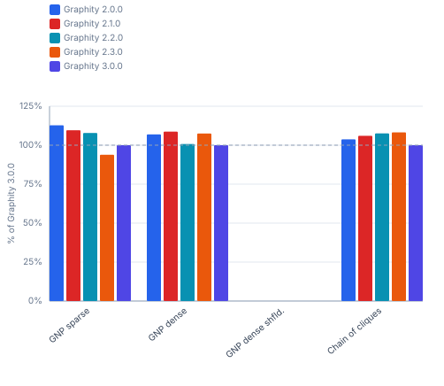

#### Times @ 10M nodes (ms/op, lower is better)

| Shape | Graphity 2.0.0 | Graphity 2.1.0 | Graphity 2.2.0 | Graphity 2.3.0 | Graphity 3.0.0 |
|---|---:|---:|---:|---:|---:|
| GNP sparse<br><sub>10M nodes, 30M edges</sub> | 248.6 ms (0.9×) | 240.4 ms (0.8×) | 243.3 ms (0.9×) | 242.5 ms (0.9×) | 284.2 ms |
| GNP dense<br><sub>10M nodes, 299.6M edges</sub> | 2052.8 ms (1.0×) | 1916.6 ms (0.9×) | 2326.6 ms (1.1×) | 1739.0 ms (0.8×) | 2052.3 ms |
| GNP dense shfld.<br><sub>10M nodes, 299.6M edges</sub> | 1806.0 ms | 1829.5 ms | 2301.9 ms | — | — |
| Chain of cliques<br><sub>10M nodes, 310.8M edges</sub> | 1784.0 ms (0.9×) | 1794.6 ms (0.9×) | 1846.2 ms (0.9×) | 2061.3 ms (1.0×) | 2052.5 ms |

#### Throughput @ 10M nodes (op/s, higher is better)

| Shape | Graphity 2.0.0 | Graphity 2.1.0 | Graphity 2.2.0 | Graphity 2.3.0 | Graphity 3.0.0 |
|---|---:|---:|---:|---:|---:|
| GNP sparse<br><sub>10M nodes, 30M edges</sub> | 4.023 op/s (114%) | 4.160 op/s (118%) | 4.110 op/s (117%) | 4.124 op/s (117%) | 3.519 op/s |
| GNP dense<br><sub>10M nodes, 299.6M edges</sub> | 0.487 op/s (100.0%) | 0.522 op/s (107%) | 0.430 op/s (88.2%) | 0.575 op/s (118%) | 0.487 op/s |
| GNP dense shfld.<br><sub>10M nodes, 299.6M edges</sub> | 0.554 op/s | 0.547 op/s | 0.434 op/s | — | — |
| Chain of cliques<br><sub>10M nodes, 310.8M edges</sub> | 0.561 op/s (115%) | 0.557 op/s (114%) | 0.542 op/s (111%) | 0.485 op/s (99.6%) | 0.487 op/s |

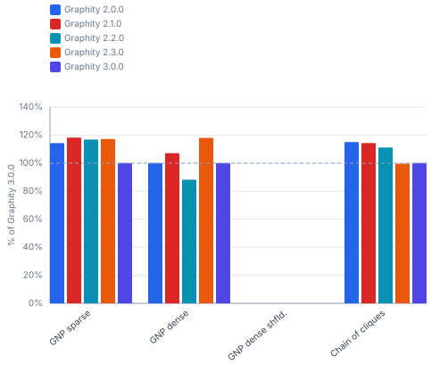

#### Times @ 100M nodes (ms/op, lower is better)

| Shape | Graphity 2.0.0 | Graphity 2.1.0 | Graphity 2.2.0 | Graphity 2.3.0 | Graphity 3.0.0 |
|---|---:|---:|---:|---:|---:|
| GNP sparse<br><sub>100M nodes, 300M edges</sub> | 2945.8 ms (1.1×) | 2971.7 ms (1.1×) | 2986.8 ms (1.1×) | 2457.0 ms (0.9×) | 2733.8 ms |

#### Throughput @ 100M nodes (op/s, higher is better)

| Shape | Graphity 2.0.0 | Graphity 2.1.0 | Graphity 2.2.0 | Graphity 2.3.0 | Graphity 3.0.0 |
|---|---:|---:|---:|---:|---:|
| GNP sparse<br><sub>100M nodes, 300M edges</sub> | 0.339 op/s (92.8%) | 0.337 op/s (92.0%) | 0.335 op/s (91.5%) | 0.407 op/s (111%) | 0.366 op/s |

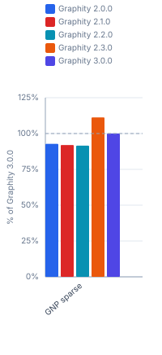

### 1.2 Out-adjacency traversal (outNodes, no algorithm)

#### Times @ 10k nodes (ms/op, lower is better)

| Shape | Graphity 2.3.0 | Graphity 2.4.0 | Graphity 3.0.0 |
|---|---:|---:|---:|
| Path<br><sub>10k nodes, 10k edges</sub> | 0.014 ms (1.0×) | 0.014 ms (1.0×) | 0.014 ms |
| Path shfld.<br><sub>10k nodes, 10k edges</sub> | 0.014 ms (1.0×) | 0.014 ms (1.0×) | 0.014 ms |
| Tree<br><sub>10k nodes, 10k edges</sub> | 0.010 ms (1.0×) | 0.010 ms (1.0×) | 0.010 ms |
| GNP sparse<br><sub>10k nodes, 30k edges</sub> | 0.017 ms (1.0×) | 0.017 ms (1.0×) | 0.017 ms |
| GNP dense<br><sub>10k nodes, 299.6k edges</sub> | 0.048 ms (1.0×) | 0.047 ms (1.0×) | 0.048 ms |
| Chain of cliques<br><sub>10k nodes, 310.8k edges</sub> | 0.051 ms (1.0×) | 0.051 ms (1.0×) | 0.051 ms |
| Chain of cliques shfld.<br><sub>10k nodes, 310.8k edges</sub> | 0.053 ms (1.0×) | 0.053 ms (1.0×) | 0.053 ms |

#### Throughput @ 10k nodes (op/s, higher is better)

| Shape | Graphity 2.3.0 | Graphity 2.4.0 | Graphity 3.0.0 |
|---|---:|---:|---:|
| Path<br><sub>10k nodes, 10k edges</sub> | 71 429 op/s (100%) | 71 429 op/s (100%) | 71 429 op/s |
| Path shfld.<br><sub>10k nodes, 10k edges</sub> | 71 429 op/s (100%) | 71 429 op/s (100%) | 71 429 op/s |
| Tree<br><sub>10k nodes, 10k edges</sub> | 100 000 op/s (100%) | 100 000 op/s (100%) | 100 000 op/s |
| GNP sparse<br><sub>10k nodes, 30k edges</sub> | 58 824 op/s (100%) | 58 824 op/s (100%) | 58 824 op/s |
| GNP dense<br><sub>10k nodes, 299.6k edges</sub> | 20 833 op/s (100%) | 21 277 op/s (102%) | 20 833 op/s |
| Chain of cliques<br><sub>10k nodes, 310.8k edges</sub> | 19 608 op/s (100%) | 19 608 op/s (100%) | 19 608 op/s |
| Chain of cliques shfld.<br><sub>10k nodes, 310.8k edges</sub> | 18 868 op/s (100%) | 18 868 op/s (100%) | 18 868 op/s |

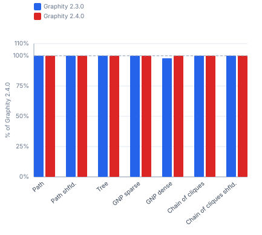

#### Times @ 100k nodes (ms/op, lower is better)

| Shape | Graphity 2.3.0 | Graphity 2.4.0 | Graphity 3.0.0 |
|---|---:|---:|---:|
| Path<br><sub>100k nodes, 100k edges</sub> | 0.169 ms (1.0×) | 0.170 ms (1.0×) | 0.169 ms |
| Path shfld.<br><sub>100k nodes, 100k edges</sub> | 0.170 ms (1.0×) | 0.169 ms (1.0×) | 0.169 ms |
| Tree<br><sub>100k nodes, 100k edges</sub> | 0.404 ms (1.0×) | 0.405 ms (1.0×) | 0.400 ms |
| GNP sparse<br><sub>100k nodes, 300k edges</sub> | 0.658 ms (1.0×) | 0.653 ms (1.0×) | 0.652 ms |
| GNP dense<br><sub>100k nodes, 3M edges</sub> | 1.134 ms (1.0×) | 1.130 ms (1.0×) | 1.132 ms |
| Chain of cliques<br><sub>100k nodes, 3.1M edges</sub> | 0.517 ms (1.0×) | 0.518 ms (1.0×) | 0.514 ms |
| Chain of cliques shfld.<br><sub>100k nodes, 3.1M edges</sub> | 0.514 ms (1.0×) | 0.518 ms (1.0×) | 0.512 ms |

#### Throughput @ 100k nodes (op/s, higher is better)

| Shape | Graphity 2.3.0 | Graphity 2.4.0 | Graphity 3.0.0 |
|---|---:|---:|---:|
| Path<br><sub>100k nodes, 100k edges</sub> | 5 917 op/s (100%) | 5 882 op/s (99.4%) | 5 917 op/s |
| Path shfld.<br><sub>100k nodes, 100k edges</sub> | 5 882 op/s (99.4%) | 5 917 op/s (100%) | 5 917 op/s |
| Tree<br><sub>100k nodes, 100k edges</sub> | 2 475 op/s (99.0%) | 2 469 op/s (98.8%) | 2 500 op/s |
| GNP sparse<br><sub>100k nodes, 300k edges</sub> | 1 520 op/s (99.1%) | 1 531 op/s (99.8%) | 1 534 op/s |
| GNP dense<br><sub>100k nodes, 3M edges</sub> | 881.8 op/s (99.8%) | 885.0 op/s (100%) | 883.4 op/s |
| Chain of cliques<br><sub>100k nodes, 3.1M edges</sub> | 1 934 op/s (99.4%) | 1 931 op/s (99.2%) | 1 946 op/s |
| Chain of cliques shfld.<br><sub>100k nodes, 3.1M edges</sub> | 1 946 op/s (99.6%) | 1 931 op/s (98.8%) | 1 953 op/s |

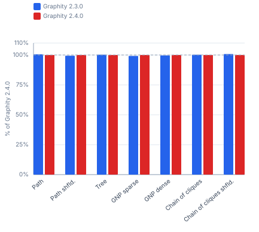

### 1.3 In-adjacency traversal (inNodes, no algorithm)

#### Times @ 10k nodes (ms/op, lower is better)

| Shape | Graphity 2.3.0 | Graphity 2.4.0 | Graphity 3.0.0 |
|---|---:|---:|---:|
| Path<br><sub>10k nodes, 10k edges</sub> | 0.014 ms (1.0×) | 0.014 ms (1.0×) | 0.014 ms |
| Path shfld.<br><sub>10k nodes, 10k edges</sub> | 0.014 ms (1.0×) | 0.014 ms (1.0×) | 0.014 ms |
| Tree<br><sub>10k nodes, 10k edges</sub> | 0.014 ms (1.0×) | 0.014 ms (1.0×) | 0.014 ms |
| GNP sparse<br><sub>10k nodes, 30k edges</sub> | 0.017 ms (1.0×) | 0.017 ms (1.0×) | 0.017 ms |
| GNP dense<br><sub>10k nodes, 299.6k edges</sub> | 0.050 ms (1.0×) | 0.050 ms (1.0×) | 0.050 ms |
| Chain of cliques<br><sub>10k nodes, 310.8k edges</sub> | 0.054 ms (1.0×) | 0.054 ms (1.0×) | 0.054 ms |
| Chain of cliques shfld.<br><sub>10k nodes, 310.8k edges</sub> | 0.056 ms (1.0×) | 0.056 ms (1.0×) | 0.056 ms |

#### Throughput @ 10k nodes (op/s, higher is better)

| Shape | Graphity 2.3.0 | Graphity 2.4.0 | Graphity 3.0.0 |
|---|---:|---:|---:|
| Path<br><sub>10k nodes, 10k edges</sub> | 71 429 op/s (100%) | 71 429 op/s (100%) | 71 429 op/s |
| Path shfld.<br><sub>10k nodes, 10k edges</sub> | 71 429 op/s (100%) | 71 429 op/s (100%) | 71 429 op/s |
| Tree<br><sub>10k nodes, 10k edges</sub> | 71 429 op/s (100%) | 71 429 op/s (100%) | 71 429 op/s |
| GNP sparse<br><sub>10k nodes, 30k edges</sub> | 58 824 op/s (100%) | 58 824 op/s (100%) | 58 824 op/s |
| GNP dense<br><sub>10k nodes, 299.6k edges</sub> | 20 000 op/s (100%) | 20 000 op/s (100%) | 20 000 op/s |
| Chain of cliques<br><sub>10k nodes, 310.8k edges</sub> | 18 519 op/s (100%) | 18 519 op/s (100%) | 18 519 op/s |
| Chain of cliques shfld.<br><sub>10k nodes, 310.8k edges</sub> | 17 857 op/s (100%) | 17 857 op/s (100%) | 17 857 op/s |

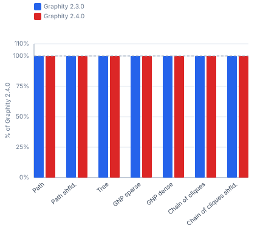

#### Times @ 100k nodes (ms/op, lower is better)

| Shape | Graphity 2.3.0 | Graphity 2.4.0 | Graphity 3.0.0 |
|---|---:|---:|---:|
| Path<br><sub>100k nodes, 100k edges</sub> | 0.170 ms (1.0×) | 0.171 ms (1.0×) | 0.170 ms |
| Path shfld.<br><sub>100k nodes, 100k edges</sub> | 0.171 ms (1.0×) | 0.171 ms (1.0×) | 0.170 ms |
| Tree<br><sub>100k nodes, 100k edges</sub> | 0.170 ms (1.0×) | 0.171 ms (1.0×) | 0.170 ms |
| GNP sparse<br><sub>100k nodes, 300k edges</sub> | 0.669 ms (1.0×) | 0.662 ms (1.0×) | 0.658 ms |
| GNP dense<br><sub>100k nodes, 3M edges</sub> | 1.238 ms (1.1×) | 1.186 ms (1.0×) | 1.179 ms |
| Chain of cliques<br><sub>100k nodes, 3.1M edges</sub> | 0.538 ms (1.0×) | 0.541 ms (1.0×) | 0.534 ms |
| Chain of cliques shfld.<br><sub>100k nodes, 3.1M edges</sub> | 0.540 ms (1.0×) | 0.541 ms (1.0×) | 0.534 ms |

#### Throughput @ 100k nodes (op/s, higher is better)

| Shape | Graphity 2.3.0 | Graphity 2.4.0 | Graphity 3.0.0 |
|---|---:|---:|---:|
| Path<br><sub>100k nodes, 100k edges</sub> | 5 882 op/s (100%) | 5 848 op/s (99.4%) | 5 882 op/s |
| Path shfld.<br><sub>100k nodes, 100k edges</sub> | 5 848 op/s (99.4%) | 5 848 op/s (99.4%) | 5 882 op/s |
| Tree<br><sub>100k nodes, 100k edges</sub> | 5 882 op/s (100%) | 5 848 op/s (99.4%) | 5 882 op/s |
| GNP sparse<br><sub>100k nodes, 300k edges</sub> | 1 495 op/s (98.4%) | 1 511 op/s (99.4%) | 1 520 op/s |
| GNP dense<br><sub>100k nodes, 3M edges</sub> | 807.8 op/s (95.2%) | 843.2 op/s (99.4%) | 848.2 op/s |
| Chain of cliques<br><sub>100k nodes, 3.1M edges</sub> | 1 859 op/s (99.3%) | 1 848 op/s (98.7%) | 1 873 op/s |
| Chain of cliques shfld.<br><sub>100k nodes, 3.1M edges</sub> | 1 852 op/s (98.9%) | 1 848 op/s (98.7%) | 1 873 op/s |

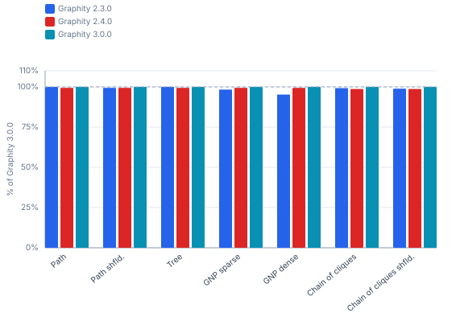

### 1.4 SCC

#### Times @ 10k nodes (ms/op, lower is better)

| Shape | Graphity 1.0 | Graphity 2.0.0 | Graphity 2.1.0 | Graphity 2.2.0 | Graphity 2.3.0 | Graphity 2.4.0 | Graphity 3.0.0 | Graphity 2.0.0<br>(reordered) | Graphity 2.1.0<br>(reordered) | Graphity 2.2.0<br>(reordered) | Graphity 2.3.0<br>(reordered) | Graphity 2.4.0<br>(reordered) | Graphity 3.0.0<br>(reordered) |
|---|---:|---:|---:|---:|---:|---:|---:|---:|---:|---:|---:|---:|---:|
| Path<br><sub>10k nodes, 10k edges</sub> | 0.106 ms (1.0×) | 0.113 ms (1.0×) | 0.106 ms (1.0×) | 0.106 ms (1.0×) | 0.106 ms (1.0×) | 0.109 ms (1.0×) | 0.108 ms | 0.112 ms (1.0×) | 0.106 ms (1.0×) | 0.106 ms (1.0×) | 0.106 ms (1.0×) | 0.110 ms (1.0×) | 0.106 ms (1.0×) |
| Path shfld.<br><sub>10k nodes, 10k edges</sub> | 0.129 ms (1.0×) | 0.134 ms (1.0×) | 0.134 ms (1.0×) | 0.135 ms (1.0×) | 0.134 ms (1.0×) | 0.138 ms (1.0×) | 0.135 ms | 0.108 ms (0.8×) | 0.105 ms (0.8×) | 0.106 ms (0.8×) | 0.104 ms (0.8×) | 0.111 ms (0.8×) | 0.110 ms (0.8×) |
| Tree<br><sub>10k nodes, 10k edges</sub> | 0.271 ms (2.5×) | 0.107 ms (1.0×) | 0.104 ms (1.0×) | 0.105 ms (1.0×) | 0.103 ms (1.0×) | 0.112 ms (1.0×) | 0.107 ms | 0.095 ms (0.9×) | 0.086 ms (0.8×) | 0.086 ms (0.8×) | 0.084 ms (0.8×) | 0.101 ms (0.9×) | 0.093 ms (0.9×) |
| GNP sparse<br><sub>10k nodes, 30k edges</sub> | 0.245 ms (1.0×) | 0.239 ms (1.0×) | 0.242 ms (1.0×) | 0.245 ms (1.0×) | 0.232 ms (0.9×) | 0.241 ms (1.0×) | 0.246 ms | 0.111 ms (0.5×) | 0.112 ms (0.5×) | 0.112 ms (0.5×) | 0.110 ms (0.4×) | 0.121 ms (0.5×) | 0.115 ms (0.5×) |
| GNP dense<br><sub>10k nodes, 299.6k edges</sub> | 0.730 ms (1.3×) | 0.539 ms (1.0×) | 0.559 ms (1.0×) | 0.550 ms (1.0×) | 0.533 ms (1.0×) | 0.559 ms (1.0×) | 0.556 ms | 0.378 ms (0.7×) | 0.381 ms (0.7×) | 0.386 ms (0.7×) | 0.400 ms (0.7×) | 0.415 ms (0.7×) | 0.411 ms (0.7×) |
| GNP dense shfld.<br><sub>10k nodes, 299.6k edges</sub> | 0.730 ms | 0.531 ms | 0.539 ms | 0.576 ms | — | — | — | 0.384 ms | 0.373 ms | 0.379 ms | — | — | — |
| Chain of cliques<br><sub>10k nodes, 310.8k edges</sub> | 0.563 ms (2.0×) | 0.260 ms (0.9×) | 0.261 ms (0.9×) | 0.261 ms (0.9×) | 0.260 ms (0.9×) | 0.310 ms (1.1×) | 0.281 ms | 0.259 ms (0.9×) | 0.260 ms (0.9×) | 0.266 ms (0.9×) | 0.260 ms (0.9×) | 0.302 ms (1.1×) | 0.295 ms (1.0×) |
| Chain of cliques shfld.<br><sub>10k nodes, 310.8k edges</sub> | 0.639 ms (1.6×) | 0.338 ms (0.9×) | 0.348 ms (0.9×) | 0.349 ms (0.9×) | 0.342 ms (0.9×) | 0.401 ms (1.0×) | 0.388 ms | 0.250 ms (0.6×) | 0.265 ms (0.7×) | 0.264 ms (0.7×) | 0.255 ms (0.7×) | 0.302 ms (0.8×) | 0.288 ms (0.7×) |

#### Throughput @ 10k nodes (op/s, higher is better)

| Shape | Graphity 1.0 | Graphity 2.0.0 | Graphity 2.1.0 | Graphity 2.2.0 | Graphity 2.3.0 | Graphity 2.4.0 | Graphity 3.0.0 | Graphity 2.0.0<br>(reordered) | Graphity 2.1.0<br>(reordered) | Graphity 2.2.0<br>(reordered) | Graphity 2.3.0<br>(reordered) | Graphity 2.4.0<br>(reordered) | Graphity 3.0.0<br>(reordered) |
|---|---:|---:|---:|---:|---:|---:|---:|---:|---:|---:|---:|---:|---:|
| Path<br><sub>10k nodes, 10k edges</sub> | 9 434 op/s (102%) | 8 850 op/s (95.6%) | 9 434 op/s (102%) | 9 434 op/s (102%) | 9 434 op/s (102%) | 9 174 op/s (99.1%) | 9 259 op/s | 8 929 op/s (96.4%) | 9 434 op/s (102%) | 9 434 op/s (102%) | 9 434 op/s (102%) | 9 091 op/s (98.2%) | 9 434 op/s (102%) |
| Path shfld.<br><sub>10k nodes, 10k edges</sub> | 7 752 op/s (105%) | 7 463 op/s (101%) | 7 463 op/s (101%) | 7 407 op/s (100%) | 7 463 op/s (101%) | 7 246 op/s (97.8%) | 7 407 op/s | 9 259 op/s (125%) | 9 524 op/s (129%) | 9 434 op/s (127%) | 9 615 op/s (130%) | 9 009 op/s (122%) | 9 091 op/s (123%) |
| Tree<br><sub>10k nodes, 10k edges</sub> | 3 690 op/s (39.5%) | 9 346 op/s (100%) | 9 615 op/s (103%) | 9 524 op/s (102%) | 9 709 op/s (104%) | 8 929 op/s (95.5%) | 9 346 op/s | 10 526 op/s (113%) | 11 628 op/s (124%) | 11 628 op/s (124%) | 11 905 op/s (127%) | 9 901 op/s (106%) | 10 753 op/s (115%) |
| GNP sparse<br><sub>10k nodes, 30k edges</sub> | 4 082 op/s (100%) | 4 184 op/s (103%) | 4 132 op/s (102%) | 4 082 op/s (100%) | 4 310 op/s (106%) | 4 149 op/s (102%) | 4 065 op/s | 9 009 op/s (222%) | 8 929 op/s (220%) | 8 929 op/s (220%) | 9 091 op/s (224%) | 8 264 op/s (203%) | 8 696 op/s (214%) |
| GNP dense<br><sub>10k nodes, 299.6k edges</sub> | 1 370 op/s (76.2%) | 1 855 op/s (103%) | 1 789 op/s (99.5%) | 1 818 op/s (101%) | 1 876 op/s (104%) | 1 789 op/s (99.5%) | 1 799 op/s | 2 646 op/s (147%) | 2 625 op/s (146%) | 2 591 op/s (144%) | 2 500 op/s (139%) | 2 410 op/s (134%) | 2 433 op/s (135%) |
| GNP dense shfld.<br><sub>10k nodes, 299.6k edges</sub> | 1 370 op/s | 1 883 op/s | 1 855 op/s | 1 736 op/s | — | — | — | 2 604 op/s | 2 681 op/s | 2 639 op/s | — | — | — |
| Chain of cliques<br><sub>10k nodes, 310.8k edges</sub> | 1 776 op/s (49.9%) | 3 846 op/s (108%) | 3 831 op/s (108%) | 3 831 op/s (108%) | 3 846 op/s (108%) | 3 226 op/s (90.6%) | 3 559 op/s | 3 861 op/s (108%) | 3 846 op/s (108%) | 3 759 op/s (106%) | 3 846 op/s (108%) | 3 311 op/s (93.0%) | 3 390 op/s (95.3%) |
| Chain of cliques shfld.<br><sub>10k nodes, 310.8k edges</sub> | 1 565 op/s (60.7%) | 2 959 op/s (115%) | 2 874 op/s (111%) | 2 865 op/s (111%) | 2 924 op/s (113%) | 2 494 op/s (96.8%) | 2 577 op/s | 4 000 op/s (155%) | 3 774 op/s (146%) | 3 788 op/s (147%) | 3 922 op/s (152%) | 3 311 op/s (128%) | 3 472 op/s (135%) |

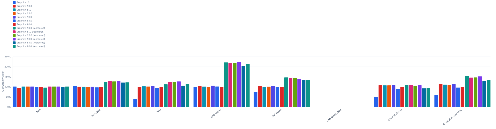

#### Times @ 100k nodes (ms/op, lower is better)

| Shape | Graphity 1.0 | Graphity 2.0.0 | Graphity 2.1.0 | Graphity 2.2.0 | Graphity 2.3.0 | Graphity 2.4.0 | Graphity 3.0.0 | Graphity 2.0.0<br>(reordered) | Graphity 2.1.0<br>(reordered) | Graphity 2.2.0<br>(reordered) | Graphity 2.3.0<br>(reordered) | Graphity 2.4.0<br>(reordered) | Graphity 3.0.0<br>(reordered) |
|---|---:|---:|---:|---:|---:|---:|---:|---:|---:|---:|---:|---:|---:|
| Path<br><sub>100k nodes, 100k edges</sub> | — | 1.130 ms (1.0×) | 1.030 ms (0.9×) | 1.021 ms (0.9×) | 1.118 ms (1.0×) | 1.158 ms (1.0×) | 1.129 ms | 1.117 ms (1.0×) | 1.025 ms (0.9×) | 1.030 ms (0.9×) | 1.027 ms (0.9×) | 1.060 ms (0.9×) | 1.029 ms (0.9×) |
| Path shfld.<br><sub>100k nodes, 100k edges</sub> | 2.415 ms (1.0×) | 2.192 ms (0.9×) | 2.146 ms (0.9×) | 2.236 ms (1.0×) | 2.279 ms (1.0×) | 2.451 ms (1.0×) | 2.347 ms | 1.038 ms (0.4×) | 1.035 ms (0.4×) | 1.052 ms (0.4×) | 1.040 ms (0.4×) | 1.091 ms (0.5×) | 1.052 ms (0.4×) |
| Tree<br><sub>100k nodes, 100k edges</sub> | 11.69 ms (5.6×) | 2.240 ms (1.1×) | 2.122 ms (1.0×) | 2.153 ms (1.0×) | 2.159 ms (1.0×) | 2.161 ms (1.0×) | 2.074 ms | 1.413 ms (0.7×) | 1.305 ms (0.6×) | 1.303 ms (0.6×) | 1.285 ms (0.6×) | 1.354 ms (0.7×) | 1.290 ms (0.6×) |
| GNP sparse<br><sub>100k nodes, 300k edges</sub> | 4.872 ms (1.1×) | 4.329 ms (1.0×) | 4.447 ms (1.0×) | 4.617 ms (1.1×) | 4.400 ms (1.0×) | 4.389 ms (1.0×) | 4.378 ms | 2.247 ms (0.5×) | 2.265 ms (0.5×) | 2.220 ms (0.5×) | 2.152 ms (0.5×) | 2.246 ms (0.5×) | 2.200 ms (0.5×) |
| GNP dense<br><sub>100k nodes, 3M edges</sub> | 9.957 ms (1.3×) | 7.389 ms (1.0×) | 7.397 ms (1.0×) | 8.010 ms (1.0×) | 7.751 ms (1.0×) | 9.265 ms (1.2×) | 7.713 ms | 4.475 ms (0.6×) | 4.431 ms (0.6×) | 4.693 ms (0.6×) | 4.474 ms (0.6×) | 4.946 ms (0.6×) | 4.534 ms (0.6×) |
| GNP dense shfld.<br><sub>100k nodes, 3M edges</sub> | — | 7.595 ms | 7.548 ms | 8.094 ms | — | — | — | 4.423 ms | 4.537 ms | 4.517 ms | — | — | — |
| Chain of cliques<br><sub>100k nodes, 3.1M edges</sub> | 5.702 ms (1.9×) | 2.623 ms (0.9×) | 2.606 ms (0.9×) | 2.509 ms (0.8×) | 2.614 ms (0.9×) | 3.058 ms (1.0×) | 3.001 ms | 2.625 ms (0.9×) | 2.598 ms (0.9×) | 2.645 ms (0.9×) | 2.616 ms (0.9×) | 2.936 ms (1.0×) | 2.834 ms (0.9×) |
| Chain of cliques shfld.<br><sub>100k nodes, 3.1M edges</sub> | 7.381 ms (1.5×) | 4.697 ms (1.0×) | 4.820 ms (1.0×) | 4.904 ms (1.0×) | 5.033 ms (1.0×) | 6.351 ms (1.3×) | 4.929 ms | 2.542 ms (0.5×) | 2.596 ms (0.5×) | 2.789 ms (0.6×) | 2.732 ms (0.6×) | 3.040 ms (0.6×) | 2.902 ms (0.6×) |

#### Throughput @ 100k nodes (op/s, higher is better)

| Shape | Graphity 1.0 | Graphity 2.0.0 | Graphity 2.1.0 | Graphity 2.2.0 | Graphity 2.3.0 | Graphity 2.4.0 | Graphity 3.0.0 | Graphity 2.0.0<br>(reordered) | Graphity 2.1.0<br>(reordered) | Graphity 2.2.0<br>(reordered) | Graphity 2.3.0<br>(reordered) | Graphity 2.4.0<br>(reordered) | Graphity 3.0.0<br>(reordered) |
|---|---:|---:|---:|---:|---:|---:|---:|---:|---:|---:|---:|---:|---:|
| Path<br><sub>100k nodes, 100k edges</sub> | — | 885.0 op/s (99.9%) | 970.9 op/s (110%) | 979.4 op/s (111%) | 894.5 op/s (101%) | 863.6 op/s (97.5%) | 885.7 op/s | 895.3 op/s (101%) | 975.6 op/s (110%) | 970.9 op/s (110%) | 973.7 op/s (110%) | 943.4 op/s (107%) | 971.8 op/s (110%) |
| Path shfld.<br><sub>100k nodes, 100k edges</sub> | 414.1 op/s (97.2%) | 456.2 op/s (107%) | 466.0 op/s (109%) | 447.2 op/s (105%) | 438.8 op/s (103%) | 408.0 op/s (95.8%) | 426.1 op/s | 963.4 op/s (226%) | 966.2 op/s (227%) | 950.6 op/s (223%) | 961.5 op/s (226%) | 916.6 op/s (215%) | 950.6 op/s (223%) |
| Tree<br><sub>100k nodes, 100k edges</sub> | 85.56 op/s (17.7%) | 446.4 op/s (92.6%) | 471.3 op/s (97.7%) | 464.5 op/s (96.3%) | 463.2 op/s (96.1%) | 462.7 op/s (96.0%) | 482.2 op/s | 707.7 op/s (147%) | 766.3 op/s (159%) | 767.5 op/s (159%) | 778.2 op/s (161%) | 738.6 op/s (153%) | 775.2 op/s (161%) |
| GNP sparse<br><sub>100k nodes, 300k edges</sub> | 205.3 op/s (89.9%) | 231.0 op/s (101%) | 224.9 op/s (98.4%) | 216.6 op/s (94.8%) | 227.3 op/s (99.5%) | 227.8 op/s (99.7%) | 228.4 op/s | 445.0 op/s (195%) | 441.5 op/s (193%) | 450.5 op/s (197%) | 464.7 op/s (203%) | 445.2 op/s (195%) | 454.5 op/s (199%) |
| GNP dense<br><sub>100k nodes, 3M edges</sub> | 100.4 op/s (77.5%) | 135.3 op/s (104%) | 135.2 op/s (104%) | 124.8 op/s (96.3%) | 129.0 op/s (99.5%) | 107.9 op/s (83.2%) | 129.7 op/s | 223.5 op/s (172%) | 225.7 op/s (174%) | 213.1 op/s (164%) | 223.5 op/s (172%) | 202.2 op/s (156%) | 220.6 op/s (170%) |
| GNP dense shfld.<br><sub>100k nodes, 3M edges</sub> | — | 131.7 op/s | 132.5 op/s | 123.5 op/s | — | — | — | 226.1 op/s | 220.4 op/s | 221.4 op/s | — | — | — |
| Chain of cliques<br><sub>100k nodes, 3.1M edges</sub> | 175.4 op/s (52.6%) | 381.2 op/s (114%) | 383.7 op/s (115%) | 398.6 op/s (120%) | 382.6 op/s (115%) | 327.0 op/s (98.1%) | 333.2 op/s | 381.0 op/s (114%) | 384.9 op/s (116%) | 378.1 op/s (113%) | 382.3 op/s (115%) | 340.6 op/s (102%) | 352.9 op/s (106%) |
| Chain of cliques shfld.<br><sub>100k nodes, 3.1M edges</sub> | 135.5 op/s (66.8%) | 212.9 op/s (105%) | 207.5 op/s (102%) | 203.9 op/s (101%) | 198.7 op/s (97.9%) | 157.5 op/s (77.6%) | 202.9 op/s | 393.4 op/s (194%) | 385.2 op/s (190%) | 358.6 op/s (177%) | 366.0 op/s (180%) | 328.9 op/s (162%) | 344.6 op/s (170%) |

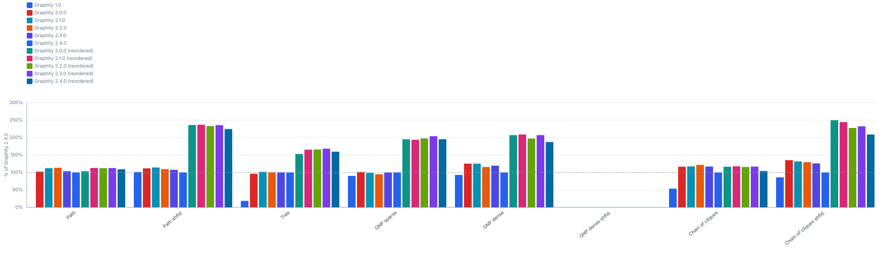

#### Times @ 1M nodes (ms/op, lower is better)

| Shape | Graphity 2.0.0 | Graphity 2.1.0 | Graphity 2.2.0 | Graphity 2.3.0 | Graphity 2.4.0 | Graphity 3.0.0 | Graphity 2.0.0<br>(reordered) | Graphity 2.1.0<br>(reordered) | Graphity 2.2.0<br>(reordered) | Graphity 2.3.0<br>(reordered) | Graphity 2.4.0<br>(reordered) | Graphity 3.0.0<br>(reordered) |
|---|---:|---:|---:|---:|---:|---:|---:|---:|---:|---:|---:|---:|
| GNP sparse<br><sub>1M nodes, 3M edges</sub> | 77.49 ms (1.0×) | 76.73 ms (1.0×) | 86.77 ms (1.1×) | 83.52 ms (1.1×) | 117.5 ms (1.5×) | 75.93 ms | 26.75 ms (0.4×) | 26.04 ms (0.3×) | 25.87 ms (0.3×) | 26.19 ms (0.3×) | 31.28 ms (0.4×) | 25.82 ms (0.3×) |
| GNP dense<br><sub>1M nodes, 30M edges</sub> | 238.7 ms (1.0×) | 233.4 ms (0.9×) | 246.1 ms (1.0×) | 239.7 ms (1.0×) | 267.9 ms (1.1×) | 250.1 ms | — | 61.63 ms (0.2×) | 61.93 ms (0.2×) | 61.88 ms (0.2×) | 70.19 ms (0.3×) | 65.54 ms (0.3×) |
| GNP dense shfld.<br><sub>1M nodes, 30M edges</sub> | 232.9 ms | 229.7 ms | 248.1 ms | — | — | — | 66.11 ms | 62.45 ms | 62.57 ms | — | — | — |
| Chain of cliques<br><sub>1M nodes, 31.1M edges</sub> | 25.36 ms (0.9×) | 26.24 ms (0.9×) | 26.51 ms (0.9×) | 26.41 ms (0.9×) | 30.70 ms (1.0×) | 29.42 ms | — | 26.27 ms (0.9×) | 26.54 ms (0.9×) | 26.47 ms (0.9×) | 31.18 ms (1.1×) | 29.40 ms (1.0×) |

#### Throughput @ 1M nodes (op/s, higher is better)

| Shape | Graphity 2.0.0 | Graphity 2.1.0 | Graphity 2.2.0 | Graphity 2.3.0 | Graphity 2.4.0 | Graphity 3.0.0 | Graphity 2.0.0<br>(reordered) | Graphity 2.1.0<br>(reordered) | Graphity 2.2.0<br>(reordered) | Graphity 2.3.0<br>(reordered) | Graphity 2.4.0<br>(reordered) | Graphity 3.0.0<br>(reordered) |
|---|---:|---:|---:|---:|---:|---:|---:|---:|---:|---:|---:|---:|
| GNP sparse<br><sub>1M nodes, 3M edges</sub> | 12.91 op/s (98.0%) | 13.03 op/s (99.0%) | 11.52 op/s (87.5%) | 11.97 op/s (90.9%) | 8.511 op/s (64.6%) | 13.17 op/s | 37.38 op/s (284%) | 38.41 op/s (292%) | 38.65 op/s (293%) | 38.19 op/s (290%) | 31.97 op/s (243%) | 38.73 op/s (294%) |
| GNP dense<br><sub>1M nodes, 30M edges</sub> | 4.189 op/s (105%) | 4.284 op/s (107%) | 4.063 op/s (102%) | 4.172 op/s (104%) | 3.733 op/s (93.4%) | 3.998 op/s | — | 16.23 op/s (406%) | 16.15 op/s (404%) | 16.16 op/s (404%) | 14.25 op/s (356%) | 15.26 op/s (382%) |
| GNP dense shfld.<br><sub>1M nodes, 30M edges</sub> | 4.294 op/s | 4.354 op/s | 4.031 op/s | — | — | — | 15.13 op/s | 16.01 op/s | 15.98 op/s | — | — | — |
| Chain of cliques<br><sub>1M nodes, 31.1M edges</sub> | 39.43 op/s (116%) | 38.10 op/s (112%) | 37.72 op/s (111%) | 37.87 op/s (111%) | 32.58 op/s (95.8%) | 33.99 op/s | — | 38.06 op/s (112%) | 37.67 op/s (111%) | 37.78 op/s (111%) | 32.07 op/s (94.4%) | 34.01 op/s (100%) |

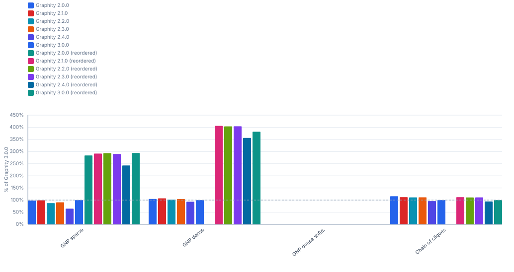

#### Times @ 10M nodes (ms/op, lower is better)

| Shape | Graphity 2.0.0 | Graphity 2.1.0 | Graphity 2.2.0 | Graphity 2.3.0 | Graphity 2.4.0 | Graphity 3.0.0 | Graphity 2.0.0<br>(reordered) | Graphity 2.1.0<br>(reordered) | Graphity 2.2.0<br>(reordered) | Graphity 2.3.0<br>(reordered) | Graphity 2.4.0<br>(reordered) | Graphity 3.0.0<br>(reordered) |
|---|---:|---:|---:|---:|---:|---:|---:|---:|---:|---:|---:|---:|
| GNP sparse<br><sub>10M nodes, 30M edges</sub> | 3085.1 ms (1.0×) | 3051.6 ms (1.0×) | 3120.3 ms (1.0×) | 3055.4 ms (1.0×) | 3155.9 ms (1.0×) | 3118.7 ms | 739.3 ms (0.2×) | 700.8 ms (0.2×) | 757.2 ms (0.2×) | 716.1 ms (0.2×) | 773.9 ms (0.2×) | 741.3 ms (0.2×) |
| GNP dense<br><sub>10M nodes, 299.6M edges</sub> | 6301.4 ms (0.9×) | 6518.8 ms (1.0×) | 6783.8 ms (1.0×) | 6885.2 ms (1.0×) | 6771.3 ms (1.0×) | 6700.8 ms | — | 2978.2 ms (0.4×) | 3038.0 ms (0.5×) | 2873.4 ms (0.4×) | 3192.5 ms (0.5×) | 3089.4 ms (0.5×) |
| GNP dense shfld.<br><sub>10M nodes, 299.6M edges</sub> | 6297.6 ms | 6583.3 ms | 6754.9 ms | — | — | — | 2740.8 ms | 2700.6 ms | 3578.0 ms | — | — | — |
| Chain of cliques<br><sub>10M nodes, 310.8M edges</sub> | 268.4 ms (0.8×) | 275.9 ms (0.8×) | 256.3 ms (0.7×) | 283.3 ms (0.8×) | 318.4 ms (0.9×) | 346.1 ms | — | 271.5 ms (0.8×) | 274.0 ms (0.8×) | 281.5 ms (0.8×) | 322.3 ms (0.9×) | 307.9 ms (0.9×) |

#### Throughput @ 10M nodes (op/s, higher is better)

| Shape | Graphity 2.0.0 | Graphity 2.1.0 | Graphity 2.2.0 | Graphity 2.3.0 | Graphity 2.4.0 | Graphity 3.0.0 | Graphity 2.0.0<br>(reordered) | Graphity 2.1.0<br>(reordered) | Graphity 2.2.0<br>(reordered) | Graphity 2.3.0<br>(reordered) | Graphity 2.4.0<br>(reordered) | Graphity 3.0.0<br>(reordered) |
|---|---:|---:|---:|---:|---:|---:|---:|---:|---:|---:|---:|---:|
| GNP sparse<br><sub>10M nodes, 30M edges</sub> | 0.324 op/s (101%) | 0.328 op/s (102%) | 0.320 op/s (99.9%) | 0.327 op/s (102%) | 0.317 op/s (98.8%) | 0.321 op/s | 1.353 op/s (422%) | 1.427 op/s (445%) | 1.321 op/s (412%) | 1.396 op/s (436%) | 1.292 op/s (403%) | 1.349 op/s (421%) |
| GNP dense<br><sub>10M nodes, 299.6M edges</sub> | 0.159 op/s (106%) | 0.153 op/s (103%) | 0.147 op/s (98.8%) | 0.145 op/s (97.3%) | 0.148 op/s (99.0%) | 0.149 op/s | — | 0.336 op/s (225%) | 0.329 op/s (221%) | 0.348 op/s (233%) | 0.313 op/s (210%) | 0.324 op/s (217%) |
| GNP dense shfld.<br><sub>10M nodes, 299.6M edges</sub> | 0.159 op/s | 0.152 op/s | 0.148 op/s | — | — | — | 0.365 op/s | 0.370 op/s | 0.279 op/s | — | — | — |
| Chain of cliques<br><sub>10M nodes, 310.8M edges</sub> | 3.726 op/s (129%) | 3.625 op/s (125%) | 3.902 op/s (135%) | 3.530 op/s (122%) | 3.141 op/s (109%) | 2.889 op/s | — | 3.683 op/s (127%) | 3.650 op/s (126%) | 3.552 op/s (123%) | 3.103 op/s (107%) | 3.248 op/s (112%) |

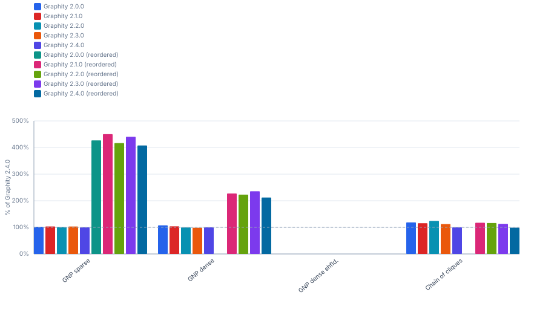

#### Times @ 100M nodes (ms/op, lower is better)

| Shape | Graphity 2.0.0 | Graphity 2.1.0 | Graphity 2.2.0 | Graphity 2.3.0 | Graphity 2.4.0 | Graphity 3.0.0 | Graphity 2.0.0<br>(reordered) | Graphity 2.1.0<br>(reordered) | Graphity 2.2.0<br>(reordered) | Graphity 2.3.0<br>(reordered) | Graphity 2.4.0<br>(reordered) | Graphity 3.0.0<br>(reordered) |
|---|---:|---:|---:|---:|---:|---:|---:|---:|---:|---:|---:|---:|
| GNP sparse<br><sub>100M nodes, 300M edges</sub> | 36814 ms (1.0×) | 36265 ms (1.0×) | 36545 ms (1.0×) | 36155 ms (1.0×) | 37032 ms (1.0×) | 37185 ms | 9963.5 ms (0.3×) | 9839.3 ms (0.3×) | 9918.4 ms (0.3×) | 9842.1 ms (0.3×) | 10158 ms (0.3×) | 10067 ms (0.3×) |

#### Throughput @ 100M nodes (op/s, higher is better)

| Shape | Graphity 2.0.0 | Graphity 2.1.0 | Graphity 2.2.0 | Graphity 2.3.0 | Graphity 2.4.0 | Graphity 3.0.0 | Graphity 2.0.0<br>(reordered) | Graphity 2.1.0<br>(reordered) | Graphity 2.2.0<br>(reordered) | Graphity 2.3.0<br>(reordered) | Graphity 2.4.0<br>(reordered) | Graphity 3.0.0<br>(reordered) |
|---|---:|---:|---:|---:|---:|---:|---:|---:|---:|---:|---:|---:|
| GNP sparse<br><sub>100M nodes, 300M edges</sub> | 0.027 op/s (101%) | 0.028 op/s (103%) | 0.027 op/s (102%) | 0.028 op/s (103%) | 0.027 op/s (100%) | 0.027 op/s | 0.100 op/s (373%) | 0.102 op/s (378%) | 0.101 op/s (375%) | 0.102 op/s (378%) | 0.098 op/s (366%) | 0.099 op/s (369%) |

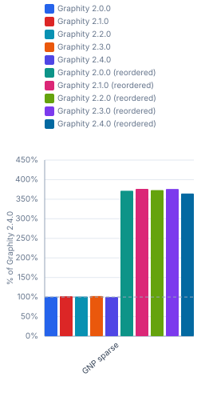

### 1.5 WCC

#### Times @ 10k nodes (ms/op, lower is better)

| Shape | Graphity 1.0 | Graphity 2.0.0 | Graphity 2.1.0 | Graphity 2.2.0 | Graphity 2.3.0 | Graphity 2.4.0 | Graphity 3.0.0 | Graphity 2.0.0<br>(reordered) | Graphity 2.1.0<br>(reordered) | Graphity 2.2.0<br>(reordered) | Graphity 2.3.0<br>(reordered) | Graphity 2.4.0<br>(reordered) | Graphity 3.0.0<br>(reordered) |
|---|---:|---:|---:|---:|---:|---:|---:|---:|---:|---:|---:|---:|---:|
| Path<br><sub>10k nodes, 10k edges</sub> | 0.037 ms (1.0×) | 0.036 ms (1.0×) | 0.037 ms (1.0×) | 0.036 ms (1.0×) | 0.040 ms (1.1×) | 0.038 ms (1.0×) | 0.037 ms | 0.042 ms (1.1×) | 0.040 ms (1.1×) | 0.042 ms (1.1×) | 0.036 ms (1.0×) | 0.037 ms (1.0×) | 0.037 ms (1.0×) |
| Path shfld.<br><sub>10k nodes, 10k edges</sub> | 0.046 ms (1.2×) | 0.046 ms (1.2×) | 0.053 ms (1.4×) | 0.046 ms (1.2×) | 0.056 ms (1.4×) | 0.047 ms (1.2×) | 0.039 ms | 0.042 ms (1.1×) | 0.042 ms (1.1×) | 0.042 ms (1.1×) | 0.042 ms (1.1×) | 0.042 ms (1.1×) | 0.036 ms (0.9×) |
| Tree<br><sub>10k nodes, 10k edges</sub> | 0.038 ms (1.0×) | 0.038 ms (1.0×) | 0.038 ms (1.0×) | 0.038 ms (1.0×) | 0.038 ms (1.0×) | 0.044 ms (1.1×) | 0.039 ms | 0.038 ms (1.0×) | 0.044 ms (1.1×) | 0.039 ms (1.0×) | 0.039 ms (1.0×) | 0.040 ms (1.0×) | 0.039 ms (1.0×) |
| GNP sparse<br><sub>10k nodes, 30k edges</sub> | 0.095 ms (1.1×) | 0.083 ms (1.0×) | 0.097 ms (1.2×) | 0.102 ms (1.2×) | 0.095 ms (1.1×) | 0.087 ms (1.0×) | 0.084 ms | 0.086 ms (1.0×) | 0.082 ms (1.0×) | 0.081 ms (1.0×) | 0.089 ms (1.1×) | 0.083 ms (1.0×) | 0.077 ms (0.9×) |
| GNP dense<br><sub>10k nodes, 299.6k edges</sub> | 0.530 ms (1.1×) | 0.524 ms (1.1×) | 0.523 ms (1.1×) | 0.531 ms (1.1×) | 0.513 ms (1.1×) | 0.516 ms (1.1×) | 0.474 ms | 0.524 ms (1.1×) | 0.520 ms (1.1×) | 0.537 ms (1.1×) | 0.512 ms (1.1×) | 0.515 ms (1.1×) | 0.472 ms (1.0×) |
| GNP dense shfld.<br><sub>10k nodes, 299.6k edges</sub> | 0.525 ms | 0.524 ms | 0.525 ms | 0.528 ms | — | — | — | 0.527 ms | 0.521 ms | 0.525 ms | — | — | — |
| Chain of cliques<br><sub>10k nodes, 310.8k edges</sub> | 0.578 ms (1.0×) | 0.578 ms (1.0×) | 0.579 ms (1.0×) | 0.581 ms (1.1×) | 0.572 ms (1.0×) | 0.572 ms (1.0×) | 0.552 ms | 0.578 ms (1.0×) | 0.578 ms (1.0×) | 0.589 ms (1.1×) | 0.571 ms (1.0×) | 0.573 ms (1.0×) | 0.558 ms (1.0×) |
| Chain of cliques shfld.<br><sub>10k nodes, 310.8k edges</sub> | 0.640 ms (0.9×) | 0.640 ms (0.9×) | 0.641 ms (0.9×) | 0.648 ms (1.0×) | 0.633 ms (0.9×) | 0.632 ms (0.9×) | 0.678 ms | 0.581 ms (0.9×) | 0.614 ms (0.9×) | 0.620 ms (0.9×) | 0.572 ms (0.8×) | 0.610 ms (0.9×) | 0.483 ms (0.7×) |

#### Throughput @ 10k nodes (op/s, higher is better)

| Shape | Graphity 1.0 | Graphity 2.0.0 | Graphity 2.1.0 | Graphity 2.2.0 | Graphity 2.3.0 | Graphity 2.4.0 | Graphity 3.0.0 | Graphity 2.0.0<br>(reordered) | Graphity 2.1.0<br>(reordered) | Graphity 2.2.0<br>(reordered) | Graphity 2.3.0<br>(reordered) | Graphity 2.4.0<br>(reordered) | Graphity 3.0.0<br>(reordered) |
|---|---:|---:|---:|---:|---:|---:|---:|---:|---:|---:|---:|---:|---:|
| Path<br><sub>10k nodes, 10k edges</sub> | 27 027 op/s (100%) | 27 778 op/s (103%) | 27 027 op/s (100%) | 27 778 op/s (103%) | 25 000 op/s (92.5%) | 26 316 op/s (97.4%) | 27 027 op/s | 23 810 op/s (88.1%) | 25 000 op/s (92.5%) | 23 810 op/s (88.1%) | 27 778 op/s (103%) | 27 027 op/s (100%) | 27 027 op/s (100%) |
| Path shfld.<br><sub>10k nodes, 10k edges</sub> | 21 739 op/s (84.8%) | 21 739 op/s (84.8%) | 18 868 op/s (73.6%) | 21 739 op/s (84.8%) | 17 857 op/s (69.6%) | 21 277 op/s (83.0%) | 25 641 op/s | 23 810 op/s (92.9%) | 23 810 op/s (92.9%) | 23 810 op/s (92.9%) | 23 810 op/s (92.9%) | 23 810 op/s (92.9%) | 27 778 op/s (108%) |
| Tree<br><sub>10k nodes, 10k edges</sub> | 26 316 op/s (103%) | 26 316 op/s (103%) | 26 316 op/s (103%) | 26 316 op/s (103%) | 26 316 op/s (103%) | 22 727 op/s (88.6%) | 25 641 op/s | 26 316 op/s (103%) | 22 727 op/s (88.6%) | 25 641 op/s (100%) | 25 641 op/s (100%) | 25 000 op/s (97.5%) | 25 641 op/s (100%) |
| GNP sparse<br><sub>10k nodes, 30k edges</sub> | 10 526 op/s (88.4%) | 12 048 op/s (101%) | 10 309 op/s (86.6%) | 9 804 op/s (82.4%) | 10 526 op/s (88.4%) | 11 494 op/s (96.6%) | 11 905 op/s | 11 628 op/s (97.7%) | 12 195 op/s (102%) | 12 346 op/s (104%) | 11 236 op/s (94.4%) | 12 048 op/s (101%) | 12 987 op/s (109%) |
| GNP dense<br><sub>10k nodes, 299.6k edges</sub> | 1 887 op/s (89.4%) | 1 908 op/s (90.5%) | 1 912 op/s (90.6%) | 1 883 op/s (89.3%) | 1 949 op/s (92.4%) | 1 938 op/s (91.9%) | 2 110 op/s | 1 908 op/s (90.5%) | 1 923 op/s (91.2%) | 1 862 op/s (88.3%) | 1 953 op/s (92.6%) | 1 942 op/s (92.0%) | 2 119 op/s (100%) |
| GNP dense shfld.<br><sub>10k nodes, 299.6k edges</sub> | 1 905 op/s | 1 908 op/s | 1 905 op/s | 1 894 op/s | — | — | — | 1 898 op/s | 1 919 op/s | 1 905 op/s | — | — | — |
| Chain of cliques<br><sub>10k nodes, 310.8k edges</sub> | 1 730 op/s (95.5%) | 1 730 op/s (95.5%) | 1 727 op/s (95.3%) | 1 721 op/s (95.0%) | 1 748 op/s (96.5%) | 1 748 op/s (96.5%) | 1 812 op/s | 1 730 op/s (95.5%) | 1 730 op/s (95.5%) | 1 698 op/s (93.7%) | 1 751 op/s (96.7%) | 1 745 op/s (96.3%) | 1 792 op/s (98.9%) |
| Chain of cliques shfld.<br><sub>10k nodes, 310.8k edges</sub> | 1 562 op/s (106%) | 1 562 op/s (106%) | 1 560 op/s (106%) | 1 543 op/s (105%) | 1 580 op/s (107%) | 1 582 op/s (107%) | 1 475 op/s | 1 721 op/s (117%) | 1 629 op/s (110%) | 1 613 op/s (109%) | 1 748 op/s (119%) | 1 639 op/s (111%) | 2 070 op/s (140%) |

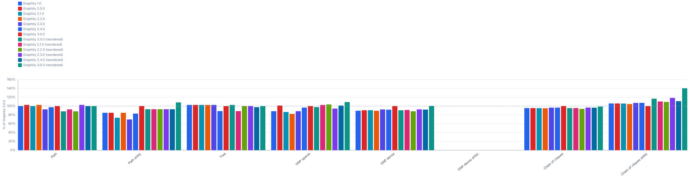

#### Times @ 100k nodes (ms/op, lower is better)

| Shape | Graphity 1.0 | Graphity 2.0.0 | Graphity 2.1.0 | Graphity 2.2.0 | Graphity 2.3.0 | Graphity 2.4.0 | Graphity 3.0.0 | Graphity 2.0.0<br>(reordered) | Graphity 2.1.0<br>(reordered) | Graphity 2.2.0<br>(reordered) | Graphity 2.3.0<br>(reordered) | Graphity 2.4.0<br>(reordered) | Graphity 3.0.0<br>(reordered) |
|---|---:|---:|---:|---:|---:|---:|---:|---:|---:|---:|---:|---:|---:|
| Path<br><sub>100k nodes, 100k edges</sub> | 0.393 ms (1.1×) | 0.398 ms (1.1×) | 0.406 ms (1.1×) | 0.395 ms (1.1×) | 0.395 ms (1.1×) | 0.406 ms (1.1×) | 0.362 ms | 0.400 ms (1.1×) | 0.352 ms (1.0×) | 0.357 ms (1.0×) | 0.400 ms (1.1×) | 0.405 ms (1.1×) | 0.359 ms (1.0×) |
| Path shfld.<br><sub>100k nodes, 100k edges</sub> | 1.229 ms (1.1×) | 1.228 ms (1.1×) | 1.232 ms (1.1×) | 1.291 ms (1.1×) | 1.228 ms (1.1×) | 1.233 ms (1.1×) | 1.164 ms | 0.390 ms (0.3×) | 0.347 ms (0.3×) | 0.356 ms (0.3×) | 0.392 ms (0.3×) | 0.401 ms (0.3×) | 0.360 ms (0.3×) |
| Tree<br><sub>100k nodes, 100k edges</sub> | 0.661 ms (1.1×) | 0.636 ms (1.0×) | 0.669 ms (1.1×) | 0.665 ms (1.1×) | 0.632 ms (1.0×) | 0.677 ms (1.1×) | 0.619 ms | 0.732 ms (1.2×) | 0.770 ms (1.2×) | 0.732 ms (1.2×) | 0.713 ms (1.2×) | 0.733 ms (1.2×) | 0.700 ms (1.1×) |
| GNP sparse<br><sub>100k nodes, 300k edges</sub> | 1.769 ms (1.0×) | 1.767 ms (1.0×) | 1.794 ms (1.0×) | 1.800 ms (1.0×) | 1.772 ms (1.0×) | 1.767 ms (1.0×) | 1.746 ms | 1.550 ms (0.9×) | 1.561 ms (0.9×) | 1.572 ms (0.9×) | 1.525 ms (0.9×) | 1.566 ms (0.9×) | 1.405 ms (0.8×) |
| GNP dense<br><sub>100k nodes, 3M edges</sub> | 6.082 ms (1.0×) | 6.090 ms (1.0×) | 6.096 ms (1.0×) | 6.096 ms (1.0×) | 6.078 ms (1.0×) | 6.139 ms (1.0×) | 5.967 ms | 6.069 ms (1.0×) | 6.054 ms (1.0×) | 6.263 ms (1.0×) | 6.004 ms (1.0×) | 6.131 ms (1.0×) | 5.323 ms (0.9×) |
| GNP dense shfld.<br><sub>100k nodes, 3M edges</sub> | 6.163 ms | 6.091 ms | 6.088 ms | 6.158 ms | — | — | — | 6.163 ms | 6.118 ms | 6.194 ms | — | — | — |
| Chain of cliques<br><sub>100k nodes, 3.1M edges</sub> | 5.858 ms (1.1×) | 6.000 ms (1.2×) | 5.778 ms (1.1×) | 6.479 ms (1.2×) | 5.791 ms (1.1×) | 5.724 ms (1.1×) | 5.211 ms | 5.927 ms (1.1×) | 5.764 ms (1.1×) | 6.018 ms (1.2×) | 5.672 ms (1.1×) | 5.744 ms (1.1×) | 5.223 ms (1.0×) |
| Chain of cliques shfld.<br><sub>100k nodes, 3.1M edges</sub> | 5.955 ms (1.1×) | 5.953 ms (1.1×) | 5.988 ms (1.1×) | 6.054 ms (1.1×) | 5.883 ms (1.1×) | 6.045 ms (1.1×) | 5.374 ms | 6.021 ms (1.1×) | 6.133 ms (1.1×) | 5.936 ms (1.1×) | 5.888 ms (1.1×) | 6.146 ms (1.1×) | 5.221 ms (1.0×) |

#### Throughput @ 100k nodes (op/s, higher is better)

| Shape | Graphity 1.0 | Graphity 2.0.0 | Graphity 2.1.0 | Graphity 2.2.0 | Graphity 2.3.0 | Graphity 2.4.0 | Graphity 3.0.0 | Graphity 2.0.0<br>(reordered) | Graphity 2.1.0<br>(reordered) | Graphity 2.2.0<br>(reordered) | Graphity 2.3.0<br>(reordered) | Graphity 2.4.0<br>(reordered) | Graphity 3.0.0<br>(reordered) |
|---|---:|---:|---:|---:|---:|---:|---:|---:|---:|---:|---:|---:|---:|
| Path<br><sub>100k nodes, 100k edges</sub> | 2 545 op/s (92.1%) | 2 513 op/s (91.0%) | 2 463 op/s (89.2%) | 2 532 op/s (91.6%) | 2 532 op/s (91.6%) | 2 463 op/s (89.2%) | 2 762 op/s | 2 500 op/s (90.5%) | 2 841 op/s (103%) | 2 801 op/s (101%) | 2 500 op/s (90.5%) | 2 469 op/s (89.4%) | 2 786 op/s (101%) |
| Path shfld.<br><sub>100k nodes, 100k edges</sub> | 813.7 op/s (94.7%) | 814.3 op/s (94.8%) | 811.7 op/s (94.5%) | 774.6 op/s (90.2%) | 814.3 op/s (94.8%) | 811.0 op/s (94.4%) | 859.1 op/s | 2 564 op/s (298%) | 2 882 op/s (335%) | 2 809 op/s (327%) | 2 551 op/s (297%) | 2 494 op/s (290%) | 2 778 op/s (323%) |
| Tree<br><sub>100k nodes, 100k edges</sub> | 1 513 op/s (93.6%) | 1 572 op/s (97.3%) | 1 495 op/s (92.5%) | 1 504 op/s (93.1%) | 1 582 op/s (97.9%) | 1 477 op/s (91.4%) | 1 616 op/s | 1 366 op/s (84.6%) | 1 299 op/s (80.4%) | 1 366 op/s (84.6%) | 1 403 op/s (86.8%) | 1 364 op/s (84.4%) | 1 429 op/s (88.4%) |
| GNP sparse<br><sub>100k nodes, 300k edges</sub> | 565.3 op/s (98.7%) | 565.9 op/s (98.8%) | 557.4 op/s (97.3%) | 555.6 op/s (97.0%) | 564.3 op/s (98.5%) | 565.9 op/s (98.8%) | 572.7 op/s | 645.2 op/s (113%) | 640.6 op/s (112%) | 636.1 op/s (111%) | 655.7 op/s (114%) | 638.6 op/s (111%) | 711.7 op/s (124%) |
| GNP dense<br><sub>100k nodes, 3M edges</sub> | 164.4 op/s (98.1%) | 164.2 op/s (98.0%) | 164.0 op/s (97.9%) | 164.0 op/s (97.9%) | 164.5 op/s (98.2%) | 162.9 op/s (97.2%) | 167.6 op/s | 164.8 op/s (98.3%) | 165.2 op/s (98.6%) | 159.7 op/s (95.3%) | 166.6 op/s (99.4%) | 163.1 op/s (97.3%) | 187.9 op/s (112%) |
| GNP dense shfld.<br><sub>100k nodes, 3M edges</sub> | 162.3 op/s | 164.2 op/s | 164.3 op/s | 162.4 op/s | — | — | — | 162.3 op/s | 163.5 op/s | 161.4 op/s | — | — | — |
| Chain of cliques<br><sub>100k nodes, 3.1M edges</sub> | 170.7 op/s (89.0%) | 166.7 op/s (86.8%) | 173.1 op/s (90.2%) | 154.3 op/s (80.4%) | 172.7 op/s (90.0%) | 174.7 op/s (91.0%) | 191.9 op/s | 168.7 op/s (87.9%) | 173.5 op/s (90.4%) | 166.2 op/s (86.6%) | 176.3 op/s (91.9%) | 174.1 op/s (90.7%) | 191.5 op/s (99.8%) |
| Chain of cliques shfld.<br><sub>100k nodes, 3.1M edges</sub> | 167.9 op/s (90.2%) | 168.0 op/s (90.3%) | 167.0 op/s (89.7%) | 165.2 op/s (88.8%) | 170.0 op/s (91.3%) | 165.4 op/s (88.9%) | 186.1 op/s | 166.1 op/s (89.3%) | 163.1 op/s (87.6%) | 168.5 op/s (90.5%) | 169.8 op/s (91.3%) | 162.7 op/s (87.4%) | 191.5 op/s (103%) |

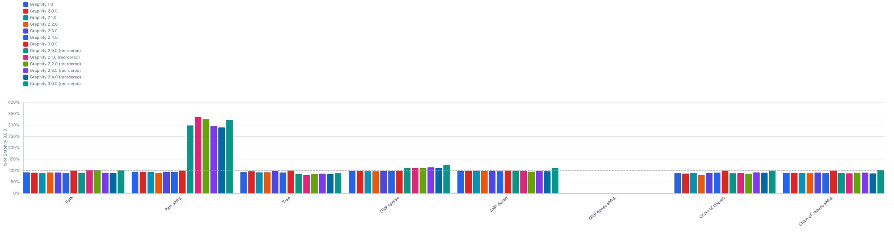

#### Times @ 1M nodes (ms/op, lower is better)

| Shape | Graphity 2.0.0 | Graphity 2.1.0 | Graphity 2.2.0 | Graphity 2.3.0 | Graphity 2.4.0 | Graphity 3.0.0 | Graphity 2.0.0<br>(reordered) | Graphity 2.1.0<br>(reordered) | Graphity 2.2.0<br>(reordered) | Graphity 2.3.0<br>(reordered) | Graphity 2.4.0<br>(reordered) | Graphity 3.0.0<br>(reordered) |
|---|---:|---:|---:|---:|---:|---:|---:|---:|---:|---:|---:|---:|
| GNP sparse<br><sub>1M nodes, 3M edges</sub> | 21.74 ms (1.1×) | 21.57 ms (1.1×) | 19.97 ms (1.1×) | 21.40 ms (1.1×) | 21.28 ms (1.1×) | 18.98 ms | 17.26 ms (0.9×) | 16.24 ms (0.9×) | 16.39 ms (0.9×) | 17.45 ms (0.9×) | 19.21 ms (1.0×) | 15.20 ms (0.8×) |
| GNP dense<br><sub>1M nodes, 30M edges</sub> | 65.50 ms (0.9×) | 78.43 ms (1.1×) | 67.53 ms (1.0×) | 67.67 ms (1.0×) | 67.51 ms (1.0×) | 69.50 ms | — | 66.27 ms (1.0×) | 69.74 ms (1.0×) | 66.93 ms (1.0×) | 67.42 ms (1.0×) | 68.66 ms (1.0×) |
| GNP dense shfld.<br><sub>1M nodes, 30M edges</sub> | 70.47 ms | 66.99 ms | 68.44 ms | — | — | — | 69.61 ms | 66.64 ms | 68.78 ms | — | — | — |
| Chain of cliques<br><sub>1M nodes, 31.1M edges</sub> | 50.95 ms (0.9×) | 51.65 ms (0.9×) | 50.92 ms (0.9×) | 50.41 ms (0.9×) | 49.98 ms (0.9×) | 57.66 ms | — | 50.10 ms (0.9×) | 50.64 ms (0.9×) | 50.15 ms (0.9×) | 50.46 ms (0.9×) | 60.40 ms (1.0×) |

#### Throughput @ 1M nodes (op/s, higher is better)

| Shape | Graphity 2.0.0 | Graphity 2.1.0 | Graphity 2.2.0 | Graphity 2.3.0 | Graphity 2.4.0 | Graphity 3.0.0 | Graphity 2.0.0<br>(reordered) | Graphity 2.1.0<br>(reordered) | Graphity 2.2.0<br>(reordered) | Graphity 2.3.0<br>(reordered) | Graphity 2.4.0<br>(reordered) | Graphity 3.0.0<br>(reordered) |
|---|---:|---:|---:|---:|---:|---:|---:|---:|---:|---:|---:|---:|
| GNP sparse<br><sub>1M nodes, 3M edges</sub> | 46.00 op/s (87.3%) | 46.37 op/s (88.0%) | 50.08 op/s (95.1%) | 46.73 op/s (88.7%) | 46.99 op/s (89.2%) | 52.68 op/s | 57.94 op/s (110%) | 61.58 op/s (117%) | 61.02 op/s (116%) | 57.29 op/s (109%) | 52.06 op/s (98.8%) | 65.77 op/s (125%) |
| GNP dense<br><sub>1M nodes, 30M edges</sub> | 15.27 op/s (106%) | 12.75 op/s (88.6%) | 14.81 op/s (103%) | 14.78 op/s (103%) | 14.81 op/s (103%) | 14.39 op/s | — | 15.09 op/s (105%) | 14.34 op/s (99.7%) | 14.94 op/s (104%) | 14.83 op/s (103%) | 14.57 op/s (101%) |
| GNP dense shfld.<br><sub>1M nodes, 30M edges</sub> | 14.19 op/s | 14.93 op/s | 14.61 op/s | — | — | — | 14.37 op/s | 15.01 op/s | 14.54 op/s | — | — | — |
| Chain of cliques<br><sub>1M nodes, 31.1M edges</sub> | 19.63 op/s (113%) | 19.36 op/s (112%) | 19.64 op/s (113%) | 19.84 op/s (114%) | 20.01 op/s (115%) | 17.34 op/s | — | 19.96 op/s (115%) | 19.75 op/s (114%) | 19.94 op/s (115%) | 19.82 op/s (114%) | 16.56 op/s (95.5%) |

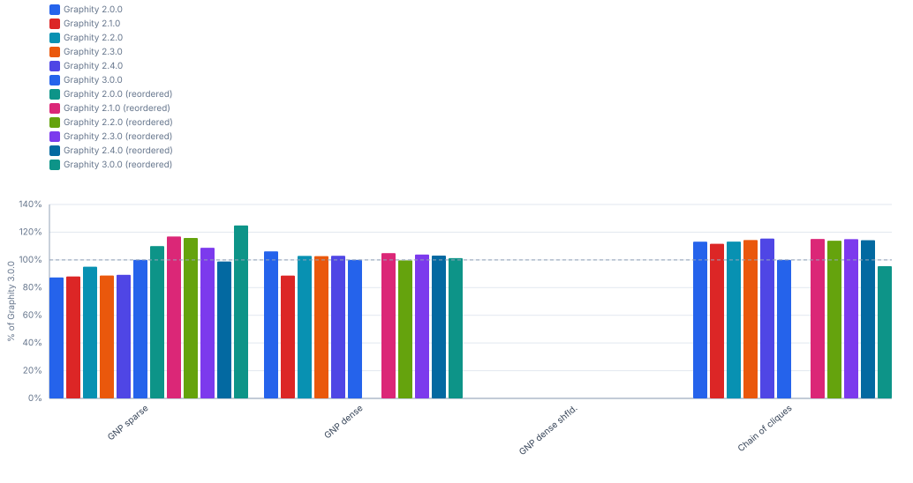

#### Times @ 10M nodes (ms/op, lower is better)

| Shape | Graphity 2.0.0 | Graphity 2.1.0 | Graphity 2.2.0 | Graphity 2.3.0 | Graphity 2.4.0 | Graphity 3.0.0 | Graphity 2.0.0<br>(reordered) | Graphity 2.1.0<br>(reordered) | Graphity 2.2.0<br>(reordered) | Graphity 2.3.0<br>(reordered) | Graphity 2.4.0<br>(reordered) | Graphity 3.0.0<br>(reordered) |
|---|---:|---:|---:|---:|---:|---:|---:|---:|---:|---:|---:|---:|
| GNP sparse<br><sub>10M nodes, 30M edges</sub> | 615.6 ms (1.0×) | 600.5 ms (1.0×) | 569.5 ms (1.0×) | 590.8 ms (1.0×) | 606.7 ms (1.0×) | 597.3 ms | 410.6 ms (0.7×) | 378.4 ms (0.6×) | 447.4 ms (0.7×) | 406.0 ms (0.7×) | 414.5 ms (0.7×) | 373.0 ms (0.6×) |
| GNP dense<br><sub>10M nodes, 299.6M edges</sub> | 4094.7 ms (1.1×) | 4106.6 ms (1.1×) | 4580.5 ms (1.2×) | 3441.2 ms (0.9×) | 3273.0 ms (0.9×) | 3772.8 ms | — | 3774.2 ms (1.0×) | 4418.3 ms (1.2×) | 3251.8 ms (0.9×) | 3301.6 ms (0.9×) | 3556.2 ms (0.9×) |
| GNP dense shfld.<br><sub>10M nodes, 299.6M edges</sub> | 3899.0 ms | 3919.9 ms | 3734.0 ms | — | — | — | 3844.9 ms | 3828.2 ms | 4399.7 ms | — | — | — |
| Chain of cliques<br><sub>10M nodes, 310.8M edges</sub> | 754.7 ms (1.2×) | 516.1 ms (0.8×) | 594.1 ms (1.0×) | 518.9 ms (0.9×) | 520.9 ms (0.9×) | 608.6 ms | — | 516.0 ms (0.8×) | 561.6 ms (0.9×) | 521.1 ms (0.9×) | 522.3 ms (0.9×) | 537.1 ms (0.9×) |

#### Throughput @ 10M nodes (op/s, higher is better)

| Shape | Graphity 2.0.0 | Graphity 2.1.0 | Graphity 2.2.0 | Graphity 2.3.0 | Graphity 2.4.0 | Graphity 3.0.0 | Graphity 2.0.0<br>(reordered) | Graphity 2.1.0<br>(reordered) | Graphity 2.2.0<br>(reordered) | Graphity 2.3.0<br>(reordered) | Graphity 2.4.0<br>(reordered) | Graphity 3.0.0<br>(reordered) |
|---|---:|---:|---:|---:|---:|---:|---:|---:|---:|---:|---:|---:|
| GNP sparse<br><sub>10M nodes, 30M edges</sub> | 1.624 op/s (97.0%) | 1.665 op/s (99.5%) | 1.756 op/s (105%) | 1.693 op/s (101%) | 1.648 op/s (98.5%) | 1.674 op/s | 2.435 op/s (145%) | 2.643 op/s (158%) | 2.235 op/s (134%) | 2.463 op/s (147%) | 2.413 op/s (144%) | 2.681 op/s (160%) |
| GNP dense<br><sub>10M nodes, 299.6M edges</sub> | 0.244 op/s (92.1%) | 0.244 op/s (91.9%) | 0.218 op/s (82.4%) | 0.291 op/s (110%) | 0.306 op/s (115%) | 0.265 op/s | — | 0.265 op/s (100.0%) | 0.226 op/s (85.4%) | 0.308 op/s (116%) | 0.303 op/s (114%) | 0.281 op/s (106%) |
| GNP dense shfld.<br><sub>10M nodes, 299.6M edges</sub> | 0.256 op/s | 0.255 op/s | 0.268 op/s | — | — | — | 0.260 op/s | 0.261 op/s | 0.227 op/s | — | — | — |
| Chain of cliques<br><sub>10M nodes, 310.8M edges</sub> | 1.325 op/s (80.6%) | 1.938 op/s (118%) | 1.683 op/s (102%) | 1.927 op/s (117%) | 1.920 op/s (117%) | 1.643 op/s | — | 1.938 op/s (118%) | 1.781 op/s (108%) | 1.919 op/s (117%) | 1.915 op/s (117%) | 1.862 op/s (113%) |

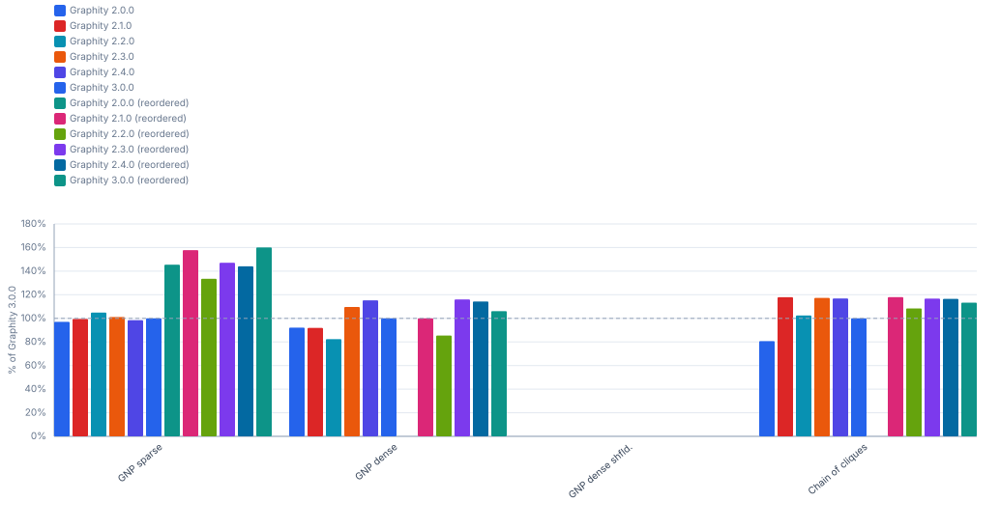

#### Times @ 100M nodes (ms/op, lower is better)

| Shape | Graphity 2.0.0 | Graphity 2.1.0 | Graphity 2.2.0 | Graphity 2.3.0 | Graphity 2.4.0 | Graphity 3.0.0 | Graphity 2.0.0<br>(reordered) | Graphity 2.1.0<br>(reordered) | Graphity 2.2.0<br>(reordered) | Graphity 2.3.0<br>(reordered) | Graphity 2.4.0<br>(reordered) | Graphity 3.0.0<br>(reordered) |
|---|---:|---:|---:|---:|---:|---:|---:|---:|---:|---:|---:|---:|
| GNP sparse<br><sub>100M nodes, 300M edges</sub> | 8231.6 ms (0.9×) | 9442.8 ms (1.1×) | 9600.9 ms (1.1×) | 8807.1 ms (1.0×) | 8761.4 ms (1.0×) | 8971.8 ms | 6807.7 ms (0.8×) | 6812.3 ms (0.8×) | 6010.4 ms (0.7×) | 7245.4 ms (0.8×) | 7238.6 ms (0.8×) | 6199.9 ms (0.7×) |

#### Throughput @ 100M nodes (op/s, higher is better)

| Shape | Graphity 2.0.0 | Graphity 2.1.0 | Graphity 2.2.0 | Graphity 2.3.0 | Graphity 2.4.0 | Graphity 3.0.0 | Graphity 2.0.0<br>(reordered) | Graphity 2.1.0<br>(reordered) | Graphity 2.2.0<br>(reordered) | Graphity 2.3.0<br>(reordered) | Graphity 2.4.0<br>(reordered) | Graphity 3.0.0<br>(reordered) |
|---|---:|---:|---:|---:|---:|---:|---:|---:|---:|---:|---:|---:|
| GNP sparse<br><sub>100M nodes, 300M edges</sub> | 0.121 op/s (109%) | 0.106 op/s (95.0%) | 0.104 op/s (93.4%) | 0.114 op/s (102%) | 0.114 op/s (102%) | 0.111 op/s | 0.147 op/s (132%) | 0.147 op/s (132%) | 0.166 op/s (149%) | 0.138 op/s (124%) | 0.138 op/s (124%) | 0.161 op/s (145%) |

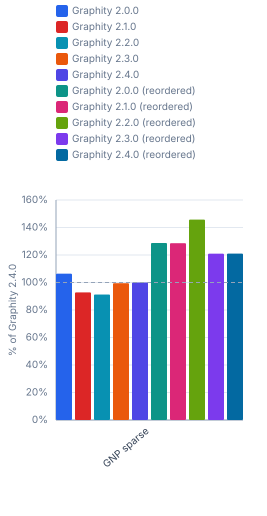

### 1.6 CCs

#### Times @ 10k nodes (ms/op, lower is better)

| Shape | Graphity 1.0 | Graphity 2.0.0 | Graphity 2.1.0 | Graphity 2.2.0 | Graphity 2.3.0 | Graphity 2.4.0 | Graphity 3.0.0 | Graphity 2.0.0<br>(reordered) | Graphity 2.1.0<br>(reordered) | Graphity 2.2.0<br>(reordered) | Graphity 2.3.0<br>(reordered) | Graphity 2.4.0<br>(reordered) | Graphity 3.0.0<br>(reordered) |
|---|---:|---:|---:|---:|---:|---:|---:|---:|---:|---:|---:|---:|---:|
| Path<br><sub>10k nodes, 10k edges</sub> | 0.037 ms (1.0×) | 0.042 ms (1.1×) | 0.042 ms (1.1×) | 0.043 ms (1.2×) | 0.042 ms (1.1×) | 0.037 ms (1.0×) | 0.037 ms | 0.036 ms (1.0×) | 0.042 ms (1.1×) | 0.037 ms (1.0×) | 0.036 ms (1.0×) | 0.038 ms (1.0×) | 0.037 ms (1.0×) |
| Path shfld.<br><sub>10k nodes, 10k edges</sub> | 0.053 ms (1.4×) | 0.053 ms (1.4×) | 0.045 ms (1.2×) | 0.058 ms (1.5×) | 0.045 ms (1.2×) | 0.047 ms (1.2×) | 0.039 ms | 0.036 ms (0.9×) | 0.042 ms (1.1×) | 0.036 ms (0.9×) | 0.041 ms (1.1×) | 0.043 ms (1.1×) | 0.037 ms (0.9×) |
| Tree<br><sub>10k nodes, 10k edges</sub> | 0.044 ms (1.1×) | 0.038 ms (1.0×) | 0.042 ms (1.1×) | 0.039 ms (1.0×) | 0.044 ms (1.1×) | 0.039 ms (1.0×) | 0.039 ms | 0.043 ms (1.1×) | 0.038 ms (1.0×) | 0.044 ms (1.1×) | 0.038 ms (1.0×) | 0.040 ms (1.0×) | 0.039 ms (1.0×) |
| GNP sparse<br><sub>10k nodes, 30k edges</sub> | 0.106 ms (1.2×) | 0.090 ms (1.1×) | 0.094 ms (1.1×) | 0.110 ms (1.3×) | 0.082 ms (1.0×) | 0.085 ms (1.0×) | 0.085 ms | 0.088 ms (1.0×) | 0.087 ms (1.0×) | 0.087 ms (1.0×) | 0.089 ms (1.0×) | 0.092 ms (1.1×) | 0.076 ms (0.9×) |
| GNP dense<br><sub>10k nodes, 299.6k edges</sub> | 0.518 ms (1.1×) | 0.526 ms (1.1×) | 0.524 ms (1.1×) | 0.530 ms (1.1×) | 0.516 ms (1.1×) | 0.517 ms (1.1×) | 0.474 ms | 0.520 ms (1.1×) | 0.527 ms (1.1×) | 0.530 ms (1.1×) | 0.512 ms (1.1×) | 0.516 ms (1.1×) | 0.470 ms (1.0×) |
| GNP dense shfld.<br><sub>10k nodes, 299.6k edges</sub> | 0.522 ms | 0.524 ms | 0.524 ms | 0.535 ms | — | — | — | 0.534 ms | 0.521 ms | 0.535 ms | — | — | — |
| Chain of cliques<br><sub>10k nodes, 310.8k edges</sub> | 0.586 ms (1.1×) | 0.580 ms (1.1×) | 0.588 ms (1.1×) | 0.586 ms (1.1×) | 0.582 ms (1.1×) | 0.572 ms (1.0×) | 0.552 ms | 0.584 ms (1.1×) | 0.588 ms (1.1×) | 0.556 ms (1.0×) | 0.569 ms (1.0×) | 0.573 ms (1.0×) | 0.527 ms (1.0×) |
| Chain of cliques shfld.<br><sub>10k nodes, 310.8k edges</sub> | 0.639 ms (1.0×) | 0.640 ms (1.0×) | 0.643 ms (1.0×) | 0.648 ms (1.0×) | 0.632 ms (1.0×) | 0.633 ms (1.0×) | 0.655 ms | 0.625 ms (1.0×) | 0.611 ms (0.9×) | 0.625 ms (1.0×) | 0.607 ms (0.9×) | 0.615 ms (0.9×) | 0.484 ms (0.7×) |

#### Throughput @ 10k nodes (op/s, higher is better)

| Shape | Graphity 1.0 | Graphity 2.0.0 | Graphity 2.1.0 | Graphity 2.2.0 | Graphity 2.3.0 | Graphity 2.4.0 | Graphity 3.0.0 | Graphity 2.0.0<br>(reordered) | Graphity 2.1.0<br>(reordered) | Graphity 2.2.0<br>(reordered) | Graphity 2.3.0<br>(reordered) | Graphity 2.4.0<br>(reordered) | Graphity 3.0.0<br>(reordered) |
|---|---:|---:|---:|---:|---:|---:|---:|---:|---:|---:|---:|---:|---:|
| Path<br><sub>10k nodes, 10k edges</sub> | 27 027 op/s (100%) | 23 810 op/s (88.1%) | 23 810 op/s (88.1%) | 23 256 op/s (86.0%) | 23 810 op/s (88.1%) | 27 027 op/s (100%) | 27 027 op/s | 27 778 op/s (103%) | 23 810 op/s (88.1%) | 27 027 op/s (100%) | 27 778 op/s (103%) | 26 316 op/s (97.4%) | 27 027 op/s (100%) |
| Path shfld.<br><sub>10k nodes, 10k edges</sub> | 18 868 op/s (73.6%) | 18 868 op/s (73.6%) | 22 222 op/s (86.7%) | 17 241 op/s (67.2%) | 22 222 op/s (86.7%) | 21 277 op/s (83.0%) | 25 641 op/s | 27 778 op/s (108%) | 23 810 op/s (92.9%) | 27 778 op/s (108%) | 24 390 op/s (95.1%) | 23 256 op/s (90.7%) | 27 027 op/s (105%) |
| Tree<br><sub>10k nodes, 10k edges</sub> | 22 727 op/s (88.6%) | 26 316 op/s (103%) | 23 810 op/s (92.9%) | 25 641 op/s (100%) | 22 727 op/s (88.6%) | 25 641 op/s (100%) | 25 641 op/s | 23 256 op/s (90.7%) | 26 316 op/s (103%) | 22 727 op/s (88.6%) | 26 316 op/s (103%) | 25 000 op/s (97.5%) | 25 641 op/s (100%) |
| GNP sparse<br><sub>10k nodes, 30k edges</sub> | 9 434 op/s (80.2%) | 11 111 op/s (94.4%) | 10 638 op/s (90.4%) | 9 091 op/s (77.3%) | 12 195 op/s (104%) | 11 765 op/s (100%) | 11 765 op/s | 11 364 op/s (96.6%) | 11 494 op/s (97.7%) | 11 494 op/s (97.7%) | 11 236 op/s (95.5%) | 10 870 op/s (92.4%) | 13 158 op/s (112%) |
| GNP dense<br><sub>10k nodes, 299.6k edges</sub> | 1 931 op/s (91.5%) | 1 901 op/s (90.1%) | 1 908 op/s (90.5%) | 1 887 op/s (89.4%) | 1 938 op/s (91.9%) | 1 934 op/s (91.7%) | 2 110 op/s | 1 923 op/s (91.2%) | 1 898 op/s (89.9%) | 1 887 op/s (89.4%) | 1 953 op/s (92.6%) | 1 938 op/s (91.9%) | 2 128 op/s (101%) |
| GNP dense shfld.<br><sub>10k nodes, 299.6k edges</sub> | 1 916 op/s | 1 908 op/s | 1 908 op/s | 1 869 op/s | — | — | — | 1 873 op/s | 1 919 op/s | 1 869 op/s | — | — | — |
| Chain of cliques<br><sub>10k nodes, 310.8k edges</sub> | 1 706 op/s (94.2%) | 1 724 op/s (95.2%) | 1 701 op/s (93.9%) | 1 706 op/s (94.2%) | 1 718 op/s (94.8%) | 1 748 op/s (96.5%) | 1 812 op/s | 1 712 op/s (94.5%) | 1 701 op/s (93.9%) | 1 799 op/s (99.3%) | 1 757 op/s (97.0%) | 1 745 op/s (96.3%) | 1 898 op/s (105%) |
| Chain of cliques shfld.<br><sub>10k nodes, 310.8k edges</sub> | 1 565 op/s (103%) | 1 562 op/s (102%) | 1 555 op/s (102%) | 1 543 op/s (101%) | 1 582 op/s (104%) | 1 580 op/s (103%) | 1 527 op/s | 1 600 op/s (105%) | 1 637 op/s (107%) | 1 600 op/s (105%) | 1 647 op/s (108%) | 1 626 op/s (107%) | 2 066 op/s (135%) |

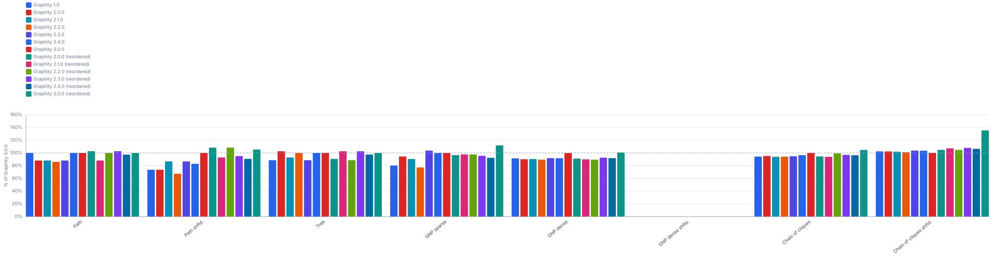

#### Times @ 100k nodes (ms/op, lower is better)

| Shape | Graphity 1.0 | Graphity 2.0.0 | Graphity 2.1.0 | Graphity 2.2.0 | Graphity 2.3.0 | Graphity 2.4.0 | Graphity 3.0.0 | Graphity 2.0.0<br>(reordered) | Graphity 2.1.0<br>(reordered) | Graphity 2.2.0<br>(reordered) | Graphity 2.3.0<br>(reordered) | Graphity 2.4.0<br>(reordered) | Graphity 3.0.0<br>(reordered) |
|---|---:|---:|---:|---:|---:|---:|---:|---:|---:|---:|---:|---:|---:|
| Path<br><sub>100k nodes, 100k edges</sub> | 0.396 ms (1.1×) | 0.403 ms (1.1×) | 0.394 ms (1.1×) | 0.398 ms (1.1×) | 0.359 ms (1.0×) | 0.405 ms (1.1×) | 0.363 ms | 0.392 ms (1.1×) | 0.394 ms (1.1×) | 0.399 ms (1.1×) | 0.359 ms (1.0×) | 0.370 ms (1.0×) | 0.358 ms (1.0×) |
| Path shfld.<br><sub>100k nodes, 100k edges</sub> | 1.229 ms (1.1×) | 1.326 ms (1.2×) | 1.232 ms (1.1×) | 1.276 ms (1.1×) | 1.314 ms (1.1×) | 1.230 ms (1.1×) | 1.145 ms | 0.369 ms (0.3×) | 0.365 ms (0.3×) | 0.403 ms (0.4×) | 0.362 ms (0.3×) | 0.401 ms (0.4×) | 0.361 ms (0.3×) |
| Tree<br><sub>100k nodes, 100k edges</sub> | 0.665 ms (1.1×) | 0.649 ms (1.1×) | 0.664 ms (1.1×) | 0.644 ms (1.0×) | 0.664 ms (1.1×) | 0.648 ms (1.0×) | 0.618 ms | 0.728 ms (1.2×) | 0.751 ms (1.2×) | 0.720 ms (1.2×) | 0.747 ms (1.2×) | 0.737 ms (1.2×) | 0.689 ms (1.1×) |
| GNP sparse<br><sub>100k nodes, 300k edges</sub> | 1.762 ms (1.1×) | 1.769 ms (1.1×) | 1.763 ms (1.1×) | 1.836 ms (1.1×) | 1.756 ms (1.1×) | 1.783 ms (1.1×) | 1.619 ms | 1.501 ms (0.9×) | 1.542 ms (1.0×) | 1.515 ms (0.9×) | 1.559 ms (1.0×) | 1.536 ms (0.9×) | 1.394 ms (0.9×) |
| GNP dense<br><sub>100k nodes, 3M edges</sub> | 6.173 ms (1.1×) | 6.095 ms (1.1×) | 6.117 ms (1.1×) | 6.177 ms (1.1×) | 6.012 ms (1.1×) | 6.197 ms (1.1×) | 5.413 ms | 6.057 ms (1.1×) | 6.066 ms (1.1×) | 6.129 ms (1.1×) | 5.998 ms (1.1×) | 6.198 ms (1.1×) | 5.329 ms (1.0×) |
| GNP dense shfld.<br><sub>100k nodes, 3M edges</sub> | 6.157 ms | 6.186 ms | 6.175 ms | 6.303 ms | — | — | — | 6.029 ms | 6.032 ms | 6.203 ms | — | — | — |
| Chain of cliques<br><sub>100k nodes, 3.1M edges</sub> | 5.806 ms (1.0×) | 5.871 ms (1.1×) | 5.816 ms (1.0×) | 5.949 ms (1.1×) | 5.678 ms (1.0×) | 5.753 ms (1.0×) | 5.543 ms | 5.856 ms (1.1×) | 5.781 ms (1.0×) | 5.961 ms (1.1×) | 5.683 ms (1.0×) | 5.732 ms (1.0×) | 5.232 ms (0.9×) |
| Chain of cliques shfld.<br><sub>100k nodes, 3.1M edges</sub> | 5.999 ms (1.3×) | 5.949 ms (1.3×) | 5.935 ms (1.3×) | 6.078 ms (1.3×) | 5.926 ms (1.3×) | 6.050 ms (1.3×) | 4.511 ms | 6.055 ms (1.3×) | 6.115 ms (1.4×) | 6.133 ms (1.4×) | 6.068 ms (1.3×) | 5.782 ms (1.3×) | 5.639 ms (1.3×) |

#### Throughput @ 100k nodes (op/s, higher is better)

| Shape | Graphity 1.0 | Graphity 2.0.0 | Graphity 2.1.0 | Graphity 2.2.0 | Graphity 2.3.0 | Graphity 2.4.0 | Graphity 3.0.0 | Graphity 2.0.0<br>(reordered) | Graphity 2.1.0<br>(reordered) | Graphity 2.2.0<br>(reordered) | Graphity 2.3.0<br>(reordered) | Graphity 2.4.0<br>(reordered) | Graphity 3.0.0<br>(reordered) |
|---|---:|---:|---:|---:|---:|---:|---:|---:|---:|---:|---:|---:|---:|
| Path<br><sub>100k nodes, 100k edges</sub> | 2 525 op/s (91.7%) | 2 481 op/s (90.1%) | 2 538 op/s (92.1%) | 2 513 op/s (91.2%) | 2 786 op/s (101%) | 2 469 op/s (89.6%) | 2 755 op/s | 2 551 op/s (92.6%) | 2 538 op/s (92.1%) | 2 506 op/s (91.0%) | 2 786 op/s (101%) | 2 703 op/s (98.1%) | 2 793 op/s (101%) |
| Path shfld.<br><sub>100k nodes, 100k edges</sub> | 813.7 op/s (93.2%) | 754.1 op/s (86.3%) | 811.7 op/s (92.9%) | 783.7 op/s (89.7%) | 761.0 op/s (87.1%) | 813.0 op/s (93.1%) | 873.4 op/s | 2 710 op/s (310%) | 2 740 op/s (314%) | 2 481 op/s (284%) | 2 762 op/s (316%) | 2 494 op/s (286%) | 2 770 op/s (317%) |
| Tree<br><sub>100k nodes, 100k edges</sub> | 1 504 op/s (92.9%) | 1 541 op/s (95.2%) | 1 506 op/s (93.1%) | 1 553 op/s (96.0%) | 1 506 op/s (93.1%) | 1 543 op/s (95.4%) | 1 618 op/s | 1 374 op/s (84.9%) | 1 332 op/s (82.3%) | 1 389 op/s (85.8%) | 1 339 op/s (82.7%) | 1 357 op/s (83.9%) | 1 451 op/s (89.7%) |
| GNP sparse<br><sub>100k nodes, 300k edges</sub> | 567.5 op/s (91.9%) | 565.3 op/s (91.5%) | 567.2 op/s (91.8%) | 544.7 op/s (88.2%) | 569.5 op/s (92.2%) | 560.9 op/s (90.8%) | 617.7 op/s | 666.2 op/s (108%) | 648.5 op/s (105%) | 660.1 op/s (107%) | 641.4 op/s (104%) | 651.0 op/s (105%) | 717.4 op/s (116%) |
| GNP dense<br><sub>100k nodes, 3M edges</sub> | 162.0 op/s (87.7%) | 164.1 op/s (88.8%) | 163.5 op/s (88.5%) | 161.9 op/s (87.6%) | 166.3 op/s (90.0%) | 161.4 op/s (87.3%) | 184.7 op/s | 165.1 op/s (89.4%) | 164.9 op/s (89.2%) | 163.2 op/s (88.3%) | 166.7 op/s (90.2%) | 161.3 op/s (87.3%) | 187.7 op/s (102%) |
| GNP dense shfld.<br><sub>100k nodes, 3M edges</sub> | 162.4 op/s | 161.7 op/s | 161.9 op/s | 158.7 op/s | — | — | — | 165.9 op/s | 165.8 op/s | 161.2 op/s | — | — | — |
| Chain of cliques<br><sub>100k nodes, 3.1M edges</sub> | 172.2 op/s (95.5%) | 170.3 op/s (94.4%) | 171.9 op/s (95.3%) | 168.1 op/s (93.2%) | 176.1 op/s (97.6%) | 173.8 op/s (96.3%) | 180.4 op/s | 170.8 op/s (94.7%) | 173.0 op/s (95.9%) | 167.8 op/s (93.0%) | 176.0 op/s (97.5%) | 174.5 op/s (96.7%) | 191.1 op/s (106%) |
| Chain of cliques shfld.<br><sub>100k nodes, 3.1M edges</sub> | 166.7 op/s (75.2%) | 168.1 op/s (75.8%) | 168.5 op/s (76.0%) | 164.5 op/s (74.2%) | 168.7 op/s (76.1%) | 165.3 op/s (74.6%) | 221.7 op/s | 165.2 op/s (74.5%) | 163.5 op/s (73.8%) | 163.1 op/s (73.6%) | 164.8 op/s (74.3%) | 173.0 op/s (78.0%) | 177.3 op/s (80.0%) |

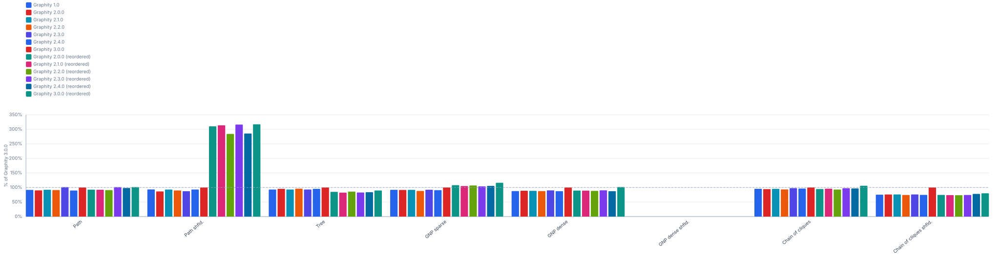

#### Times @ 1M nodes (ms/op, lower is better)

| Shape | Graphity 2.0.0 | Graphity 2.1.0 | Graphity 2.2.0 | Graphity 2.3.0 | Graphity 2.4.0 | Graphity 3.0.0 | Graphity 2.0.0<br>(reordered) | Graphity 2.1.0<br>(reordered) | Graphity 2.2.0<br>(reordered) | Graphity 2.3.0<br>(reordered) | Graphity 2.4.0<br>(reordered) | Graphity 3.0.0<br>(reordered) |
|---|---:|---:|---:|---:|---:|---:|---:|---:|---:|---:|---:|---:|
| GNP sparse<br><sub>1M nodes, 3M edges</sub> | 19.83 ms (1.0×) | 19.65 ms (1.0×) | 20.46 ms (1.1×) | 22.02 ms (1.2×) | 21.33 ms (1.1×) | 19.00 ms | 17.28 ms (0.9×) | 17.28 ms (0.9×) | 17.11 ms (0.9×) | 16.34 ms (0.9×) | 17.79 ms (0.9×) | 17.35 ms (0.9×) |
| GNP dense<br><sub>1M nodes, 30M edges</sub> | 79.11 ms (1.1×) | 67.00 ms (0.9×) | 67.57 ms (1.0×) | 68.75 ms (1.0×) | 81.85 ms (1.2×) | 70.75 ms | — | 69.08 ms (1.0×) | 67.67 ms (1.0×) | 64.90 ms (0.9×) | 66.53 ms (0.9×) | 68.41 ms (1.0×) |
| GNP dense shfld.<br><sub>1M nodes, 30M edges</sub> | 67.63 ms | 66.92 ms | 71.04 ms | — | — | — | 66.60 ms | 67.00 ms | 69.03 ms | — | — | — |
| Chain of cliques<br><sub>1M nodes, 31.1M edges</sub> | 50.35 ms (0.8×) | 50.47 ms (0.8×) | 50.58 ms (0.8×) | 49.23 ms (0.8×) | 50.09 ms (0.8×) | 62.93 ms | — | 50.11 ms (0.8×) | 50.61 ms (0.8×) | 50.53 ms (0.8×) | 49.68 ms (0.8×) | 58.79 ms (0.9×) |

#### Throughput @ 1M nodes (op/s, higher is better)

| Shape | Graphity 2.0.0 | Graphity 2.1.0 | Graphity 2.2.0 | Graphity 2.3.0 | Graphity 2.4.0 | Graphity 3.0.0 | Graphity 2.0.0<br>(reordered) | Graphity 2.1.0<br>(reordered) | Graphity 2.2.0<br>(reordered) | Graphity 2.3.0<br>(reordered) | Graphity 2.4.0<br>(reordered) | Graphity 3.0.0<br>(reordered) |
|---|---:|---:|---:|---:|---:|---:|---:|---:|---:|---:|---:|---:|
| GNP sparse<br><sub>1M nodes, 3M edges</sub> | 50.44 op/s (95.8%) | 50.88 op/s (96.7%) | 48.87 op/s (92.9%) | 45.41 op/s (86.3%) | 46.87 op/s (89.1%) | 52.63 op/s | 57.86 op/s (110%) | 57.86 op/s (110%) | 58.46 op/s (111%) | 61.19 op/s (116%) | 56.21 op/s (107%) | 57.64 op/s (110%) |
| GNP dense<br><sub>1M nodes, 30M edges</sub> | 12.64 op/s (89.4%) | 14.93 op/s (106%) | 14.80 op/s (105%) | 14.55 op/s (103%) | 12.22 op/s (86.4%) | 14.13 op/s | — | 14.48 op/s (102%) | 14.78 op/s (105%) | 15.41 op/s (109%) | 15.03 op/s (106%) | 14.62 op/s (103%) |
| GNP dense shfld.<br><sub>1M nodes, 30M edges</sub> | 14.79 op/s | 14.94 op/s | 14.08 op/s | — | — | — | 15.02 op/s | 14.92 op/s | 14.49 op/s | — | — | — |
| Chain of cliques<br><sub>1M nodes, 31.1M edges</sub> | 19.86 op/s (125%) | 19.82 op/s (125%) | 19.77 op/s (124%) | 20.31 op/s (128%) | 19.96 op/s (126%) | 15.89 op/s | — | 19.96 op/s (126%) | 19.76 op/s (124%) | 19.79 op/s (125%) | 20.13 op/s (127%) | 17.01 op/s (107%) |

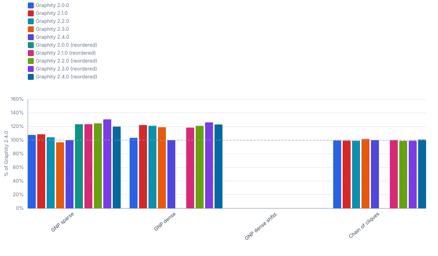

#### Times @ 10M nodes (ms/op, lower is better)

| Shape | Graphity 2.0.0 | Graphity 2.1.0 | Graphity 2.2.0 | Graphity 2.3.0 | Graphity 2.4.0 | Graphity 3.0.0 | Graphity 2.0.0<br>(reordered) | Graphity 2.1.0<br>(reordered) | Graphity 2.2.0<br>(reordered) | Graphity 2.3.0<br>(reordered) | Graphity 2.4.0<br>(reordered) | Graphity 3.0.0<br>(reordered) |
|---|---:|---:|---:|---:|---:|---:|---:|---:|---:|---:|---:|---:|
| GNP sparse<br><sub>10M nodes, 30M edges</sub> | 576.6 ms (1.0×) | 602.9 ms (1.0×) | 615.4 ms (1.0×) | 589.4 ms (1.0×) | 606.4 ms (1.0×) | 589.2 ms | 410.4 ms (0.7×) | 409.6 ms (0.7×) | 445.8 ms (0.8×) | 405.6 ms (0.7×) | 414.4 ms (0.7×) | 364.0 ms (0.6×) |
| GNP dense<br><sub>10M nodes, 299.6M edges</sub> | 4122.2 ms (1.1×) | 4102.7 ms (1.1×) | 4620.4 ms (1.2×) | 3362.6 ms (0.9×) | 3338.5 ms (0.9×) | 3750.7 ms | — | 3844.3 ms (1.0×) | 4435.6 ms (1.2×) | 3218.0 ms (0.9×) | 3229.5 ms (0.9×) | 3694.0 ms (1.0×) |
| GNP dense shfld.<br><sub>10M nodes, 299.6M edges</sub> | 3909.4 ms | 3884.4 ms | 4689.5 ms | — | — | — | 4002.5 ms | 3959.5 ms | 4352.3 ms | — | — | — |
| Chain of cliques<br><sub>10M nodes, 310.8M edges</sub> | 569.9 ms (1.1×) | 550.5 ms (1.0×) | 598.6 ms (1.1×) | 518.4 ms (1.0×) | 522.7 ms (1.0×) | 540.0 ms | — | 595.1 ms (1.1×) | 557.8 ms (1.0×) | 517.2 ms (1.0×) | 521.5 ms (1.0×) | 540.6 ms (1.0×) |

#### Throughput @ 10M nodes (op/s, higher is better)

| Shape | Graphity 2.0.0 | Graphity 2.1.0 | Graphity 2.2.0 | Graphity 2.3.0 | Graphity 2.4.0 | Graphity 3.0.0 | Graphity 2.0.0<br>(reordered) | Graphity 2.1.0<br>(reordered) | Graphity 2.2.0<br>(reordered) | Graphity 2.3.0<br>(reordered) | Graphity 2.4.0<br>(reordered) | Graphity 3.0.0<br>(reordered) |
|---|---:|---:|---:|---:|---:|---:|---:|---:|---:|---:|---:|---:|
| GNP sparse<br><sub>10M nodes, 30M edges</sub> | 1.734 op/s (102%) | 1.659 op/s (97.7%) | 1.625 op/s (95.7%) | 1.697 op/s (100.0%) | 1.649 op/s (97.2%) | 1.697 op/s | 2.437 op/s (144%) | 2.441 op/s (144%) | 2.243 op/s (132%) | 2.465 op/s (145%) | 2.413 op/s (142%) | 2.747 op/s (162%) |
| GNP dense<br><sub>10M nodes, 299.6M edges</sub> | 0.243 op/s (91.0%) | 0.244 op/s (91.4%) | 0.216 op/s (81.2%) | 0.297 op/s (112%) | 0.300 op/s (112%) | 0.267 op/s | — | 0.260 op/s (97.6%) | 0.225 op/s (84.6%) | 0.311 op/s (117%) | 0.310 op/s (116%) | 0.271 op/s (102%) |
| GNP dense shfld.<br><sub>10M nodes, 299.6M edges</sub> | 0.256 op/s | 0.257 op/s | 0.213 op/s | — | — | — | 0.250 op/s | 0.253 op/s | 0.230 op/s | — | — | — |
| Chain of cliques<br><sub>10M nodes, 310.8M edges</sub> | 1.755 op/s (94.8%) | 1.817 op/s (98.1%) | 1.671 op/s (90.2%) | 1.929 op/s (104%) | 1.913 op/s (103%) | 1.852 op/s | — | 1.680 op/s (90.7%) | 1.793 op/s (96.8%) | 1.933 op/s (104%) | 1.918 op/s (104%) | 1.850 op/s (99.9%) |

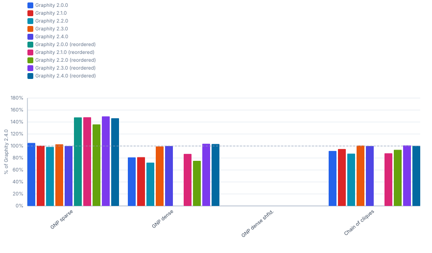

#### Times @ 100M nodes (ms/op, lower is better)

| Shape | Graphity 2.0.0 | Graphity 2.1.0 | Graphity 2.2.0 | Graphity 2.3.0 | Graphity 2.4.0 | Graphity 3.0.0 | Graphity 2.0.0<br>(reordered) | Graphity 2.1.0<br>(reordered) | Graphity 2.2.0<br>(reordered) | Graphity 2.3.0<br>(reordered) | Graphity 2.4.0<br>(reordered) | Graphity 3.0.0<br>(reordered) |
|---|---:|---:|---:|---:|---:|---:|---:|---:|---:|---:|---:|---:|
| GNP sparse<br><sub>100M nodes, 300M edges</sub> | 8479.6 ms (0.8×) | 8563.2 ms (0.8×) | 8594.8 ms (0.8×) | 8738.0 ms (0.9×) | 8837.8 ms (0.9×) | 10160 ms | 6840.6 ms (0.7×) | 6788.3 ms (0.7×) | 6004.0 ms (0.6×) | 7211.5 ms (0.7×) | 7216.7 ms (0.7×) | 6277.9 ms (0.6×) |

#### Throughput @ 100M nodes (op/s, higher is better)

| Shape | Graphity 2.0.0 | Graphity 2.1.0 | Graphity 2.2.0 | Graphity 2.3.0 | Graphity 2.4.0 | Graphity 3.0.0 | Graphity 2.0.0<br>(reordered) | Graphity 2.1.0<br>(reordered) | Graphity 2.2.0<br>(reordered) | Graphity 2.3.0<br>(reordered) | Graphity 2.4.0<br>(reordered) | Graphity 3.0.0<br>(reordered) |
|---|---:|---:|---:|---:|---:|---:|---:|---:|---:|---:|---:|---:|
| GNP sparse<br><sub>100M nodes, 300M edges</sub> | 0.118 op/s (120%) | 0.117 op/s (119%) | 0.116 op/s (118%) | 0.114 op/s (116%) | 0.113 op/s (115%) | 0.098 op/s | 0.146 op/s (149%) | 0.147 op/s (150%) | 0.167 op/s (169%) | 0.139 op/s (141%) | 0.139 op/s (141%) | 0.159 op/s (162%) |

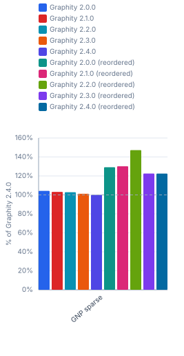

### 1.7 Condense

#### Times @ 1k nodes (ms/op, lower is better)

| Shape | Graphity 2.1.0 | Graphity 2.2.0 | Graphity 2.3.0 | Graphity 2.4.0 | Graphity 3.0.0 |
|---|---:|---:|---:|---:|---:|
| Path<br><sub>1k nodes, 1k edges</sub> | 0.011 ms (1.1×) | 0.011 ms (1.1×) | 0.010 ms (1.0×) | 0.010 ms (1.0×) | 0.010 ms |
| GNP dense<br><sub>1k nodes, 30k edges</sub> | 0.007 ms (1.0×) | 0.008 ms (1.1×) | 0.007 ms (1.0×) | 0.007 ms (1.0×) | 0.007 ms |
| Chain of cliques<br><sub>1k nodes, 31.1k edges</sub> | 0.024 ms (1.1×) | 0.024 ms (1.1×) | 0.021 ms (1.0×) | 0.022 ms (1.0×) | 0.021 ms |
| DAG GNP sparse | 0.017 ms (1.0×) | 0.017 ms (1.0×) | 0.016 ms (0.9×) | 0.017 ms (1.0×) | 0.017 ms |

#### Throughput @ 1k nodes (op/s, higher is better)

| Shape | Graphity 2.1.0 | Graphity 2.2.0 | Graphity 2.3.0 | Graphity 2.4.0 | Graphity 3.0.0 |
|---|---:|---:|---:|---:|---:|
| Path<br><sub>1k nodes, 1k edges</sub> | 90 909 op/s (90.9%) | 90 909 op/s (90.9%) | 100 000 op/s (100%) | 100 000 op/s (100%) | 100 000 op/s |
| GNP dense<br><sub>1k nodes, 30k edges</sub> | 142 857 op/s (100%) | 125 000 op/s (87.5%) | 142 857 op/s (100%) | 142 857 op/s (100%) | 142 857 op/s |
| Chain of cliques<br><sub>1k nodes, 31.1k edges</sub> | 41 667 op/s (87.5%) | 41 667 op/s (87.5%) | 47 619 op/s (100%) | 45 455 op/s (95.5%) | 47 619 op/s |
| DAG GNP sparse | 58 824 op/s (100%) | 58 824 op/s (100%) | 62 500 op/s (106%) | 58 824 op/s (100%) | 58 824 op/s |

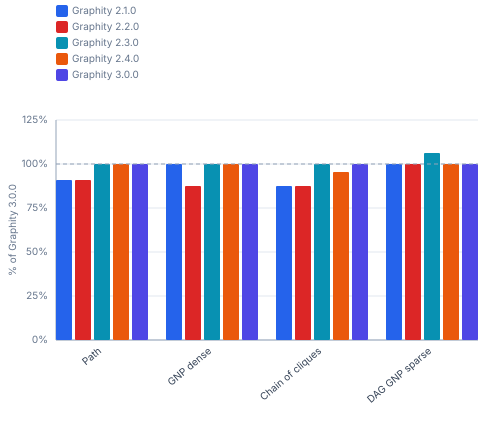

#### Times @ 10k nodes (ms/op, lower is better)

| Shape | Graphity 2.1.0 | Graphity 2.2.0 | Graphity 2.3.0 | Graphity 2.4.0 | Graphity 3.0.0 |
|---|---:|---:|---:|---:|---:|
| Path<br><sub>10k nodes, 10k edges</sub> | 0.080 ms (1.0×) | 0.080 ms (1.0×) | 0.080 ms (1.0×) | 0.081 ms (1.0×) | 0.080 ms |
| GNP dense<br><sub>10k nodes, 299.6k edges</sub> | 0.099 ms (1.3×) | 0.092 ms (1.2×) | 0.098 ms (1.2×) | 0.098 ms (1.2×) | 0.079 ms |
| Chain of cliques<br><sub>10k nodes, 310.8k edges</sub> | 0.182 ms (0.9×) | 0.185 ms (0.9×) | 0.200 ms (1.0×) | 0.201 ms (1.0×) | 0.199 ms |
| DAG GNP sparse | 0.256 ms (1.0×) | 0.261 ms (1.0×) | 0.261 ms (1.0×) | 0.261 ms (1.0×) | 0.251 ms |

#### Throughput @ 10k nodes (op/s, higher is better)

| Shape | Graphity 2.1.0 | Graphity 2.2.0 | Graphity 2.3.0 | Graphity 2.4.0 | Graphity 3.0.0 |
|---|---:|---:|---:|---:|---:|
| Path<br><sub>10k nodes, 10k edges</sub> | 12 500 op/s (100%) | 12 500 op/s (100%) | 12 500 op/s (100%) | 12 346 op/s (98.8%) | 12 500 op/s |
| GNP dense<br><sub>10k nodes, 299.6k edges</sub> | 10 101 op/s (79.8%) | 10 870 op/s (85.9%) | 10 204 op/s (80.6%) | 10 204 op/s (80.6%) | 12 658 op/s |
| Chain of cliques<br><sub>10k nodes, 310.8k edges</sub> | 5 495 op/s (109%) | 5 405 op/s (108%) | 5 000 op/s (99.5%) | 4 975 op/s (99.0%) | 5 025 op/s |
| DAG GNP sparse | 3 906 op/s (98.0%) | 3 831 op/s (96.2%) | 3 831 op/s (96.2%) | 3 831 op/s (96.2%) | 3 984 op/s |

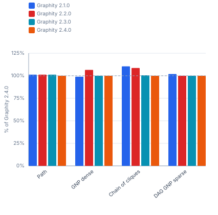

#### Times @ 100k nodes (ms/op, lower is better)

| Shape | Graphity 2.1.0 | Graphity 2.2.0 | Graphity 2.3.0 | Graphity 2.4.0 | Graphity 3.0.0 |
|---|---:|---:|---:|---:|---:|
| Path<br><sub>100k nodes, 100k edges</sub> | 0.772 ms (1.0×) | 0.768 ms (1.0×) | 0.764 ms (1.0×) | 0.758 ms (1.0×) | 0.761 ms |
| GNP dense<br><sub>100k nodes, 3M edges</sub> | 1.523 ms (1.0×) | 1.591 ms (1.0×) | 1.572 ms (1.0×) | 1.642 ms (1.1×) | 1.555 ms |
| Chain of cliques<br><sub>100k nodes, 3.1M edges</sub> | 1.722 ms (0.8×) | 1.852 ms (0.8×) | 1.908 ms (0.8×) | 2.038 ms (0.9×) | 2.290 ms |
| DAG GNP sparse | 3.542 ms (1.0×) | 3.641 ms (1.1×) | 3.590 ms (1.0×) | 3.603 ms (1.0×) | 3.467 ms |

#### Throughput @ 100k nodes (op/s, higher is better)

| Shape | Graphity 2.1.0 | Graphity 2.2.0 | Graphity 2.3.0 | Graphity 2.4.0 | Graphity 3.0.0 |
|---|---:|---:|---:|---:|---:|
| Path<br><sub>100k nodes, 100k edges</sub> | 1 295 op/s (98.6%) | 1 302 op/s (99.1%) | 1 309 op/s (99.6%) | 1 319 op/s (100%) | 1 314 op/s |
| GNP dense<br><sub>100k nodes, 3M edges</sub> | 656.6 op/s (102%) | 628.5 op/s (97.7%) | 636.1 op/s (98.9%) | 609.0 op/s (94.7%) | 643.1 op/s |
| Chain of cliques<br><sub>100k nodes, 3.1M edges</sub> | 580.7 op/s (133%) | 540.0 op/s (124%) | 524.1 op/s (120%) | 490.7 op/s (112%) | 436.7 op/s |
| DAG GNP sparse | 282.3 op/s (97.9%) | 274.6 op/s (95.2%) | 278.6 op/s (96.6%) | 277.5 op/s (96.2%) | 288.4 op/s |

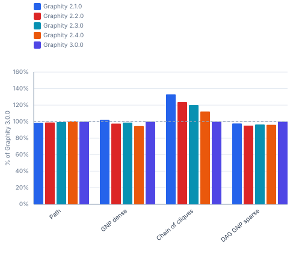

### 1.8 TopOrder

#### Times @ 10k nodes (ms/op, lower is better)

| Shape | Graphity 1.0 | Graphity 2.0.0 | Graphity 2.1.0 | Graphity 2.2.0 | Graphity 2.3.0 | Graphity 2.4.0 | Graphity 3.0.0 | Graphity 2.0.0<br>(reordered) | Graphity 2.1.0<br>(reordered) | Graphity 2.2.0<br>(reordered) | Graphity 2.3.0<br>(reordered) | Graphity 2.4.0<br>(reordered) | Graphity 3.0.0<br>(reordered) |
|---|---:|---:|---:|---:|---:|---:|---:|---:|---:|---:|---:|---:|---:|
| Path<br><sub>10k nodes, 10k edges</sub> | 0.058 ms (0.9×) | 0.067 ms (1.0×) | 0.058 ms (0.9×) | 0.067 ms (1.0×) | 0.063 ms (1.0×) | 0.062 ms (1.0×) | 0.064 ms | 0.067 ms (1.0×) | 0.066 ms (1.0×) | 0.067 ms (1.0×) | 0.066 ms (1.0×) | 0.054 ms (0.8×) | 0.060 ms (0.9×) |
| Path shfld.<br><sub>10k nodes, 10k edges</sub> | 0.099 ms (1.5×) | 0.072 ms (1.1×) | 0.070 ms (1.1×) | 0.070 ms (1.1×) | 0.070 ms (1.1×) | 0.066 ms (1.0×) | 0.064 ms | 0.056 ms (0.9×) | 0.052 ms (0.8×) | 0.052 ms (0.8×) | 0.052 ms (0.8×) | 0.055 ms (0.9×) | 0.054 ms (0.8×) |
| Tree<br><sub>10k nodes, 10k edges</sub> | 0.198 ms (3.6×) | 0.044 ms (0.8×) | 0.056 ms (1.0×) | 0.049 ms (0.9×) | 0.055 ms (1.0×) | 0.058 ms (1.1×) | 0.055 ms | 0.039 ms (0.7×) | 0.053 ms (1.0×) | 0.037 ms (0.7×) | 0.044 ms (0.8×) | 0.051 ms (0.9×) | 0.050 ms (0.9×) |
| Tree shfld. | 0.088 ms (1.7×) | 0.052 ms (1.0×) | 0.050 ms (0.9×) | 0.050 ms (0.9×) | 0.050 ms (0.9×) | 0.053 ms (1.0×) | 0.053 ms | 0.047 ms (0.9×) | 0.047 ms (0.9×) | 0.047 ms (0.9×) | 0.046 ms (0.9×) | 0.048 ms (0.9×) | 0.047 ms (0.9×) |
| DAG GNP sparse | 0.279 ms (3.7×) | 0.070 ms (0.9×) | 0.084 ms (1.1×) | 0.074 ms (1.0×) | 0.078 ms (1.0×) | 0.077 ms (1.0×) | 0.075 ms | 0.061 ms (0.8×) | 0.067 ms (0.9×) | 0.064 ms (0.9×) | 0.064 ms (0.9×) | 0.067 ms (0.9×) | 0.067 ms (0.9×) |
| DAG GNP dense | 0.448 ms (1.3×) | 0.337 ms (1.0×) | 0.324 ms (1.0×) | 0.324 ms (1.0×) | 0.326 ms (1.0×) | 0.336 ms (1.0×) | 0.333 ms | 0.245 ms (0.7×) | 0.243 ms (0.7×) | 0.245 ms (0.7×) | 0.239 ms (0.7×) | 0.256 ms (0.8×) | 0.253 ms (0.8×) |
| DAG GNP dense shfld. | 0.560 ms (1.5×) | 0.387 ms (1.0×) | 0.371 ms (1.0×) | 0.366 ms (1.0×) | 0.382 ms (1.0×) | 0.378 ms (1.0×) | 0.377 ms | 0.244 ms (0.6×) | 0.233 ms (0.6×) | 0.246 ms (0.7×) | 0.243 ms (0.6×) | 0.267 ms (0.7×) | 0.249 ms (0.7×) |

#### Throughput @ 10k nodes (op/s, higher is better)

| Shape | Graphity 1.0 | Graphity 2.0.0 | Graphity 2.1.0 | Graphity 2.2.0 | Graphity 2.3.0 | Graphity 2.4.0 | Graphity 3.0.0 | Graphity 2.0.0<br>(reordered) | Graphity 2.1.0<br>(reordered) | Graphity 2.2.0<br>(reordered) | Graphity 2.3.0<br>(reordered) | Graphity 2.4.0<br>(reordered) | Graphity 3.0.0<br>(reordered) |
|---|---:|---:|---:|---:|---:|---:|---:|---:|---:|---:|---:|---:|---:|
| Path<br><sub>10k nodes, 10k edges</sub> | 17 241 op/s (110%) | 14 925 op/s (95.5%) | 17 241 op/s (110%) | 14 925 op/s (95.5%) | 15 873 op/s (102%) | 16 129 op/s (103%) | 15 625 op/s | 14 925 op/s (95.5%) | 15 152 op/s (97.0%) | 14 925 op/s (95.5%) | 15 152 op/s (97.0%) | 18 519 op/s (119%) | 16 667 op/s (107%) |
| Path shfld.<br><sub>10k nodes, 10k edges</sub> | 10 101 op/s (64.6%) | 13 889 op/s (88.9%) | 14 286 op/s (91.4%) | 14 286 op/s (91.4%) | 14 286 op/s (91.4%) | 15 152 op/s (97.0%) | 15 625 op/s | 17 857 op/s (114%) | 19 231 op/s (123%) | 19 231 op/s (123%) | 19 231 op/s (123%) | 18 182 op/s (116%) | 18 519 op/s (119%) |
| Tree<br><sub>10k nodes, 10k edges</sub> | 5 051 op/s (27.8%) | 22 727 op/s (125%) | 17 857 op/s (98.2%) | 20 408 op/s (112%) | 18 182 op/s (100%) | 17 241 op/s (94.8%) | 18 182 op/s | 25 641 op/s (141%) | 18 868 op/s (104%) | 27 027 op/s (149%) | 22 727 op/s (125%) | 19 608 op/s (108%) | 20 000 op/s (110%) |
| Tree shfld. | 11 364 op/s (60.2%) | 19 231 op/s (102%) | 20 000 op/s (106%) | 20 000 op/s (106%) | 20 000 op/s (106%) | 18 868 op/s (100%) | 18 868 op/s | 21 277 op/s (113%) | 21 277 op/s (113%) | 21 277 op/s (113%) | 21 739 op/s (115%) | 20 833 op/s (110%) | 21 277 op/s (113%) |
| DAG GNP sparse | 3 584 op/s (26.9%) | 14 286 op/s (107%) | 11 905 op/s (89.3%) | 13 514 op/s (101%) | 12 821 op/s (96.2%) | 12 987 op/s (97.4%) | 13 333 op/s | 16 393 op/s (123%) | 14 925 op/s (112%) | 15 625 op/s (117%) | 15 625 op/s (117%) | 14 925 op/s (112%) | 14 925 op/s (112%) |
| DAG GNP dense | 2 232 op/s (74.3%) | 2 967 op/s (98.8%) | 3 086 op/s (103%) | 3 086 op/s (103%) | 3 067 op/s (102%) | 2 976 op/s (99.1%) | 3 003 op/s | 4 082 op/s (136%) | 4 115 op/s (137%) | 4 082 op/s (136%) | 4 184 op/s (139%) | 3 906 op/s (130%) | 3 953 op/s (132%) |
| DAG GNP dense shfld. | 1 786 op/s (67.3%) | 2 584 op/s (97.4%) | 2 695 op/s (102%) | 2 732 op/s (103%) | 2 618 op/s (98.7%) | 2 646 op/s (99.7%) | 2 653 op/s | 4 098 op/s (155%) | 4 292 op/s (162%) | 4 065 op/s (153%) | 4 115 op/s (155%) | 3 745 op/s (141%) | 4 016 op/s (151%) |

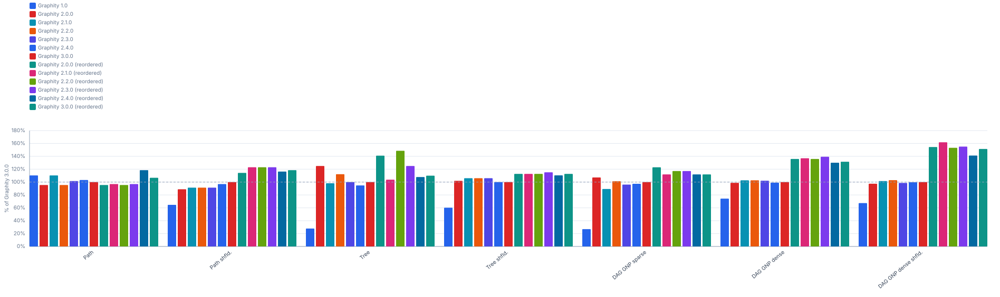

#### Times @ 100k nodes (ms/op, lower is better)

| Shape | Graphity 1.0 | Graphity 2.0.0 | Graphity 2.1.0 | Graphity 2.2.0 | Graphity 2.3.0 | Graphity 2.4.0 | Graphity 3.0.0 | Graphity 2.0.0<br>(reordered) | Graphity 2.1.0<br>(reordered) | Graphity 2.2.0<br>(reordered) | Graphity 2.3.0<br>(reordered) | Graphity 2.4.0<br>(reordered) | Graphity 3.0.0<br>(reordered) |
|---|---:|---:|---:|---:|---:|---:|---:|---:|---:|---:|---:|---:|---:|
| Path<br><sub>100k nodes, 100k edges</sub> | 0.539 ms (0.9×) | 0.656 ms (1.2×) | 0.632 ms (1.1×) | 0.632 ms (1.1×) | 0.631 ms (1.1×) | 0.524 ms (0.9×) | 0.568 ms | 0.662 ms (1.2×) | 0.629 ms (1.1×) | 0.628 ms (1.1×) | 0.631 ms (1.1×) | 0.580 ms (1.0×) | 0.614 ms (1.1×) |
| Path shfld.<br><sub>100k nodes, 100k edges</sub> | 1.287 ms (1.2×) | 1.051 ms (1.0×) | 0.964 ms (0.9×) | 1.068 ms (1.0×) | 1.080 ms (1.0×) | 1.101 ms (1.0×) | 1.057 ms | 0.566 ms (0.5×) | 0.521 ms (0.5×) | 0.528 ms (0.5×) | 0.520 ms (0.5×) | 0.665 ms (0.6×) | 0.641 ms (0.6×) |
| Tree<br><sub>100k nodes, 100k edges</sub> | 9.963 ms (8.9×) | 1.311 ms (1.2×) | 1.440 ms (1.3×) | 1.426 ms (1.3×) | 1.175 ms (1.1×) | 1.191 ms (1.1×) | 1.116 ms | 1.023 ms (0.9×) | 1.142 ms (1.0×) | 1.182 ms (1.1×) | 1.128 ms (1.0×) | 0.924 ms (0.8×) | 0.882 ms (0.8×) |
| Tree shfld. | 5.091 ms (4.0×) | 1.487 ms (1.2×) | 1.475 ms (1.2×) | 1.479 ms (1.2×) | 1.473 ms (1.2×) | 1.303 ms (1.0×) | 1.280 ms | 1.212 ms (0.9×) | 1.242 ms (1.0×) | 1.255 ms (1.0×) | 1.236 ms (1.0×) | 1.099 ms (0.9×) | 1.097 ms (0.9×) |
| DAG GNP sparse | 9.521 ms (4.5×) | 2.251 ms (1.1×) | 2.201 ms (1.0×) | 2.242 ms (1.1×) | 2.269 ms (1.1×) | 2.185 ms (1.0×) | 2.135 ms | 1.480 ms (0.7×) | 1.470 ms (0.7×) | 1.499 ms (0.7×) | 1.442 ms (0.7×) | 1.394 ms (0.7×) | 1.384 ms (0.6×) |
| DAG GNP dense | 6.487 ms (1.5×) | 4.533 ms (1.0×) | 4.333 ms (1.0×) | 4.515 ms (1.0×) | 4.475 ms (1.0×) | 5.141 ms (1.2×) | 4.424 ms | 3.208 ms (0.7×) | 3.086 ms (0.7×) | 3.127 ms (0.7×) | 3.041 ms (0.7×) | 3.204 ms (0.7×) | 3.166 ms (0.7×) |
| DAG GNP dense shfld. | 8.053 ms (1.6×) | 5.303 ms (1.0×) | 5.127 ms (1.0×) | 5.063 ms (1.0×) | 5.321 ms (1.0×) | 5.836 ms (1.1×) | 5.096 ms | 3.254 ms (0.6×) | 3.085 ms (0.6×) | 3.173 ms (0.6×) | 3.130 ms (0.6×) | 3.309 ms (0.6×) | 3.237 ms (0.6×) |

#### Throughput @ 100k nodes (op/s, higher is better)

| Shape | Graphity 1.0 | Graphity 2.0.0 | Graphity 2.1.0 | Graphity 2.2.0 | Graphity 2.3.0 | Graphity 2.4.0 | Graphity 3.0.0 | Graphity 2.0.0<br>(reordered) | Graphity 2.1.0<br>(reordered) | Graphity 2.2.0<br>(reordered) | Graphity 2.3.0<br>(reordered) | Graphity 2.4.0<br>(reordered) | Graphity 3.0.0<br>(reordered) |
|---|---:|---:|---:|---:|---:|---:|---:|---:|---:|---:|---:|---:|---:|
| Path<br><sub>100k nodes, 100k edges</sub> | 1 855 op/s (105%) | 1 524 op/s (86.6%) | 1 582 op/s (89.9%) | 1 582 op/s (89.9%) | 1 585 op/s (90.0%) | 1 908 op/s (108%) | 1 761 op/s | 1 511 op/s (85.8%) | 1 590 op/s (90.3%) | 1 592 op/s (90.4%) | 1 585 op/s (90.0%) | 1 724 op/s (97.9%) | 1 629 op/s (92.5%) |
| Path shfld.<br><sub>100k nodes, 100k edges</sub> | 777.0 op/s (82.1%) | 951.5 op/s (101%) | 1 037 op/s (110%) | 936.3 op/s (99.0%) | 925.9 op/s (97.9%) | 908.3 op/s (96.0%) | 946.1 op/s | 1 767 op/s (187%) | 1 919 op/s (203%) | 1 894 op/s (200%) | 1 923 op/s (203%) | 1 504 op/s (159%) | 1 560 op/s (165%) |
| Tree<br><sub>100k nodes, 100k edges</sub> | 100.4 op/s (11.2%) | 762.8 op/s (85.1%) | 694.4 op/s (77.5%) | 701.3 op/s (78.3%) | 851.1 op/s (95.0%) | 839.6 op/s (93.7%) | 896.1 op/s | 977.5 op/s (109%) | 875.7 op/s (97.7%) | 846.0 op/s (94.4%) | 886.5 op/s (98.9%) | 1 082 op/s (121%) | 1 134 op/s (127%) |
| Tree shfld. | 196.4 op/s (25.1%) | 672.5 op/s (86.1%) | 678.0 op/s (86.8%) | 676.1 op/s (86.5%) | 678.9 op/s (86.9%) | 767.5 op/s (98.2%) | 781.2 op/s | 825.1 op/s (106%) | 805.2 op/s (103%) | 796.8 op/s (102%) | 809.1 op/s (104%) | 909.9 op/s (116%) | 911.6 op/s (117%) |
| DAG GNP sparse | 105.0 op/s (22.4%) | 444.2 op/s (94.8%) | 454.3 op/s (97.0%) | 446.0 op/s (95.2%) | 440.7 op/s (94.1%) | 457.7 op/s (97.7%) | 468.4 op/s | 675.7 op/s (144%) | 680.3 op/s (145%) | 667.1 op/s (142%) | 693.5 op/s (148%) | 717.4 op/s (153%) | 722.5 op/s (154%) |
| DAG GNP dense | 154.2 op/s (68.2%) | 220.6 op/s (97.6%) | 230.8 op/s (102%) | 221.5 op/s (98.0%) | 223.5 op/s (98.9%) | 194.5 op/s (86.1%) | 226.0 op/s | 311.7 op/s (138%) | 324.0 op/s (143%) | 319.8 op/s (141%) | 328.8 op/s (145%) | 312.1 op/s (138%) | 315.9 op/s (140%) |
| DAG GNP dense shfld. | 124.2 op/s (63.3%) | 188.6 op/s (96.1%) | 195.0 op/s (99.4%) | 197.5 op/s (101%) | 187.9 op/s (95.8%) | 171.4 op/s (87.3%) | 196.2 op/s | 307.3 op/s (157%) | 324.1 op/s (165%) | 315.2 op/s (161%) | 319.5 op/s (163%) | 302.2 op/s (154%) | 308.9 op/s (157%) |

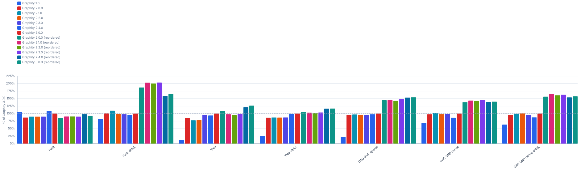

#### Times @ 1M nodes (ms/op, lower is better)

| Shape | Graphity 2.0.0 | Graphity 2.1.0 | Graphity 2.2.0 | Graphity 2.3.0 | Graphity 2.4.0 | Graphity 3.0.0 | Graphity 2.0.0<br>(reordered) | Graphity 2.1.0<br>(reordered) | Graphity 2.2.0<br>(reordered) | Graphity 2.3.0<br>(reordered) | Graphity 2.4.0<br>(reordered) | Graphity 3.0.0<br>(reordered) |
|---|---:|---:|---:|---:|---:|---:|---:|---:|---:|---:|---:|---:|
| DAG GNP sparse | 30.49 ms (1.0×) | 30.46 ms (1.0×) | 31.70 ms (1.1×) | 33.89 ms (1.1×) | 40.37 ms (1.4×) | 29.61 ms | 15.46 ms (0.5×) | 14.97 ms (0.5×) | 15.34 ms (0.5×) | 14.76 ms (0.5×) | 14.15 ms (0.5×) | 14.00 ms (0.5×) |
| DAG GNP dense | 103.7 ms (1.0×) | 103.6 ms (1.0×) | 106.4 ms (1.0×) | 104.2 ms (1.0×) | 119.5 ms (1.2×) | 103.3 ms | — | 37.35 ms (0.4×) | 38.21 ms (0.4×) | 38.09 ms (0.4×) | 39.13 ms (0.4×) | 38.34 ms (0.4×) |
| DAG GNP dense shfld. | 176.2 ms (1.0×) | 173.5 ms (1.0×) | 177.6 ms (1.0×) | 178.7 ms (1.0×) | 197.0 ms (1.1×) | 173.6 ms | 39.69 ms (0.2×) | 38.60 ms (0.2×) | 39.11 ms (0.2×) | 38.93 ms (0.2×) | 42.15 ms (0.2×) | 38.09 ms (0.2×) |

#### Throughput @ 1M nodes (op/s, higher is better)

| Shape | Graphity 2.0.0 | Graphity 2.1.0 | Graphity 2.2.0 | Graphity 2.3.0 | Graphity 2.4.0 | Graphity 3.0.0 | Graphity 2.0.0<br>(reordered) | Graphity 2.1.0<br>(reordered) | Graphity 2.2.0<br>(reordered) | Graphity 2.3.0<br>(reordered) | Graphity 2.4.0<br>(reordered) | Graphity 3.0.0<br>(reordered) |
|---|---:|---:|---:|---:|---:|---:|---:|---:|---:|---:|---:|---:|
| DAG GNP sparse | 32.80 op/s (97.1%) | 32.83 op/s (97.2%) | 31.55 op/s (93.4%) | 29.51 op/s (87.4%) | 24.77 op/s (73.3%) | 33.78 op/s | 64.68 op/s (192%) | 66.82 op/s (198%) | 65.18 op/s (193%) | 67.77 op/s (201%) | 70.69 op/s (209%) | 71.42 op/s (211%) |
| DAG GNP dense | 9.643 op/s (99.6%) | 9.653 op/s (99.7%) | 9.398 op/s (97.1%) | 9.597 op/s (99.1%) | 8.368 op/s (86.4%) | 9.681 op/s | — | 26.77 op/s (277%) | 26.17 op/s (270%) | 26.25 op/s (271%) | 25.56 op/s (264%) | 26.09 op/s (269%) |
| DAG GNP dense shfld. | 5.675 op/s (98.5%) | 5.764 op/s (100%) | 5.631 op/s (97.7%) | 5.596 op/s (97.1%) | 5.076 op/s (88.1%) | 5.760 op/s | 25.20 op/s (437%) | 25.90 op/s (450%) | 25.57 op/s (444%) | 25.69 op/s (446%) | 23.73 op/s (412%) | 26.25 op/s (456%) |

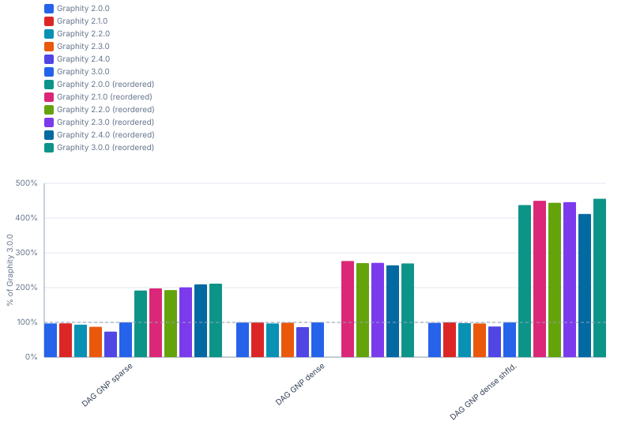

#### Times @ 10M nodes (ms/op, lower is better)

| Shape | Graphity 2.0.0 | Graphity 2.1.0 | Graphity 2.2.0 | Graphity 2.3.0 | Graphity 2.4.0 | Graphity 3.0.0 | Graphity 2.0.0<br>(reordered) | Graphity 2.1.0<br>(reordered) | Graphity 2.2.0<br>(reordered) | Graphity 2.3.0<br>(reordered) | Graphity 2.4.0<br>(reordered) | Graphity 3.0.0<br>(reordered) |
|---|---:|---:|---:|---:|---:|---:|---:|---:|---:|---:|---:|---:|
| DAG GNP sparse | 1170.9 ms (1.0×) | 1145.1 ms (1.0×) | 1241.1 ms (1.1×) | 1133.7 ms (1.0×) | 1145.6 ms (1.0×) | 1120.6 ms | 160.8 ms (0.1×) | 156.7 ms (0.1×) | 163.7 ms (0.1×) | 154.0 ms (0.1×) | 157.0 ms (0.1×) | 159.8 ms (0.1×) |
| DAG GNP dense | 1966.4 ms (1.0×) | 1890.5 ms (1.0×) | 2005.5 ms (1.0×) | 1935.8 ms (1.0×) | 1964.4 ms (1.0×) | 1919.6 ms | — | 450.2 ms (0.2×) | 466.3 ms (0.2×) | 466.2 ms (0.2×) | 515.7 ms (0.3×) | 505.2 ms (0.3×) |
| DAG GNP dense shfld. | 2823.5 ms (1.0×) | 2805.5 ms (1.0×) | 2927.1 ms (1.1×) | 2829.4 ms (1.1×) | 2712.5 ms (1.0×) | 2694.5 ms | 414.3 ms (0.2×) | 405.1 ms (0.2×) | 418.1 ms (0.2×) | 429.6 ms (0.2×) | 420.8 ms (0.2×) | 414.3 ms (0.2×) |

#### Throughput @ 10M nodes (op/s, higher is better)

| Shape | Graphity 2.0.0 | Graphity 2.1.0 | Graphity 2.2.0 | Graphity 2.3.0 | Graphity 2.4.0 | Graphity 3.0.0 | Graphity 2.0.0<br>(reordered) | Graphity 2.1.0<br>(reordered) | Graphity 2.2.0<br>(reordered) | Graphity 2.3.0<br>(reordered) | Graphity 2.4.0<br>(reordered) | Graphity 3.0.0<br>(reordered) |
|---|---:|---:|---:|---:|---:|---:|---:|---:|---:|---:|---:|---:|
| DAG GNP sparse | 0.854 op/s (95.7%) | 0.873 op/s (97.9%) | 0.806 op/s (90.3%) | 0.882 op/s (98.8%) | 0.873 op/s (97.8%) | 0.892 op/s | 6.219 op/s (697%) | 6.382 op/s (715%) | 6.109 op/s (685%) | 6.494 op/s (728%) | 6.369 op/s (714%) | 6.258 op/s (701%) |
| DAG GNP dense | 0.509 op/s (97.6%) | 0.529 op/s (102%) | 0.499 op/s (95.7%) | 0.517 op/s (99.2%) | 0.509 op/s (97.7%) | 0.521 op/s | — | 2.221 op/s (426%) | 2.145 op/s (412%) | 2.145 op/s (412%) | 1.939 op/s (372%) | 1.979 op/s (380%) |
| DAG GNP dense shfld. | 0.354 op/s (95.4%) | 0.356 op/s (96.0%) | 0.342 op/s (92.1%) | 0.353 op/s (95.2%) | 0.369 op/s (99.3%) | 0.371 op/s | 2.414 op/s (650%) | 2.469 op/s (665%) | 2.392 op/s (644%) | 2.328 op/s (627%) | 2.376 op/s (640%) | 2.414 op/s (650%) |

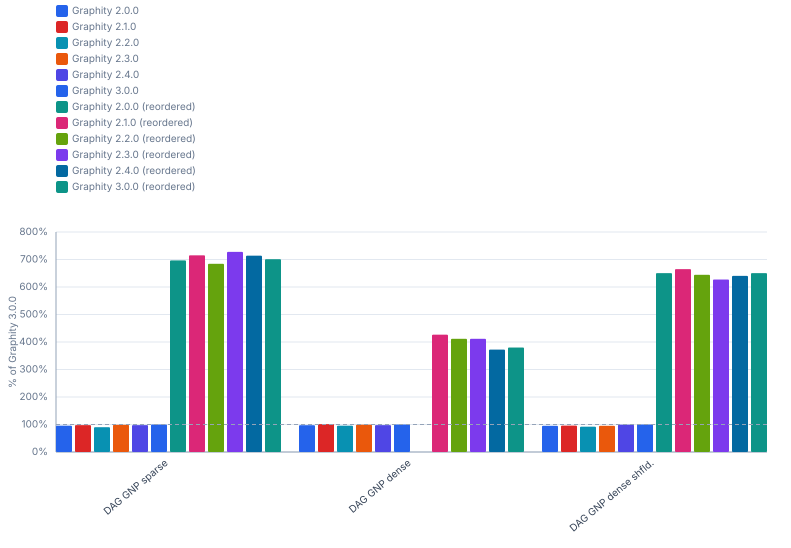

#### Times @ 100M nodes (ms/op, lower is better)

| Shape | Graphity 2.0.0 | Graphity 2.1.0 | Graphity 2.2.0 | Graphity 2.3.0 | Graphity 2.4.0 | Graphity 3.0.0 | Graphity 2.0.0<br>(reordered) | Graphity 2.1.0<br>(reordered) | Graphity 2.2.0<br>(reordered) | Graphity 2.3.0<br>(reordered) | Graphity 2.4.0<br>(reordered) | Graphity 3.0.0<br>(reordered) |
|---|---:|---:|---:|---:|---:|---:|---:|---:|---:|---:|---:|---:|
| DAG GNP sparse | 17135 ms (1.0×) | 17065 ms (1.0×) | 18079 ms (1.1×) | 16836 ms (1.0×) | 16683 ms (1.0×) | 16414 ms | 1810.4 ms (0.1×) | 1759.8 ms (0.1×) | 1855.1 ms (0.1×) | 1845.1 ms (0.1×) | 1719.5 ms (0.1×) | 1730.7 ms (0.1×) |

#### Throughput @ 100M nodes (op/s, higher is better)

| Shape | Graphity 2.0.0 | Graphity 2.1.0 | Graphity 2.2.0 | Graphity 2.3.0 | Graphity 2.4.0 | Graphity 3.0.0 | Graphity 2.0.0<br>(reordered) | Graphity 2.1.0<br>(reordered) | Graphity 2.2.0<br>(reordered) | Graphity 2.3.0<br>(reordered) | Graphity 2.4.0<br>(reordered) | Graphity 3.0.0<br>(reordered) |
|---|---:|---:|---:|---:|---:|---:|---:|---:|---:|---:|---:|---:|
| DAG GNP sparse | 0.058 op/s (95.8%) | 0.059 op/s (96.2%) | 0.055 op/s (90.8%) | 0.059 op/s (97.5%) | 0.060 op/s (98.4%) | 0.061 op/s | 0.552 op/s (907%) | 0.568 op/s (933%) | 0.539 op/s (885%) | 0.542 op/s (890%) | 0.582 op/s (955%) | 0.578 op/s (948%) |

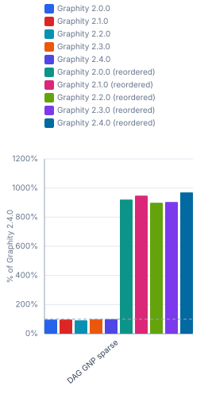

### 1.9 TopOrderAndLevels

#### Times @ 10k nodes (ms/op, lower is better)

| Shape | Graphity 1.0 | Graphity 2.0.0 | Graphity 2.1.0 | Graphity 2.2.0 | Graphity 2.3.0 | Graphity 2.4.0 | Graphity 3.0.0 | Graphity 2.0.0<br>(reordered) | Graphity 2.1.0<br>(reordered) | Graphity 2.2.0<br>(reordered) | Graphity 2.3.0<br>(reordered) | Graphity 2.4.0<br>(reordered) | Graphity 3.0.0<br>(reordered) | Graphity 2.1.0<br>(bi-adjacent) | Graphity 2.2.0<br>(bi-adjacent) | Graphity 2.3.0<br>(bi-adjacent) | Graphity 2.4.0<br>(bi-adjacent) | Graphity 3.0.0<br>(bi-adjacent) |
|---|---:|---:|---:|---:|---:|---:|---:|---:|---:|---:|---:|---:|---:|---:|---:|---:|---:|---:|
| Path<br><sub>10k nodes, 10k edges</sub> | 0.039 ms (1.0×) | 0.039 ms (1.0×) | 0.040 ms (1.0×) | 0.039 ms (1.0×) | 0.040 ms (1.0×) | 0.040 ms (1.0×) | 0.039 ms | 0.037 ms (0.9×) | 0.040 ms (1.0×) | 0.039 ms (1.0×) | 0.039 ms (1.0×) | 0.040 ms (1.0×) | 0.039 ms (1.0×) | 0.041 ms (1.1×) | 0.041 ms (1.1×) | 0.040 ms (1.0×) | 0.041 ms (1.1×) | 0.039 ms (1.0×) |
| Path shfld.<br><sub>10k nodes, 10k edges</sub> | 0.055 ms (1.0×) | 0.056 ms (1.0×) | 0.056 ms (1.0×) | 0.057 ms (1.0×) | 0.056 ms (1.0×) | 0.056 ms (1.0×) | 0.056 ms | 0.038 ms (0.7×) | 0.040 ms (0.7×) | 0.040 ms (0.7×) | 0.039 ms (0.7×) | 0.040 ms (0.7×) | 0.040 ms (0.7×) | 0.054 ms (1.0×) | 0.055 ms (1.0×) | 0.054 ms (1.0×) | 0.055 ms (1.0×) | 0.054 ms (1.0×) |
| Tree<br><sub>10k nodes, 10k edges</sub> | 0.031 ms (1.0×) | 0.031 ms (1.0×) | 0.034 ms (1.1×) | 0.035 ms (1.2×) | 0.031 ms (1.0×) | 0.035 ms (1.2×) | 0.030 ms | 0.030 ms (1.0×) | 0.027 ms (0.9×) | 0.031 ms (1.0×) | 0.031 ms (1.0×) | 0.028 ms (0.9×) | 0.030 ms (1.0×) | 0.028 ms (0.9×) | 0.029 ms (1.0×) | 0.028 ms (0.9×) | 0.030 ms (1.0×) | 0.028 ms (0.9×) |
| Tree shfld. | 0.034 ms (1.1×) | 0.031 ms (1.0×) | 0.034 ms (1.1×) | 0.032 ms (1.0×) | 0.031 ms (1.0×) | 0.035 ms (1.1×) | 0.031 ms | 0.031 ms (1.0×) | 0.031 ms (1.0×) | 0.031 ms (1.0×) | 0.031 ms (1.0×) | 0.029 ms (0.9×) | 0.027 ms (0.9×) | 0.030 ms (1.0×) | 0.030 ms (1.0×) | 0.029 ms (0.9×) | 0.031 ms (1.0×) | 0.029 ms (0.9×) |
| DAG GNP sparse | 0.052 ms (0.9×) | 0.057 ms (1.0×) | 0.052 ms (0.9×) | 0.061 ms (1.1×) | 0.052 ms (0.9×) | 0.053 ms (0.9×) | 0.056 ms | 0.050 ms (0.9×) | 0.054 ms (1.0×) | 0.054 ms (1.0×) | 0.054 ms (1.0×) | 0.055 ms (1.0×) | 0.055 ms (1.0×) | 0.042 ms (0.8×) | 0.045 ms (0.8×) | 0.042 ms (0.8×) | 0.043 ms (0.8×) | 0.040 ms (0.7×) |
| DAG GNP dense | 0.364 ms (0.9×) | 0.358 ms (0.9×) | 0.355 ms (0.9×) | 0.364 ms (0.9×) | 0.350 ms (0.9×) | 0.357 ms (0.9×) | 0.386 ms | 0.326 ms (0.8×) | 0.324 ms (0.8×) | 0.334 ms (0.9×) | 0.320 ms (0.8×) | 0.323 ms (0.8×) | 0.340 ms (0.9×) | 0.240 ms (0.6×) | 0.249 ms (0.6×) | 0.241 ms (0.6×) | 0.238 ms (0.6×) | 0.216 ms (0.6×) |
| DAG GNP dense shfld. | 0.393 ms (0.9×) | 0.396 ms (1.0×) | 0.400 ms (1.0×) | 0.404 ms (1.0×) | 0.395 ms (1.0×) | 0.390 ms (0.9×) | 0.415 ms | 0.323 ms (0.8×) | 0.321 ms (0.8×) | 0.328 ms (0.8×) | 0.312 ms (0.8×) | 0.314 ms (0.8×) | 0.353 ms (0.9×) | 0.289 ms (0.7×) | 0.295 ms (0.7×) | 0.280 ms (0.7×) | 0.286 ms (0.7×) | 0.261 ms (0.6×) |

#### Throughput @ 10k nodes (op/s, higher is better)

| Shape | Graphity 1.0 | Graphity 2.0.0 | Graphity 2.1.0 | Graphity 2.2.0 | Graphity 2.3.0 | Graphity 2.4.0 | Graphity 3.0.0 | Graphity 2.0.0<br>(reordered) | Graphity 2.1.0<br>(reordered) | Graphity 2.2.0<br>(reordered) | Graphity 2.3.0<br>(reordered) | Graphity 2.4.0<br>(reordered) | Graphity 3.0.0<br>(reordered) | Graphity 2.1.0<br>(bi-adjacent) | Graphity 2.2.0<br>(bi-adjacent) | Graphity 2.3.0<br>(bi-adjacent) | Graphity 2.4.0<br>(bi-adjacent) | Graphity 3.0.0<br>(bi-adjacent) |
|---|---:|---:|---:|---:|---:|---:|---:|---:|---:|---:|---:|---:|---:|---:|---:|---:|---:|---:|
| Path<br><sub>10k nodes, 10k edges</sub> | 25 641 op/s (100%) | 25 641 op/s (100%) | 25 000 op/s (97.5%) | 25 641 op/s (100%) | 25 000 op/s (97.5%) | 25 000 op/s (97.5%) | 25 641 op/s | 27 027 op/s (105%) | 25 000 op/s (97.5%) | 25 641 op/s (100%) | 25 641 op/s (100%) | 25 000 op/s (97.5%) | 25 641 op/s (100%) | 24 390 op/s (95.1%) | 24 390 op/s (95.1%) | 25 000 op/s (97.5%) | 24 390 op/s (95.1%) | 25 641 op/s (100%) |
| Path shfld.<br><sub>10k nodes, 10k edges</sub> | 18 182 op/s (102%) | 17 857 op/s (100%) | 17 857 op/s (100%) | 17 544 op/s (98.2%) | 17 857 op/s (100%) | 17 857 op/s (100%) | 17 857 op/s | 26 316 op/s (147%) | 25 000 op/s (140%) | 25 000 op/s (140%) | 25 641 op/s (144%) | 25 000 op/s (140%) | 25 000 op/s (140%) | 18 519 op/s (104%) | 18 182 op/s (102%) | 18 519 op/s (104%) | 18 182 op/s (102%) | 18 519 op/s (104%) |
| Tree<br><sub>10k nodes, 10k edges</sub> | 32 258 op/s (96.8%) | 32 258 op/s (96.8%) | 29 412 op/s (88.2%) | 28 571 op/s (85.7%) | 32 258 op/s (96.8%) | 28 571 op/s (85.7%) | 33 333 op/s | 33 333 op/s (100%) | 37 037 op/s (111%) | 32 258 op/s (96.8%) | 32 258 op/s (96.8%) | 35 714 op/s (107%) | 33 333 op/s (100%) | 35 714 op/s (107%) | 34 483 op/s (103%) | 35 714 op/s (107%) | 33 333 op/s (100%) | 35 714 op/s (107%) |
| Tree shfld. | 29 412 op/s (91.2%) | 32 258 op/s (100%) | 29 412 op/s (91.2%) | 31 250 op/s (96.9%) | 32 258 op/s (100%) | 28 571 op/s (88.6%) | 32 258 op/s | 32 258 op/s (100%) | 32 258 op/s (100%) | 32 258 op/s (100%) | 32 258 op/s (100%) | 34 483 op/s (107%) | 37 037 op/s (115%) | 33 333 op/s (103%) | 33 333 op/s (103%) | 34 483 op/s (107%) | 32 258 op/s (100%) | 34 483 op/s (107%) |
| DAG GNP sparse | 19 231 op/s (108%) | 17 544 op/s (98.2%) | 19 231 op/s (108%) | 16 393 op/s (91.8%) | 19 231 op/s (108%) | 18 868 op/s (106%) | 17 857 op/s | 20 000 op/s (112%) | 18 519 op/s (104%) | 18 519 op/s (104%) | 18 519 op/s (104%) | 18 182 op/s (102%) | 18 182 op/s (102%) | 23 810 op/s (133%) | 22 222 op/s (124%) | 23 810 op/s (133%) | 23 256 op/s (130%) | 25 000 op/s (140%) |
| DAG GNP dense | 2 747 op/s (106%) | 2 793 op/s (108%) | 2 817 op/s (109%) | 2 747 op/s (106%) | 2 857 op/s (110%) | 2 801 op/s (108%) | 2 591 op/s | 3 067 op/s (118%) | 3 086 op/s (119%) | 2 994 op/s (116%) | 3 125 op/s (121%) | 3 096 op/s (120%) | 2 941 op/s (114%) | 4 167 op/s (161%) | 4 016 op/s (155%) | 4 149 op/s (160%) | 4 202 op/s (162%) | 4 630 op/s (179%) |
| DAG GNP dense shfld. | 2 545 op/s (106%) | 2 525 op/s (105%) | 2 500 op/s (104%) | 2 475 op/s (103%) | 2 532 op/s (105%) | 2 564 op/s (106%) | 2 410 op/s | 3 096 op/s (128%) | 3 115 op/s (129%) | 3 049 op/s (127%) | 3 205 op/s (133%) | 3 185 op/s (132%) | 2 833 op/s (118%) | 3 460 op/s (144%) | 3 390 op/s (141%) | 3 571 op/s (148%) | 3 497 op/s (145%) | 3 831 op/s (159%) |

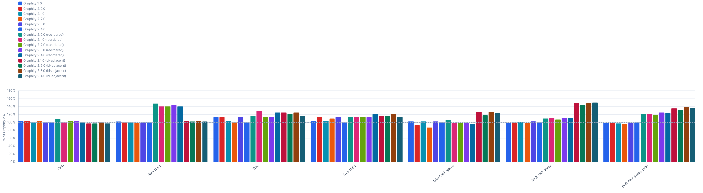

#### Times @ 100k nodes (ms/op, lower is better)

| Shape | Graphity 1.0 | Graphity 2.0.0 | Graphity 2.1.0 | Graphity 2.2.0 | Graphity 2.3.0 | Graphity 2.4.0 | Graphity 3.0.0 | Graphity 2.0.0<br>(reordered) | Graphity 2.1.0<br>(reordered) | Graphity 2.2.0<br>(reordered) | Graphity 2.3.0<br>(reordered) | Graphity 2.4.0<br>(reordered) | Graphity 3.0.0<br>(reordered) | Graphity 2.1.0<br>(bi-adjacent) | Graphity 2.2.0<br>(bi-adjacent) | Graphity 2.3.0<br>(bi-adjacent) | Graphity 2.4.0<br>(bi-adjacent) | Graphity 3.0.0<br>(bi-adjacent) |
|---|---:|---:|---:|---:|---:|---:|---:|---:|---:|---:|---:|---:|---:|---:|---:|---:|---:|---:|
| Path<br><sub>100k nodes, 100k edges</sub> | 0.562 ms (1.0×) | 0.456 ms (0.8×) | 0.457 ms (0.8×) | 0.462 ms (0.8×) | 0.452 ms (0.8×) | 0.567 ms (1.0×) | 0.552 ms | 0.560 ms (1.0×) | 0.458 ms (0.8×) | 0.571 ms (1.0×) | 0.547 ms (1.0×) | 0.458 ms (0.8×) | 0.377 ms (0.7×) | 0.348 ms (0.6×) | 0.360 ms (0.7×) | 0.370 ms (0.7×) | 0.359 ms (0.7×) | 0.395 ms (0.7×) |
| Path shfld.<br><sub>100k nodes, 100k edges</sub> | 1.463 ms (1.0×) | 1.378 ms (0.9×) | 1.459 ms (1.0×) | 1.424 ms (1.0×) | 1.314 ms (0.9×) | 1.454 ms (1.0×) | 1.471 ms | 0.559 ms (0.4×) | 0.564 ms (0.4×) | 0.565 ms (0.4×) | 0.450 ms (0.3×) | 0.457 ms (0.3×) | 0.572 ms (0.4×) | 1.253 ms (0.9×) | 1.335 ms (0.9×) | 1.280 ms (0.9×) | 1.346 ms (0.9×) | 1.267 ms (0.9×) |
| Tree<br><sub>100k nodes, 100k edges</sub> | 0.934 ms (1.0×) | 0.929 ms (1.0×) | 0.927 ms (1.0×) | 0.947 ms (1.0×) | 0.926 ms (1.0×) | 0.936 ms (1.0×) | 0.945 ms | 0.863 ms (0.9×) | 0.782 ms (0.8×) | 0.845 ms (0.9×) | 0.783 ms (0.8×) | 0.838 ms (0.9×) | 0.839 ms (0.9×) | 0.839 ms (0.9×) | 0.852 ms (0.9×) | 0.849 ms (0.9×) | 0.869 ms (0.9×) | 0.827 ms (0.9×) |
| Tree shfld. | 1.048 ms (1.1×) | 0.945 ms (1.0×) | 1.032 ms (1.1×) | 0.954 ms (1.0×) | 0.951 ms (1.0×) | 0.962 ms (1.0×) | 0.959 ms | 0.829 ms (0.9×) | 0.891 ms (0.9×) | 0.893 ms (0.9×) | 0.835 ms (0.9×) | 0.839 ms (0.9×) | 0.891 ms (0.9×) | 0.884 ms (0.9×) | 0.896 ms (0.9×) | 0.917 ms (1.0×) | 0.872 ms (0.9×) | 0.873 ms (0.9×) |
| DAG GNP sparse | 2.167 ms (1.0×) | 2.211 ms (1.0×) | 2.159 ms (1.0×) | 2.261 ms (1.0×) | 2.153 ms (1.0×) | 2.210 ms (1.0×) | 2.160 ms | 1.974 ms (0.9×) | 1.962 ms (0.9×) | 1.985 ms (0.9×) | 1.936 ms (0.9×) | 1.940 ms (0.9×) | 1.940 ms (0.9×) | 1.989 ms (0.9×) | 1.981 ms (0.9×) | 1.931 ms (0.9×) | 1.938 ms (0.9×) | 1.880 ms (0.9×) |
| DAG GNP dense | 5.160 ms (1.0×) | 5.093 ms (1.0×) | 5.070 ms (1.0×) | 5.364 ms (1.1×) | 5.212 ms (1.0×) | 5.634 ms (1.1×) | 5.104 ms | 4.574 ms (0.9×) | 4.551 ms (0.9×) | 4.696 ms (0.9×) | 4.618 ms (0.9×) | 5.018 ms (1.0×) | 4.710 ms (0.9×) | 3.777 ms (0.7×) | 4.360 ms (0.9×) | 3.651 ms (0.7×) | 4.212 ms (0.8×) | 3.631 ms (0.7×) |
| DAG GNP dense shfld. | 5.877 ms (1.0×) | 5.806 ms (1.0×) | 5.763 ms (1.0×) | 5.866 ms (1.0×) | 6.018 ms (1.0×) | 6.536 ms (1.1×) | 5.786 ms | 4.496 ms (0.8×) | 4.496 ms (0.8×) | 4.690 ms (0.8×) | 4.535 ms (0.8×) | 4.979 ms (0.9×) | 4.550 ms (0.8×) | 4.487 ms (0.8×) | 4.509 ms (0.8×) | 4.514 ms (0.8×) | 5.049 ms (0.9×) | 4.287 ms (0.7×) |

#### Throughput @ 100k nodes (op/s, higher is better)

| Shape | Graphity 1.0 | Graphity 2.0.0 | Graphity 2.1.0 | Graphity 2.2.0 | Graphity 2.3.0 | Graphity 2.4.0 | Graphity 3.0.0 | Graphity 2.0.0<br>(reordered) | Graphity 2.1.0<br>(reordered) | Graphity 2.2.0<br>(reordered) | Graphity 2.3.0<br>(reordered) | Graphity 2.4.0<br>(reordered) | Graphity 3.0.0<br>(reordered) | Graphity 2.1.0<br>(bi-adjacent) | Graphity 2.2.0<br>(bi-adjacent) | Graphity 2.3.0<br>(bi-adjacent) | Graphity 2.4.0<br>(bi-adjacent) | Graphity 3.0.0<br>(bi-adjacent) |
|---|---:|---:|---:|---:|---:|---:|---:|---:|---:|---:|---:|---:|---:|---:|---:|---:|---:|---:|
| Path<br><sub>100k nodes, 100k edges</sub> | 1 779 op/s (98.2%) | 2 193 op/s (121%) | 2 188 op/s (121%) | 2 165 op/s (119%) | 2 212 op/s (122%) | 1 764 op/s (97.4%) | 1 812 op/s | 1 786 op/s (98.6%) | 2 183 op/s (121%) | 1 751 op/s (96.7%) | 1 828 op/s (101%) | 2 183 op/s (121%) | 2 653 op/s (146%) | 2 874 op/s (159%) | 2 778 op/s (153%) | 2 703 op/s (149%) | 2 786 op/s (154%) | 2 532 op/s (140%) |
| Path shfld.<br><sub>100k nodes, 100k edges</sub> | 683.5 op/s (101%) | 725.7 op/s (107%) | 685.4 op/s (101%) | 702.2 op/s (103%) | 761.0 op/s (112%) | 687.8 op/s (101%) | 679.8 op/s | 1 789 op/s (263%) | 1 773 op/s (261%) | 1 770 op/s (260%) | 2 222 op/s (327%) | 2 188 op/s (322%) | 1 748 op/s (257%) | 798.1 op/s (117%) | 749.1 op/s (110%) | 781.2 op/s (115%) | 742.9 op/s (109%) | 789.3 op/s (116%) |
| Tree<br><sub>100k nodes, 100k edges</sub> | 1 071 op/s (101%) | 1 076 op/s (102%) | 1 079 op/s (102%) | 1 056 op/s (99.8%) | 1 080 op/s (102%) | 1 068 op/s (101%) | 1 058 op/s | 1 159 op/s (110%) | 1 279 op/s (121%) | 1 183 op/s (112%) | 1 277 op/s (121%) | 1 193 op/s (113%) | 1 192 op/s (113%) | 1 192 op/s (113%) | 1 174 op/s (111%) | 1 178 op/s (111%) | 1 151 op/s (109%) | 1 209 op/s (114%) |
| Tree shfld. | 954.2 op/s (91.5%) | 1 058 op/s (101%) | 969.0 op/s (92.9%) | 1 048 op/s (101%) | 1 052 op/s (101%) | 1 040 op/s (99.7%) | 1 043 op/s | 1 206 op/s (116%) | 1 122 op/s (108%) | 1 120 op/s (107%) | 1 198 op/s (115%) | 1 192 op/s (114%) | 1 122 op/s (108%) | 1 131 op/s (108%) | 1 116 op/s (107%) | 1 091 op/s (105%) | 1 147 op/s (110%) | 1 145 op/s (110%) |
| DAG GNP sparse | 461.5 op/s (99.7%) | 452.3 op/s (97.7%) | 463.2 op/s (100%) | 442.3 op/s (95.5%) | 464.5 op/s (100%) | 452.5 op/s (97.7%) | 463.0 op/s | 506.6 op/s (109%) | 509.7 op/s (110%) | 503.8 op/s (109%) | 516.5 op/s (112%) | 515.5 op/s (111%) | 515.5 op/s (111%) | 502.8 op/s (109%) | 504.8 op/s (109%) | 517.9 op/s (112%) | 516.0 op/s (111%) | 531.9 op/s (115%) |
| DAG GNP dense | 193.8 op/s (98.9%) | 196.3 op/s (100%) | 197.2 op/s (101%) | 186.4 op/s (95.2%) | 191.9 op/s (97.9%) | 177.5 op/s (90.6%) | 195.9 op/s | 218.6 op/s (112%) | 219.7 op/s (112%) | 212.9 op/s (109%) | 216.5 op/s (111%) | 199.3 op/s (102%) | 212.3 op/s (108%) | 264.8 op/s (135%) | 229.4 op/s (117%) | 273.9 op/s (140%) | 237.4 op/s (121%) | 275.4 op/s (141%) |
| DAG GNP dense shfld. | 170.2 op/s (98.5%) | 172.2 op/s (99.7%) | 173.5 op/s (100%) | 170.5 op/s (98.6%) | 166.2 op/s (96.1%) | 153.0 op/s (88.5%) | 172.8 op/s | 222.4 op/s (129%) | 222.4 op/s (129%) | 213.2 op/s (123%) | 220.5 op/s (128%) | 200.8 op/s (116%) | 219.8 op/s (127%) | 222.9 op/s (129%) | 221.8 op/s (128%) | 221.5 op/s (128%) | 198.1 op/s (115%) | 233.3 op/s (135%) |

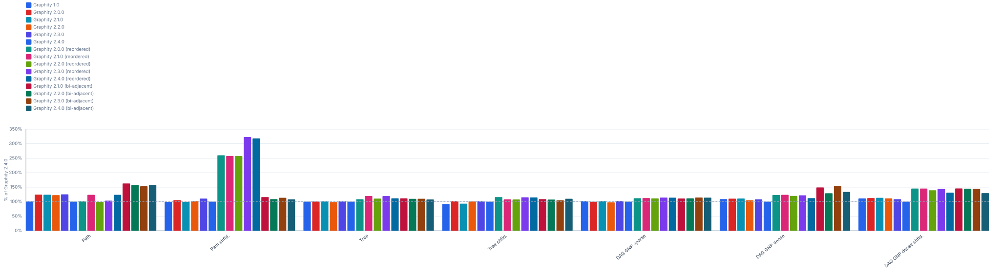

#### Times @ 1M nodes (ms/op, lower is better)

| Shape | Graphity 2.0.0 | Graphity 2.1.0 | Graphity 2.2.0 | Graphity 2.3.0 | Graphity 2.4.0 | Graphity 3.0.0 | Graphity 2.0.0<br>(reordered) | Graphity 2.1.0<br>(reordered) | Graphity 2.2.0<br>(reordered) | Graphity 2.3.0<br>(reordered) | Graphity 2.4.0<br>(reordered) | Graphity 3.0.0<br>(reordered) |
|---|---:|---:|---:|---:|---:|---:|---:|---:|---:|---:|---:|---:|
| DAG GNP sparse | 29.60 ms (1.0×) | 29.09 ms (1.0×) | 32.07 ms (1.1×) | 31.72 ms (1.1×) | 38.38 ms (1.3×) | 29.53 ms | 26.85 ms (0.9×) | 25.49 ms (0.9×) | 27.96 ms (0.9×) | 28.43 ms (1.0×) | 36.68 ms (1.2×) | 25.93 ms (0.9×) |
| DAG GNP dense | 112.1 ms (1.0×) | 113.1 ms (1.0×) | 112.9 ms (1.0×) | 112.5 ms (1.0×) | 129.6 ms (1.2×) | 111.6 ms | — | 92.44 ms (0.8×) | 95.81 ms (0.9×) | 93.99 ms (0.8×) | 113.3 ms (1.0×) | 89.49 ms (0.8×) |
| DAG GNP dense shfld. | 191.1 ms (1.0×) | 190.3 ms (1.0×) | 206.4 ms (1.1×) | 199.4 ms (1.0×) | 209.4 ms (1.1×) | 194.0 ms | 89.45 ms (0.5×) | 92.20 ms (0.5×) | 96.05 ms (0.5×) | 92.20 ms (0.5×) | 110.4 ms (0.6×) | 91.16 ms (0.5×) |

#### Throughput @ 1M nodes (op/s, higher is better)

| Shape | Graphity 2.0.0 | Graphity 2.1.0 | Graphity 2.2.0 | Graphity 2.3.0 | Graphity 2.4.0 | Graphity 3.0.0 | Graphity 2.0.0<br>(reordered) | Graphity 2.1.0<br>(reordered) | Graphity 2.2.0<br>(reordered) | Graphity 2.3.0<br>(reordered) | Graphity 2.4.0<br>(reordered) | Graphity 3.0.0<br>(reordered) |
|---|---:|---:|---:|---:|---:|---:|---:|---:|---:|---:|---:|---:|
| DAG GNP sparse | 33.78 op/s (99.8%) | 34.38 op/s (102%) | 31.18 op/s (92.1%) | 31.53 op/s (93.1%) | 26.06 op/s (77.0%) | 33.86 op/s | 37.24 op/s (110%) | 39.23 op/s (116%) | 35.76 op/s (106%) | 35.18 op/s (104%) | 27.26 op/s (80.5%) | 38.57 op/s (114%) |
| DAG GNP dense | 8.921 op/s (99.6%) | 8.842 op/s (98.7%) | 8.857 op/s (98.8%) | 8.889 op/s (99.2%) | 7.716 op/s (86.1%) | 8.961 op/s | — | 10.82 op/s (121%) | 10.44 op/s (116%) | 10.64 op/s (119%) | 8.826 op/s (98.5%) | 11.17 op/s (125%) |
| DAG GNP dense shfld. | 5.233 op/s (102%) | 5.255 op/s (102%) | 4.845 op/s (94.0%) | 5.015 op/s (97.3%) | 4.776 op/s (92.6%) | 5.155 op/s | 11.18 op/s (217%) | 10.85 op/s (210%) | 10.41 op/s (202%) | 10.85 op/s (210%) | 9.058 op/s (176%) | 10.97 op/s (213%) |

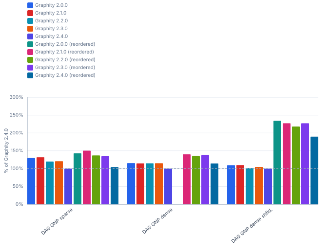

#### Times @ 10M nodes (ms/op, lower is better)

| Shape | Graphity 2.0.0 | Graphity 2.1.0 | Graphity 2.2.0 | Graphity 2.3.0 | Graphity 2.4.0 | Graphity 3.0.0 | Graphity 2.0.0<br>(reordered) | Graphity 2.1.0<br>(reordered) | Graphity 2.2.0<br>(reordered) | Graphity 2.3.0<br>(reordered) | Graphity 2.4.0<br>(reordered) | Graphity 3.0.0<br>(reordered) |
|---|---:|---:|---:|---:|---:|---:|---:|---:|---:|---:|---:|---:|
| DAG GNP sparse | 856.2 ms (1.0×) | 853.6 ms (1.0×) | 877.4 ms (1.0×) | 847.7 ms (0.9×) | 860.1 ms (1.0×) | 895.3 ms | 751.9 ms (0.8×) | 759.4 ms (0.8×) | 772.4 ms (0.9×) | 752.4 ms (0.8×) | 770.8 ms (0.9×) | 773.8 ms (0.9×) |
| DAG GNP dense | 3085.9 ms (1.0×) | 2971.3 ms (1.0×) | 3289.1 ms (1.1×) | 3082.4 ms (1.0×) | 3105.4 ms (1.0×) | 2966.2 ms | — | 2553.0 ms (0.9×) | 3050.5 ms (1.0×) | 2699.6 ms (0.9×) | 2757.7 ms (0.9×) | 2703.4 ms (0.9×) |
| DAG GNP dense shfld. | 4398.5 ms (1.0×) | 4386.9 ms (1.0×) | 4671.3 ms (1.0×) | 4329.4 ms (0.9×) | 4418.6 ms (1.0×) | 4616.3 ms | 2631.0 ms (0.6×) | 2623.6 ms (0.6×) | 2667.8 ms (0.6×) | 2707.5 ms (0.6×) | 2608.4 ms (0.6×) | 2724.6 ms (0.6×) |

#### Throughput @ 10M nodes (op/s, higher is better)

| Shape | Graphity 2.0.0 | Graphity 2.1.0 | Graphity 2.2.0 | Graphity 2.3.0 | Graphity 2.4.0 | Graphity 3.0.0 | Graphity 2.0.0<br>(reordered) | Graphity 2.1.0<br>(reordered) | Graphity 2.2.0<br>(reordered) | Graphity 2.3.0<br>(reordered) | Graphity 2.4.0<br>(reordered) | Graphity 3.0.0<br>(reordered) |
|---|---:|---:|---:|---:|---:|---:|---:|---:|---:|---:|---:|---:|
| DAG GNP sparse | 1.168 op/s (105%) | 1.172 op/s (105%) | 1.140 op/s (102%) | 1.180 op/s (106%) | 1.163 op/s (104%) | 1.117 op/s | 1.330 op/s (119%) | 1.317 op/s (118%) | 1.295 op/s (116%) | 1.329 op/s (119%) | 1.297 op/s (116%) | 1.292 op/s (116%) |
| DAG GNP dense | 0.324 op/s (96.1%) | 0.337 op/s (99.8%) | 0.304 op/s (90.2%) | 0.324 op/s (96.2%) | 0.322 op/s (95.5%) | 0.337 op/s | — | 0.392 op/s (116%) | 0.328 op/s (97.2%) | 0.370 op/s (110%) | 0.363 op/s (108%) | 0.370 op/s (110%) |
| DAG GNP dense shfld. | 0.227 op/s (105%) | 0.228 op/s (105%) | 0.214 op/s (98.8%) | 0.231 op/s (107%) | 0.226 op/s (104%) | 0.217 op/s | 0.380 op/s (175%) | 0.381 op/s (176%) | 0.375 op/s (173%) | 0.369 op/s (171%) | 0.383 op/s (177%) | 0.367 op/s (169%) |

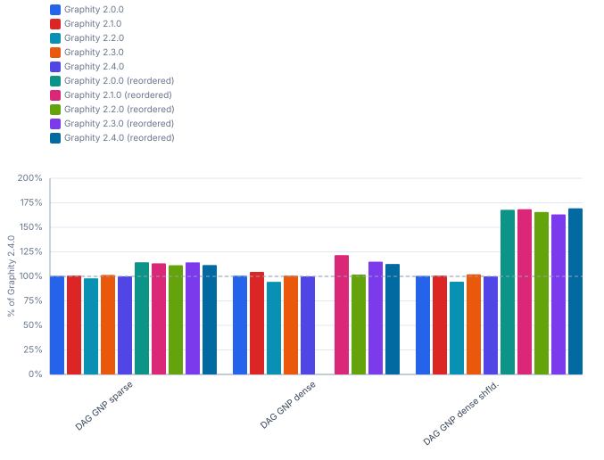

#### Times @ 100M nodes (ms/op, lower is better)

| Shape | Graphity 2.0.0 | Graphity 2.1.0 | Graphity 2.2.0 | Graphity 2.3.0 | Graphity 2.4.0 | Graphity 3.0.0 | Graphity 2.0.0<br>(reordered) | Graphity 2.1.0<br>(reordered) | Graphity 2.2.0<br>(reordered) | Graphity 2.3.0<br>(reordered) | Graphity 2.4.0<br>(reordered) | Graphity 3.0.0<br>(reordered) |
|---|---:|---:|---:|---:|---:|---:|---:|---:|---:|---:|---:|---:|
| DAG GNP sparse | 11384 ms (0.9×) | 11412 ms (0.9×) | 11575 ms (1.0×) | 11214 ms (0.9×) | 11304 ms (0.9×) | 12069 ms | 9441.1 ms (0.8×) | 9419.7 ms (0.8×) | 9530.7 ms (0.8×) | 9499.8 ms (0.8×) | 9506.7 ms (0.8×) | 10542 ms (0.9×) |

#### Throughput @ 100M nodes (op/s, higher is better)

| Shape | Graphity 2.0.0 | Graphity 2.1.0 | Graphity 2.2.0 | Graphity 2.3.0 | Graphity 2.4.0 | Graphity 3.0.0 | Graphity 2.0.0<br>(reordered) | Graphity 2.1.0<br>(reordered) | Graphity 2.2.0<br>(reordered) | Graphity 2.3.0<br>(reordered) | Graphity 2.4.0<br>(reordered) | Graphity 3.0.0<br>(reordered) |
|---|---:|---:|---:|---:|---:|---:|---:|---:|---:|---:|---:|---:|
| DAG GNP sparse | 0.088 op/s (106%) | 0.088 op/s (106%) | 0.086 op/s (104%) | 0.089 op/s (108%) | 0.088 op/s (107%) | 0.083 op/s | 0.106 op/s (128%) | 0.106 op/s (128%) | 0.105 op/s (127%) | 0.105 op/s (127%) | 0.105 op/s (127%) | 0.095 op/s (114%) |

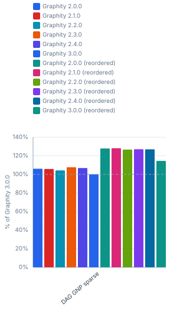

### 1.10 BackEdges

#### Times @ 10k nodes (ms/op, lower is better)

| Shape | Graphity 1.0 | Graphity 2.0.0 | Graphity 2.1.0 | Graphity 2.2.0 | Graphity 2.3.0 | Graphity 2.4.0 | Graphity 3.0.0 | Graphity 2.0.0<br>(reordered) | Graphity 2.1.0<br>(reordered) | Graphity 2.2.0<br>(reordered) | Graphity 2.3.0<br>(reordered) | Graphity 2.4.0<br>(reordered) | Graphity 3.0.0<br>(reordered) |
|---|---:|---:|---:|---:|---:|---:|---:|---:|---:|---:|---:|---:|---:|
| Path<br><sub>10k nodes, 10k edges</sub> | 0.047 ms (0.8×) | 0.061 ms (1.1×) | 0.060 ms (1.1×) | 0.052 ms (0.9×) | 0.059 ms (1.0×) | 0.049 ms (0.9×) | 0.057 ms | 0.061 ms (1.1×) | 0.060 ms (1.1×) | 0.061 ms (1.1×) | 0.059 ms (1.0×) | 0.050 ms (0.9×) | 0.048 ms (0.8×) |
| Path shfld.<br><sub>10k nodes, 10k edges</sub> | 0.058 ms (0.9×) | 0.067 ms (1.0×) | 0.065 ms (1.0×) | 0.065 ms (1.0×) | 0.065 ms (1.0×) | 0.062 ms (0.9×) | 0.067 ms | 0.051 ms (0.8×) | 0.050 ms (0.7×) | 0.051 ms (0.8×) | 0.051 ms (0.8×) | 0.051 ms (0.8×) | 0.054 ms (0.8×) |
| Tree<br><sub>10k nodes, 10k edges</sub> | 0.223 ms (4.8×) | 0.049 ms (1.1×) | 0.049 ms (1.1×) | 0.049 ms (1.1×) | 0.048 ms (1.0×) | 0.042 ms (0.9×) | 0.046 ms | 0.048 ms (1.0×) | 0.046 ms (1.0×) | 0.047 ms (1.0×) | 0.041 ms (0.9×) | 0.038 ms (0.8×) | 0.042 ms (0.9×) |
| GNP sparse<br><sub>10k nodes, 30k edges</sub> | 0.207 ms (1.1×) | 0.119 ms (0.6×) | 0.164 ms (0.9×) | 0.143 ms (0.8×) | 0.165 ms (0.9×) | 0.190 ms (1.0×) | 0.190 ms | 0.090 ms (0.5×) | 0.087 ms (0.5×) | 0.093 ms (0.5×) | 0.085 ms (0.4×) | 0.094 ms (0.5×) | 0.103 ms (0.5×) |
| GNP dense<br><sub>10k nodes, 299.6k edges</sub> | 0.797 ms (0.8×) | 0.776 ms (0.8×) | 0.771 ms (0.8×) | 0.775 ms (0.8×) | 0.781 ms (0.8×) | 0.806 ms (0.8×) | 1.008 ms | 0.647 ms (0.6×) | 0.665 ms (0.7×) | 0.658 ms (0.7×) | 0.656 ms (0.7×) | 0.690 ms (0.7×) | 0.875 ms (0.9×) |
| GNP dense shfld.<br><sub>10k nodes, 299.6k edges</sub> | 0.811 ms | 0.779 ms | 0.780 ms | 0.776 ms | — | — | — | 0.669 ms | 0.652 ms | 0.662 ms | — | — | — |
| Chain of cliques<br><sub>10k nodes, 310.8k edges</sub> | 0.512 ms (0.6×) | 0.592 ms (0.7×) | 0.582 ms (0.7×) | 0.582 ms (0.7×) | 0.583 ms (0.7×) | 0.616 ms (0.8×) | 0.816 ms | 0.592 ms (0.7×) | 0.580 ms (0.7×) | 0.596 ms (0.7×) | 0.589 ms (0.7×) | 0.617 ms (0.8×) | 0.816 ms (1.0×) |
| Chain of cliques shfld.<br><sub>10k nodes, 310.8k edges</sub> | 0.619 ms (0.7×) | 0.644 ms (0.7×) | 0.642 ms (0.7×) | 0.657 ms (0.8×) | 0.642 ms (0.7×) | 0.656 ms (0.8×) | 0.869 ms | 0.588 ms (0.7×) | 0.634 ms (0.7×) | 0.588 ms (0.7×) | 0.582 ms (0.7×) | 0.600 ms (0.7×) | 0.801 ms (0.9×) |

#### Throughput @ 10k nodes (op/s, higher is better)

| Shape | Graphity 1.0 | Graphity 2.0.0 | Graphity 2.1.0 | Graphity 2.2.0 | Graphity 2.3.0 | Graphity 2.4.0 | Graphity 3.0.0 | Graphity 2.0.0<br>(reordered) | Graphity 2.1.0<br>(reordered) | Graphity 2.2.0<br>(reordered) | Graphity 2.3.0<br>(reordered) | Graphity 2.4.0<br>(reordered) | Graphity 3.0.0<br>(reordered) |
|---|---:|---:|---:|---:|---:|---:|---:|---:|---:|---:|---:|---:|---:|
| Path<br><sub>10k nodes, 10k edges</sub> | 21 277 op/s (121%) | 16 393 op/s (93.4%) | 16 667 op/s (95.0%) | 19 231 op/s (110%) | 16 949 op/s (96.6%) | 20 408 op/s (116%) | 17 544 op/s | 16 393 op/s (93.4%) | 16 667 op/s (95.0%) | 16 393 op/s (93.4%) | 16 949 op/s (96.6%) | 20 000 op/s (114%) | 20 833 op/s (119%) |
| Path shfld.<br><sub>10k nodes, 10k edges</sub> | 17 241 op/s (116%) | 14 925 op/s (100%) | 15 385 op/s (103%) | 15 385 op/s (103%) | 15 385 op/s (103%) | 16 129 op/s (108%) | 14 925 op/s | 19 608 op/s (131%) | 20 000 op/s (134%) | 19 608 op/s (131%) | 19 608 op/s (131%) | 19 608 op/s (131%) | 18 519 op/s (124%) |
| Tree<br><sub>10k nodes, 10k edges</sub> | 4 484 op/s (20.6%) | 20 408 op/s (93.9%) | 20 408 op/s (93.9%) | 20 408 op/s (93.9%) | 20 833 op/s (95.8%) | 23 810 op/s (110%) | 21 739 op/s | 20 833 op/s (95.8%) | 21 739 op/s (100%) | 21 277 op/s (97.9%) | 24 390 op/s (112%) | 26 316 op/s (121%) | 23 810 op/s (110%) |
| GNP sparse<br><sub>10k nodes, 30k edges</sub> | 4 831 op/s (91.8%) | 8 403 op/s (160%) | 6 098 op/s (116%) | 6 993 op/s (133%) | 6 061 op/s (115%) | 5 263 op/s (100%) | 5 263 op/s | 11 111 op/s (211%) | 11 494 op/s (218%) | 10 753 op/s (204%) | 11 765 op/s (224%) | 10 638 op/s (202%) | 9 709 op/s (184%) |
| GNP dense<br><sub>10k nodes, 299.6k edges</sub> | 1 255 op/s (126%) | 1 289 op/s (130%) | 1 297 op/s (131%) | 1 290 op/s (130%) | 1 280 op/s (129%) | 1 241 op/s (125%) | 992.1 op/s | 1 546 op/s (156%) | 1 504 op/s (152%) | 1 520 op/s (153%) | 1 524 op/s (154%) | 1 449 op/s (146%) | 1 143 op/s (115%) |
| GNP dense shfld.<br><sub>10k nodes, 299.6k edges</sub> | 1 233 op/s | 1 284 op/s | 1 282 op/s | 1 289 op/s | — | — | — | 1 495 op/s | 1 534 op/s | 1 511 op/s | — | — | — |
| Chain of cliques<br><sub>10k nodes, 310.8k edges</sub> | 1 953 op/s (159%) | 1 689 op/s (138%) | 1 718 op/s (140%) | 1 718 op/s (140%) | 1 715 op/s (140%) | 1 623 op/s (132%) | 1 225 op/s | 1 689 op/s (138%) | 1 724 op/s (141%) | 1 678 op/s (137%) | 1 698 op/s (139%) | 1 621 op/s (132%) | 1 225 op/s (100%) |
| Chain of cliques shfld.<br><sub>10k nodes, 310.8k edges</sub> | 1 616 op/s (140%) | 1 553 op/s (135%) | 1 558 op/s (135%) | 1 522 op/s (132%) | 1 558 op/s (135%) | 1 524 op/s (132%) | 1 151 op/s | 1 701 op/s (148%) | 1 577 op/s (137%) | 1 701 op/s (148%) | 1 718 op/s (149%) | 1 667 op/s (145%) | 1 248 op/s (108%) |

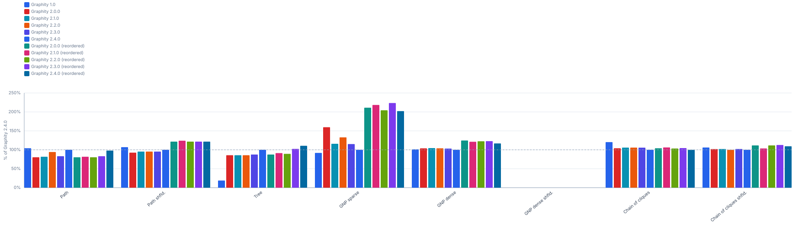

#### Times @ 100k nodes (ms/op, lower is better)

| Shape | Graphity 1.0 | Graphity 2.0.0 | Graphity 2.1.0 | Graphity 2.2.0 | Graphity 2.3.0 | Graphity 2.4.0 | Graphity 3.0.0 | Graphity 2.0.0<br>(reordered) | Graphity 2.1.0<br>(reordered) | Graphity 2.2.0<br>(reordered) | Graphity 2.3.0<br>(reordered) | Graphity 2.4.0<br>(reordered) | Graphity 3.0.0<br>(reordered) |
|---|---:|---:|---:|---:|---:|---:|---:|---:|---:|---:|---:|---:|---:|
| Path<br><sub>100k nodes, 100k edges</sub> | 0.507 ms (0.9×) | 0.606 ms (1.1×) | 0.563 ms (1.0×) | 0.568 ms (1.0×) | 0.557 ms (1.0×) | 0.478 ms (0.8×) | 0.569 ms | 0.605 ms (1.1×) | 0.556 ms (1.0×) | 0.569 ms (1.0×) | 0.558 ms (1.0×) | 0.454 ms (0.8×) | 0.569 ms (1.0×) |
| Path shfld.<br><sub>100k nodes, 100k edges</sub> | 1.351 ms (1.2×) | 0.945 ms (0.8×) | 1.063 ms (0.9×) | 0.994 ms (0.9×) | 1.042 ms (0.9×) | 1.027 ms (0.9×) | 1.130 ms | 0.510 ms (0.5×) | 0.513 ms (0.5×) | 0.506 ms (0.4×) | 0.503 ms (0.4×) | 0.524 ms (0.5×) | 0.553 ms (0.5×) |
| Tree<br><sub>100k nodes, 100k edges</sub> | 9.871 ms (8.4×) | 1.327 ms (1.1×) | 1.271 ms (1.1×) | 1.295 ms (1.1×) | 1.315 ms (1.1×) | 1.166 ms (1.0×) | 1.175 ms | 1.083 ms (0.9×) | 0.872 ms (0.7×) | 1.035 ms (0.9×) | 1.038 ms (0.9×) | 0.903 ms (0.8×) | 0.963 ms (0.8×) |
| GNP sparse<br><sub>100k nodes, 300k edges</sub> | 4.691 ms (1.4×) | 3.177 ms (1.0×) | 3.086 ms (0.9×) | 3.124 ms (1.0×) | 3.047 ms (0.9×) | 3.246 ms (1.0×) | 3.283 ms | 1.962 ms (0.6×) | 1.890 ms (0.6×) | 1.895 ms (0.6×) | 1.962 ms (0.6×) | 1.952 ms (0.6×) | 2.030 ms (0.6×) |
| GNP dense<br><sub>100k nodes, 3M edges</sub> | 17.38 ms (1.0×) | 12.91 ms (0.7×) | 12.72 ms (0.7×) | 13.51 ms (0.7×) | 13.08 ms (0.7×) | 14.30 ms (0.8×) | 18.27 ms | 7.303 ms (0.4×) | 7.055 ms (0.4×) | 7.279 ms (0.4×) | 7.220 ms (0.4×) | 7.507 ms (0.4×) | 9.700 ms (0.5×) |
| GNP dense shfld.<br><sub>100k nodes, 3M edges</sub> | 17.38 ms | 12.63 ms | 12.71 ms | 13.88 ms | — | — | — | 7.353 ms | 7.081 ms | 7.242 ms | — | — | — |
| Chain of cliques<br><sub>100k nodes, 3.1M edges</sub> | 8.563 ms (1.0×) | 6.365 ms (0.7×) | 6.191 ms (0.7×) | 6.179 ms (0.7×) | 6.134 ms (0.7×) | 6.510 ms (0.7×) | 8.973 ms | 6.292 ms (0.7×) | 6.108 ms (0.7×) | 6.220 ms (0.7×) | 6.154 ms (0.7×) | 6.525 ms (0.7×) | 8.970 ms (1.0×) |
| Chain of cliques shfld.<br><sub>100k nodes, 3.1M edges</sub> | 13.28 ms (0.8×) | 11.15 ms (0.6×) | 11.15 ms (0.6×) | 12.63 ms (0.7×) | 11.61 ms (0.7×) | 12.52 ms (0.7×) | 17.43 ms | 6.545 ms (0.4×) | 6.298 ms (0.4×) | 6.482 ms (0.4×) | 6.395 ms (0.4×) | 6.633 ms (0.4×) | 9.152 ms (0.5×) |

#### Throughput @ 100k nodes (op/s, higher is better)

| Shape | Graphity 1.0 | Graphity 2.0.0 | Graphity 2.1.0 | Graphity 2.2.0 | Graphity 2.3.0 | Graphity 2.4.0 | Graphity 3.0.0 | Graphity 2.0.0<br>(reordered) | Graphity 2.1.0<br>(reordered) | Graphity 2.2.0<br>(reordered) | Graphity 2.3.0<br>(reordered) | Graphity 2.4.0<br>(reordered) | Graphity 3.0.0<br>(reordered) |
|---|---:|---:|---:|---:|---:|---:|---:|---:|---:|---:|---:|---:|---:|
| Path<br><sub>100k nodes, 100k edges</sub> | 1 972 op/s (112%) | 1 650 op/s (93.9%) | 1 776 op/s (101%) | 1 761 op/s (100%) | 1 795 op/s (102%) | 2 092 op/s (119%) | 1 757 op/s | 1 653 op/s (94.0%) | 1 799 op/s (102%) | 1 757 op/s (100%) | 1 792 op/s (102%) | 2 203 op/s (125%) | 1 757 op/s (100%) |
| Path shfld.<br><sub>100k nodes, 100k edges</sub> | 740.2 op/s (83.6%) | 1 058 op/s (120%) | 940.7 op/s (106%) | 1 006 op/s (114%) | 959.7 op/s (108%) | 973.7 op/s (110%) | 885.0 op/s | 1 961 op/s (222%) | 1 949 op/s (220%) | 1 976 op/s (223%) | 1 988 op/s (225%) | 1 908 op/s (216%) | 1 808 op/s (204%) |
| Tree<br><sub>100k nodes, 100k edges</sub> | 101.3 op/s (11.9%) | 753.6 op/s (88.5%) | 786.8 op/s (92.4%) | 772.2 op/s (90.7%) | 760.5 op/s (89.4%) | 857.6 op/s (101%) | 851.1 op/s | 923.4 op/s (108%) | 1 147 op/s (135%) | 966.2 op/s (114%) | 963.4 op/s (113%) | 1 107 op/s (130%) | 1 038 op/s (122%) |
| GNP sparse<br><sub>100k nodes, 300k edges</sub> | 213.2 op/s (70.0%) | 314.8 op/s (103%) | 324.0 op/s (106%) | 320.1 op/s (105%) | 328.2 op/s (108%) | 308.1 op/s (101%) | 304.6 op/s | 509.7 op/s (167%) | 529.1 op/s (174%) | 527.7 op/s (173%) | 509.7 op/s (167%) | 512.3 op/s (168%) | 492.6 op/s (162%) |
| GNP dense<br><sub>100k nodes, 3M edges</sub> | 57.53 op/s (105%) | 77.44 op/s (141%) | 78.61 op/s (144%) | 74.05 op/s (135%) | 76.43 op/s (140%) | 69.93 op/s (128%) | 54.75 op/s | 136.9 op/s (250%) | 141.7 op/s (259%) | 137.4 op/s (251%) | 138.5 op/s (253%) | 133.2 op/s (243%) | 103.1 op/s (188%) |
| GNP dense shfld.<br><sub>100k nodes, 3M edges</sub> | 57.53 op/s | 79.20 op/s | 78.71 op/s | 72.07 op/s | — | — | — | 136.0 op/s | 141.2 op/s | 138.1 op/s | — | — | — |
| Chain of cliques<br><sub>100k nodes, 3.1M edges</sub> | 116.8 op/s (105%) | 157.1 op/s (141%) | 161.5 op/s (145%) | 161.8 op/s (145%) | 163.0 op/s (146%) | 153.6 op/s (138%) | 111.4 op/s | 158.9 op/s (143%) | 163.7 op/s (147%) | 160.8 op/s (144%) | 162.5 op/s (146%) | 153.3 op/s (138%) | 111.5 op/s (100%) |
| Chain of cliques shfld.<br><sub>100k nodes, 3.1M edges</sub> | 75.31 op/s (131%) | 89.65 op/s (156%) | 89.69 op/s (156%) | 79.16 op/s (138%) | 86.14 op/s (150%) | 79.90 op/s (139%) | 57.36 op/s | 152.8 op/s (266%) | 158.8 op/s (277%) | 154.3 op/s (269%) | 156.4 op/s (273%) | 150.8 op/s (263%) | 109.3 op/s (191%) |

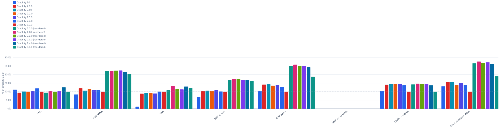

#### Times @ 1M nodes (ms/op, lower is better)

| Shape | Graphity 2.0.0 | Graphity 2.1.0 | Graphity 2.2.0 | Graphity 2.3.0 | Graphity 2.4.0 | Graphity 3.0.0 | Graphity 2.0.0<br>(reordered) | Graphity 2.1.0<br>(reordered) | Graphity 2.2.0<br>(reordered) | Graphity 2.3.0<br>(reordered) | Graphity 2.4.0<br>(reordered) | Graphity 3.0.0<br>(reordered) |
|---|---:|---:|---:|---:|---:|---:|---:|---:|---:|---:|---:|---:|
| GNP sparse<br><sub>1M nodes, 3M edges</sub> | 49.47 ms (0.9×) | 45.23 ms (0.9×) | 49.41 ms (0.9×) | 53.11 ms (1.0×) | 68.33 ms (1.3×) | 52.34 ms | 20.62 ms (0.4×) | 19.54 ms (0.4×) | 19.64 ms (0.4×) | 21.00 ms (0.4×) | 20.93 ms (0.4×) | 21.42 ms (0.4×) |
| GNP dense<br><sub>1M nodes, 30M edges</sub> | 240.2 ms (0.8×) | 242.3 ms (0.8×) | 251.1 ms (0.8×) | 247.6 ms (0.8×) | 258.1 ms (0.9×) | 296.3 ms | — | 92.69 ms (0.3×) | 93.71 ms (0.3×) | 89.72 ms (0.3×) | 104.2 ms (0.4×) | 124.9 ms (0.4×) |
| GNP dense shfld.<br><sub>1M nodes, 30M edges</sub> | 241.4 ms | 240.9 ms | 253.4 ms | — | — | — | 94.11 ms | 90.99 ms | 92.78 ms | — | — | — |
| Chain of cliques<br><sub>1M nodes, 31.1M edges</sub> | 75.32 ms (0.7×) | 76.46 ms (0.7×) | 77.08 ms (0.7×) | 74.96 ms (0.7×) | 79.86 ms (0.7×) | 111.4 ms | — | 76.53 ms (0.7×) | 77.78 ms (0.7×) | 76.19 ms (0.7×) | 79.00 ms (0.7×) | 111.4 ms (1.0×) |

#### Throughput @ 1M nodes (op/s, higher is better)

| Shape | Graphity 2.0.0 | Graphity 2.1.0 | Graphity 2.2.0 | Graphity 2.3.0 | Graphity 2.4.0 | Graphity 3.0.0 | Graphity 2.0.0<br>(reordered) | Graphity 2.1.0<br>(reordered) | Graphity 2.2.0<br>(reordered) | Graphity 2.3.0<br>(reordered) | Graphity 2.4.0<br>(reordered) | Graphity 3.0.0<br>(reordered) |
|---|---:|---:|---:|---:|---:|---:|---:|---:|---:|---:|---:|---:|
| GNP sparse<br><sub>1M nodes, 3M edges</sub> | 20.22 op/s (106%) | 22.11 op/s (116%) | 20.24 op/s (106%) | 18.83 op/s (98.5%) | 14.63 op/s (76.6%) | 19.11 op/s | 48.50 op/s (254%) | 51.17 op/s (268%) | 50.91 op/s (266%) | 47.63 op/s (249%) | 47.77 op/s (250%) | 46.68 op/s (244%) |
| GNP dense<br><sub>1M nodes, 30M edges</sub> | 4.163 op/s (123%) | 4.127 op/s (122%) | 3.982 op/s (118%) | 4.039 op/s (120%) | 3.874 op/s (115%) | 3.375 op/s | — | 10.79 op/s (320%) | 10.67 op/s (316%) | 11.15 op/s (330%) | 9.597 op/s (284%) | 8.006 op/s (237%) |
| GNP dense shfld.<br><sub>1M nodes, 30M edges</sub> | 4.143 op/s | 4.151 op/s | 3.946 op/s | — | — | — | 10.63 op/s | 10.99 op/s | 10.78 op/s | — | — | — |
| Chain of cliques<br><sub>1M nodes, 31.1M edges</sub> | 13.28 op/s (148%) | 13.08 op/s (146%) | 12.97 op/s (145%) | 13.34 op/s (149%) | 12.52 op/s (139%) | 8.977 op/s | — | 13.07 op/s (146%) | 12.86 op/s (143%) | 13.12 op/s (146%) | 12.66 op/s (141%) | 8.977 op/s (100%) |

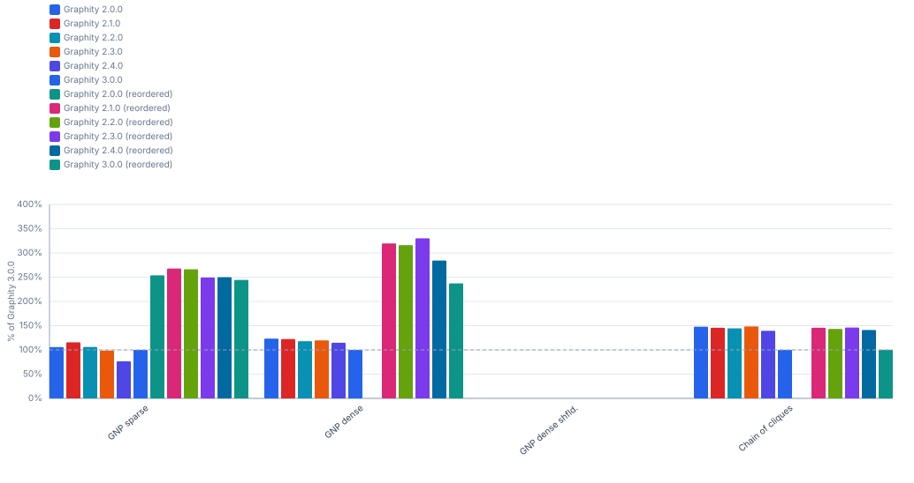

#### Times @ 10M nodes (ms/op, lower is better)

| Shape | Graphity 2.0.0 | Graphity 2.1.0 | Graphity 2.2.0 | Graphity 2.3.0 | Graphity 2.4.0 | Graphity 3.0.0 | Graphity 2.0.0<br>(reordered) | Graphity 2.1.0<br>(reordered) | Graphity 2.2.0<br>(reordered) | Graphity 2.3.0<br>(reordered) | Graphity 2.4.0<br>(reordered) | Graphity 3.0.0<br>(reordered) |
|---|---:|---:|---:|---:|---:|---:|---:|---:|---:|---:|---:|---:|
| GNP sparse<br><sub>10M nodes, 30M edges</sub> | 1984.9 ms (1.0×) | 1952.3 ms (1.0×) | 2052.4 ms (1.0×) | 2025.5 ms (1.0×) | 1996.7 ms (1.0×) | 2045.0 ms | 254.0 ms (0.1×) | 244.4 ms (0.1×) | 244.8 ms (0.1×) | 246.6 ms (0.1×) | 261.7 ms (0.1×) | 271.1 ms (0.1×) |
| GNP dense<br><sub>10M nodes, 299.6M edges</sub> | 3708.4 ms (0.9×) | 3722.5 ms (0.9×) | 3843.7 ms (1.0×) | 3661.0 ms (0.9×) | 3711.0 ms (0.9×) | 4003.5 ms | — | 1223.7 ms (0.3×) | 1022.2 ms (0.3×) | 927.2 ms (0.2×) | 976.8 ms (0.2×) | 1245.4 ms (0.3×) |
| GNP dense shfld.<br><sub>10M nodes, 299.6M edges</sub> | 3672.0 ms | 3874.8 ms | 3989.1 ms | — | — | — | 930.6 ms | 1124.4 ms | 1135.8 ms | — | — | — |
| Chain of cliques<br><sub>10M nodes, 310.8M edges</sub> | 815.0 ms (0.8×) | 839.7 ms (0.8×) | 838.2 ms (0.8×) | 692.1 ms (0.7×) | 689.9 ms (0.7×) | 1018.0 ms | — | 797.1 ms (0.8×) | 802.5 ms (0.8×) | 689.2 ms (0.7×) | 709.6 ms (0.7×) | 1023.3 ms (1.0×) |

#### Throughput @ 10M nodes (op/s, higher is better)

| Shape | Graphity 2.0.0 | Graphity 2.1.0 | Graphity 2.2.0 | Graphity 2.3.0 | Graphity 2.4.0 | Graphity 3.0.0 | Graphity 2.0.0<br>(reordered) | Graphity 2.1.0<br>(reordered) | Graphity 2.2.0<br>(reordered) | Graphity 2.3.0<br>(reordered) | Graphity 2.4.0<br>(reordered) | Graphity 3.0.0<br>(reordered) |
|---|---:|---:|---:|---:|---:|---:|---:|---:|---:|---:|---:|---:|
| GNP sparse<br><sub>10M nodes, 30M edges</sub> | 0.504 op/s (103%) | 0.512 op/s (105%) | 0.487 op/s (99.6%) | 0.494 op/s (101%) | 0.501 op/s (102%) | 0.489 op/s | 3.937 op/s (805%) | 4.092 op/s (837%) | 4.085 op/s (835%) | 4.055 op/s (829%) | 3.821 op/s (781%) | 3.689 op/s (754%) |
| GNP dense<br><sub>10M nodes, 299.6M edges</sub> | 0.270 op/s (108%) | 0.269 op/s (108%) | 0.260 op/s (104%) | 0.273 op/s (109%) | 0.269 op/s (108%) | 0.250 op/s | — | 0.817 op/s (327%) | 0.978 op/s (392%) | 1.079 op/s (432%) | 1.024 op/s (410%) | 0.803 op/s (321%) |
| GNP dense shfld.<br><sub>10M nodes, 299.6M edges</sub> | 0.272 op/s | 0.258 op/s | 0.251 op/s | — | — | — | 1.075 op/s | 0.889 op/s | 0.880 op/s | — | — | — |
| Chain of cliques<br><sub>10M nodes, 310.8M edges</sub> | 1.227 op/s (125%) | 1.191 op/s (121%) | 1.193 op/s (121%) | 1.445 op/s (147%) | 1.449 op/s (148%) | 0.982 op/s | — | 1.255 op/s (128%) | 1.246 op/s (127%) | 1.451 op/s (148%) | 1.409 op/s (143%) | 0.977 op/s (99.5%) |

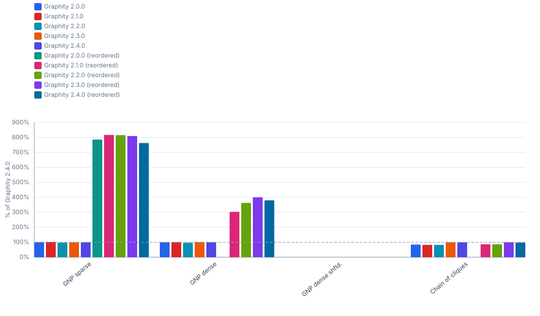

#### Times @ 100M nodes (ms/op, lower is better)

| Shape | Graphity 2.0.0 | Graphity 2.1.0 | Graphity 2.2.0 | Graphity 2.3.0 | Graphity 2.4.0 | Graphity 3.0.0 | Graphity 2.0.0<br>(reordered) | Graphity 2.1.0<br>(reordered) | Graphity 2.2.0<br>(reordered) | Graphity 2.3.0<br>(reordered) | Graphity 2.4.0<br>(reordered) | Graphity 3.0.0<br>(reordered) |
|---|---:|---:|---:|---:|---:|---:|---:|---:|---:|---:|---:|---:|
| GNP sparse<br><sub>100M nodes, 300M edges</sub> | 27110 ms (0.9×) | 26787 ms (0.9×) | 28157 ms (1.0×) | 27738 ms (1.0×) | 27875 ms (1.0×) | 28587 ms | 2988.7 ms (0.1×) | 2799.7 ms (0.1×) | 3364.5 ms (0.1×) | 3076.0 ms (0.1×) | 3042.7 ms (0.1×) | 2938.6 ms (0.1×) |

#### Throughput @ 100M nodes (op/s, higher is better)

| Shape | Graphity 2.0.0 | Graphity 2.1.0 | Graphity 2.2.0 | Graphity 2.3.0 | Graphity 2.4.0 | Graphity 3.0.0 | Graphity 2.0.0<br>(reordered) | Graphity 2.1.0<br>(reordered) | Graphity 2.2.0<br>(reordered) | Graphity 2.3.0<br>(reordered) | Graphity 2.4.0<br>(reordered) | Graphity 3.0.0<br>(reordered) |
|---|---:|---:|---:|---:|---:|---:|---:|---:|---:|---:|---:|---:|
| GNP sparse<br><sub>100M nodes, 300M edges</sub> | 0.037 op/s (105%) | 0.037 op/s (107%) | 0.036 op/s (102%) | 0.036 op/s (103%) | 0.036 op/s (103%) | 0.035 op/s | 0.335 op/s (956%) | 0.357 op/s (1021%) | 0.297 op/s (850%) | 0.325 op/s (929%) | 0.329 op/s (940%) | 0.340 op/s (973%) |

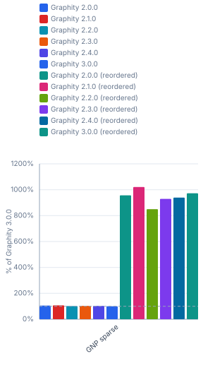

### 1.11 EdgeTypes

#### Times @ 10k nodes (ms/op, lower is better)

| Shape | Graphity 1.0 | Graphity 2.0.0 | Graphity 2.1.0 | Graphity 2.2.0 | Graphity 2.3.0 | Graphity 2.4.0 | Graphity 3.0.0 | Graphity 2.0.0<br>(reordered) | Graphity 2.1.0<br>(reordered) | Graphity 2.2.0<br>(reordered) | Graphity 2.3.0<br>(reordered) | Graphity 2.4.0<br>(reordered) | Graphity 3.0.0<br>(reordered) |
|---|---:|---:|---:|---:|---:|---:|---:|---:|---:|---:|---:|---:|---:|
| Path<br><sub>10k nodes, 10k edges</sub> | 0.051 ms (0.7×) | 0.064 ms (0.9×) | 0.063 ms (0.9×) | 0.064 ms (0.9×) | 0.064 ms (0.9×) | 0.075 ms (1.0×) | 0.072 ms | 0.064 ms (0.9×) | 0.064 ms (0.9×) | 0.065 ms (0.9×) | 0.064 ms (0.9×) | 0.066 ms (0.9×) | 0.072 ms (1.0×) |
| Path shfld.<br><sub>10k nodes, 10k edges</sub> | 0.066 ms (0.8×) | 0.077 ms (0.9×) | 0.077 ms (0.9×) | 0.077 ms (0.9×) | 0.078 ms (1.0×) | 0.083 ms (1.0×) | 0.082 ms | 0.059 ms (0.7×) | 0.060 ms (0.7×) | 0.062 ms (0.8×) | 0.060 ms (0.7×) | 0.069 ms (0.8×) | 0.067 ms (0.8×) |
| Tree<br><sub>10k nodes, 10k edges</sub> | 0.196 ms (4.0×) | 0.053 ms (1.1×) | 0.053 ms (1.1×) | 0.053 ms (1.1×) | 0.052 ms (1.1×) | 0.050 ms (1.0×) | 0.049 ms | 0.046 ms (0.9×) | 0.046 ms (0.9×) | 0.047 ms (1.0×) | 0.046 ms (0.9×) | 0.040 ms (0.8×) | 0.039 ms (0.8×) |
| GNP sparse<br><sub>10k nodes, 30k edges</sub> | 0.222 ms (1.2×) | 0.183 ms (1.0×) | 0.186 ms (1.0×) | 0.182 ms (1.0×) | 0.166 ms (0.9×) | 0.189 ms (1.0×) | 0.183 ms | 0.093 ms (0.5×) | 0.094 ms (0.5×) | 0.090 ms (0.5×) | 0.078 ms (0.4×) | 0.086 ms (0.5×) | 0.072 ms (0.4×) |
| GNP dense<br><sub>10k nodes, 299.6k edges</sub> | 0.653 ms (1.3×) | 0.511 ms (1.0×) | 0.530 ms (1.0×) | 0.533 ms (1.1×) | 0.531 ms (1.0×) | 0.525 ms (1.0×) | 0.507 ms | 0.373 ms (0.7×) | 0.377 ms (0.7×) | 0.369 ms (0.7×) | 0.384 ms (0.8×) | 0.381 ms (0.8×) | 0.364 ms (0.7×) |
| GNP dense shfld.<br><sub>10k nodes, 299.6k edges</sub> | 0.658 ms | 0.514 ms | 0.525 ms | 0.528 ms | — | — | — | 0.372 ms | 0.380 ms | 0.382 ms | — | — | — |
| Chain of cliques<br><sub>10k nodes, 310.8k edges</sub> | 0.375 ms (1.5×) | 0.282 ms (1.1×) | 0.296 ms (1.2×) | 0.296 ms (1.2×) | 0.293 ms (1.2×) | 0.280 ms (1.1×) | 0.254 ms | 0.285 ms (1.1×) | 0.297 ms (1.2×) | 0.303 ms (1.2×) | 0.293 ms (1.2×) | 0.282 ms (1.1×) | 0.254 ms (1.0×) |
| Chain of cliques shfld.<br><sub>10k nodes, 310.8k edges</sub> | 0.499 ms (1.3×) | 0.383 ms (1.0×) | 0.394 ms (1.0×) | 0.402 ms (1.0×) | 0.394 ms (1.0×) | 0.392 ms (1.0×) | 0.388 ms | 0.276 ms (0.7×) | 0.297 ms (0.8×) | 0.300 ms (0.8×) | 0.295 ms (0.8×) | 0.304 ms (0.8×) | 0.301 ms (0.8×) |

#### Throughput @ 10k nodes (op/s, higher is better)

| Shape | Graphity 1.0 | Graphity 2.0.0 | Graphity 2.1.0 | Graphity 2.2.0 | Graphity 2.3.0 | Graphity 2.4.0 | Graphity 3.0.0 | Graphity 2.0.0<br>(reordered) | Graphity 2.1.0<br>(reordered) | Graphity 2.2.0<br>(reordered) | Graphity 2.3.0<br>(reordered) | Graphity 2.4.0<br>(reordered) | Graphity 3.0.0<br>(reordered) |
|---|---:|---:|---:|---:|---:|---:|---:|---:|---:|---:|---:|---:|---:|
| Path<br><sub>10k nodes, 10k edges</sub> | 19 608 op/s (141%) | 15 625 op/s (112%) | 15 873 op/s (114%) | 15 625 op/s (112%) | 15 625 op/s (112%) | 13 333 op/s (96.0%) | 13 889 op/s | 15 625 op/s (112%) | 15 625 op/s (112%) | 15 385 op/s (111%) | 15 625 op/s (112%) | 15 152 op/s (109%) | 13 889 op/s (100%) |
| Path shfld.<br><sub>10k nodes, 10k edges</sub> | 15 152 op/s (124%) | 12 987 op/s (106%) | 12 987 op/s (106%) | 12 987 op/s (106%) | 12 821 op/s (105%) | 12 048 op/s (98.8%) | 12 195 op/s | 16 949 op/s (139%) | 16 667 op/s (137%) | 16 129 op/s (132%) | 16 667 op/s (137%) | 14 493 op/s (119%) | 14 925 op/s (122%) |
| Tree<br><sub>10k nodes, 10k edges</sub> | 5 102 op/s (25.0%) | 18 868 op/s (92.5%) | 18 868 op/s (92.5%) | 18 868 op/s (92.5%) | 19 231 op/s (94.2%) | 20 000 op/s (98.0%) | 20 408 op/s | 21 739 op/s (107%) | 21 739 op/s (107%) | 21 277 op/s (104%) | 21 739 op/s (107%) | 25 000 op/s (123%) | 25 641 op/s (126%) |
| GNP sparse<br><sub>10k nodes, 30k edges</sub> | 4 505 op/s (82.4%) | 5 464 op/s (100.0%) | 5 376 op/s (98.4%) | 5 495 op/s (101%) | 6 024 op/s (110%) | 5 291 op/s (96.8%) | 5 464 op/s | 10 753 op/s (197%) | 10 638 op/s (195%) | 11 111 op/s (203%) | 12 821 op/s (235%) | 11 628 op/s (213%) | 13 889 op/s (254%) |
| GNP dense<br><sub>10k nodes, 299.6k edges</sub> | 1 531 op/s (77.6%) | 1 957 op/s (99.2%) | 1 887 op/s (95.7%) | 1 876 op/s (95.1%) | 1 883 op/s (95.5%) | 1 905 op/s (96.6%) | 1 972 op/s | 2 681 op/s (136%) | 2 653 op/s (134%) | 2 710 op/s (137%) | 2 604 op/s (132%) | 2 625 op/s (133%) | 2 747 op/s (139%) |
| GNP dense shfld.<br><sub>10k nodes, 299.6k edges</sub> | 1 520 op/s | 1 946 op/s | 1 905 op/s | 1 894 op/s | — | — | — | 2 688 op/s | 2 632 op/s | 2 618 op/s | — | — | — |
| Chain of cliques<br><sub>10k nodes, 310.8k edges</sub> | 2 667 op/s (67.7%) | 3 546 op/s (90.1%) | 3 378 op/s (85.8%) | 3 378 op/s (85.8%) | 3 413 op/s (86.7%) | 3 571 op/s (90.7%) | 3 937 op/s | 3 509 op/s (89.1%) | 3 367 op/s (85.5%) | 3 300 op/s (83.8%) | 3 413 op/s (86.7%) | 3 546 op/s (90.1%) | 3 937 op/s (100%) |
| Chain of cliques shfld.<br><sub>10k nodes, 310.8k edges</sub> | 2 004 op/s (77.8%) | 2 611 op/s (101%) | 2 538 op/s (98.5%) | 2 488 op/s (96.5%) | 2 538 op/s (98.5%) | 2 551 op/s (99.0%) | 2 577 op/s | 3 623 op/s (141%) | 3 367 op/s (131%) | 3 333 op/s (129%) | 3 390 op/s (132%) | 3 289 op/s (128%) | 3 322 op/s (129%) |

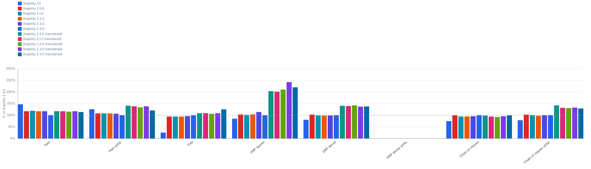

#### Times @ 100k nodes (ms/op, lower is better)

| Shape | Graphity 1.0 | Graphity 2.0.0 | Graphity 2.1.0 | Graphity 2.2.0 | Graphity 2.3.0 | Graphity 2.4.0 | Graphity 3.0.0 | Graphity 2.0.0<br>(reordered) | Graphity 2.1.0<br>(reordered) | Graphity 2.2.0<br>(reordered) | Graphity 2.3.0<br>(reordered) | Graphity 2.4.0<br>(reordered) | Graphity 3.0.0<br>(reordered) |
|---|---:|---:|---:|---:|---:|---:|---:|---:|---:|---:|---:|---:|---:|
| Path<br><sub>100k nodes, 100k edges</sub> | 0.554 ms (0.8×) | 0.647 ms (0.9×) | 0.607 ms (0.9×) | 0.603 ms (0.9×) | 0.595 ms (0.9×) | 0.629 ms (0.9×) | 0.686 ms | 0.642 ms (0.9×) | 0.592 ms (0.9×) | 0.605 ms (0.9×) | 0.604 ms (0.9×) | 0.698 ms (1.0×) | 0.691 ms (1.0×) |
| Path shfld.<br><sub>100k nodes, 100k edges</sub> | 1.563 ms (1.1×) | 1.365 ms (1.0×) | 1.408 ms (1.0×) | 1.430 ms (1.0×) | 1.386 ms (1.0×) | 1.500 ms (1.1×) | 1.387 ms | 0.615 ms (0.4×) | 0.629 ms (0.5×) | 0.634 ms (0.5×) | 0.623 ms (0.4×) | 0.643 ms (0.5×) | 0.611 ms (0.4×) |
| Tree<br><sub>100k nodes, 100k edges</sub> | 10.29 ms (7.7×) | 1.288 ms (1.0×) | 1.480 ms (1.1×) | 1.497 ms (1.1×) | 1.439 ms (1.1×) | 1.375 ms (1.0×) | 1.328 ms | 1.022 ms (0.8×) | 1.066 ms (0.8×) | 1.071 ms (0.8×) | 1.044 ms (0.8×) | 0.871 ms (0.7×) | 0.860 ms (0.6×) |
| GNP sparse<br><sub>100k nodes, 300k edges</sub> | 5.006 ms (1.5×) | 3.626 ms (1.1×) | 3.587 ms (1.0×) | 3.696 ms (1.1×) | 3.580 ms (1.0×) | 3.558 ms (1.0×) | 3.440 ms | 1.957 ms (0.6×) | 1.853 ms (0.5×) | 1.962 ms (0.6×) | 1.830 ms (0.5×) | 1.840 ms (0.5×) | 1.870 ms (0.5×) |
| GNP dense<br><sub>100k nodes, 3M edges</sub> | 9.351 ms (1.4×) | 7.009 ms (1.0×) | 6.926 ms (1.0×) | 7.537 ms (1.1×) | 7.214 ms (1.1×) | 8.165 ms (1.2×) | 6.783 ms | 4.296 ms (0.6×) | 4.197 ms (0.6×) | 4.320 ms (0.6×) | 4.159 ms (0.6×) | 4.314 ms (0.6×) | 4.121 ms (0.6×) |
| GNP dense shfld.<br><sub>100k nodes, 3M edges</sub> | 9.400 ms | 7.103 ms | 6.963 ms | 7.584 ms | — | — | — | 4.185 ms | 4.193 ms | 4.299 ms | — | — | — |
| Chain of cliques<br><sub>100k nodes, 3.1M edges</sub> | 4.372 ms (1.7×) | 2.812 ms (1.1×) | 2.706 ms (1.0×) | 2.696 ms (1.0×) | 2.701 ms (1.0×) | 2.616 ms (1.0×) | 2.580 ms | 2.815 ms (1.1×) | 2.689 ms (1.0×) | 2.754 ms (1.1×) | 2.642 ms (1.0×) | 2.615 ms (1.0×) | 2.552 ms (1.0×) |
| Chain of cliques shfld.<br><sub>100k nodes, 3.1M edges</sub> | 6.766 ms (1.3×) | 5.303 ms (1.0×) | 5.599 ms (1.1×) | 6.171 ms (1.2×) | 5.809 ms (1.1×) | 6.794 ms (1.3×) | 5.182 ms | 3.053 ms (0.6×) | 2.982 ms (0.6×) | 2.973 ms (0.6×) | 2.965 ms (0.6×) | 3.402 ms (0.7×) | 2.872 ms (0.6×) |

#### Throughput @ 100k nodes (op/s, higher is better)

| Shape | Graphity 1.0 | Graphity 2.0.0 | Graphity 2.1.0 | Graphity 2.2.0 | Graphity 2.3.0 | Graphity 2.4.0 | Graphity 3.0.0 | Graphity 2.0.0<br>(reordered) | Graphity 2.1.0<br>(reordered) | Graphity 2.2.0<br>(reordered) | Graphity 2.3.0<br>(reordered) | Graphity 2.4.0<br>(reordered) | Graphity 3.0.0<br>(reordered) |
|---|---:|---:|---:|---:|---:|---:|---:|---:|---:|---:|---:|---:|---:|
| Path<br><sub>100k nodes, 100k edges</sub> | 1 805 op/s (124%) | 1 546 op/s (106%) | 1 647 op/s (113%) | 1 658 op/s (114%) | 1 681 op/s (115%) | 1 590 op/s (109%) | 1 458 op/s | 1 558 op/s (107%) | 1 689 op/s (116%) | 1 653 op/s (113%) | 1 656 op/s (114%) | 1 433 op/s (98.3%) | 1 447 op/s (99.3%) |
| Path shfld.<br><sub>100k nodes, 100k edges</sub> | 639.8 op/s (88.7%) | 732.6 op/s (102%) | 710.2 op/s (98.5%) | 699.3 op/s (97.0%) | 721.5 op/s (100%) | 666.7 op/s (92.5%) | 721.0 op/s | 1 626 op/s (226%) | 1 590 op/s (221%) | 1 577 op/s (219%) | 1 605 op/s (223%) | 1 555 op/s (216%) | 1 637 op/s (227%) |
| Tree<br><sub>100k nodes, 100k edges</sub> | 97.17 op/s (12.9%) | 776.4 op/s (103%) | 675.7 op/s (89.7%) | 668.0 op/s (88.7%) | 694.9 op/s (92.3%) | 727.3 op/s (96.6%) | 753.0 op/s | 978.5 op/s (130%) | 938.1 op/s (125%) | 933.7 op/s (124%) | 957.9 op/s (127%) | 1 148 op/s (152%) | 1 163 op/s (154%) |
| GNP sparse<br><sub>100k nodes, 300k edges</sub> | 199.8 op/s (68.7%) | 275.8 op/s (94.9%) | 278.8 op/s (95.9%) | 270.6 op/s (93.1%) | 279.3 op/s (96.1%) | 281.1 op/s (96.7%) | 290.7 op/s | 511.0 op/s (176%) | 539.7 op/s (186%) | 509.7 op/s (175%) | 546.4 op/s (188%) | 543.5 op/s (187%) | 534.8 op/s (184%) |
| GNP dense<br><sub>100k nodes, 3M edges</sub> | 106.9 op/s (72.5%) | 142.7 op/s (96.8%) | 144.4 op/s (97.9%) | 132.7 op/s (90.0%) | 138.6 op/s (94.0%) | 122.5 op/s (83.1%) | 147.4 op/s | 232.8 op/s (158%) | 238.3 op/s (162%) | 231.5 op/s (157%) | 240.4 op/s (163%) | 231.8 op/s (157%) | 242.7 op/s (165%) |
| GNP dense shfld.<br><sub>100k nodes, 3M edges</sub> | 106.4 op/s | 140.8 op/s | 143.6 op/s | 131.9 op/s | — | — | — | 238.9 op/s | 238.5 op/s | 232.6 op/s | — | — | — |
| Chain of cliques<br><sub>100k nodes, 3.1M edges</sub> | 228.7 op/s (59.0%) | 355.6 op/s (91.7%) | 369.5 op/s (95.3%) | 370.9 op/s (95.7%) | 370.2 op/s (95.5%) | 382.3 op/s (98.6%) | 387.6 op/s | 355.2 op/s (91.7%) | 371.9 op/s (95.9%) | 363.1 op/s (93.7%) | 378.5 op/s (97.7%) | 382.4 op/s (98.7%) | 391.8 op/s (101%) |
| Chain of cliques shfld.<br><sub>100k nodes, 3.1M edges</sub> | 147.8 op/s (76.6%) | 188.6 op/s (97.7%) | 178.6 op/s (92.6%) | 162.0 op/s (84.0%) | 172.1 op/s (89.2%) | 147.2 op/s (76.3%) | 193.0 op/s | 327.5 op/s (170%) | 335.3 op/s (174%) | 336.4 op/s (174%) | 337.3 op/s (175%) | 293.9 op/s (152%) | 348.2 op/s (180%) |

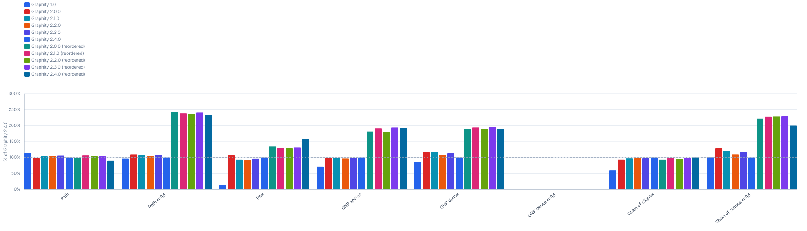

#### Times @ 1M nodes (ms/op, lower is better)

| Shape | Graphity 2.0.0 | Graphity 2.1.0 | Graphity 2.2.0 | Graphity 2.3.0 | Graphity 2.4.0 | Graphity 3.0.0 | Graphity 2.0.0<br>(reordered) | Graphity 2.1.0<br>(reordered) | Graphity 2.2.0<br>(reordered) | Graphity 2.3.0<br>(reordered) | Graphity 2.4.0<br>(reordered) | Graphity 3.0.0<br>(reordered) |
|---|---:|---:|---:|---:|---:|---:|---:|---:|---:|---:|---:|---:|
| GNP sparse<br><sub>1M nodes, 3M edges</sub> | 60.41 ms (1.1×) | 58.24 ms (1.1×) | 69.55 ms (1.3×) | 67.35 ms (1.3×) | 103.5 ms (2.0×) | 52.66 ms | 23.47 ms (0.4×) | 20.58 ms (0.4×) | 22.69 ms (0.4×) | 21.38 ms (0.4×) | 23.44 ms (0.4×) | 20.77 ms (0.4×) |
| GNP dense<br><sub>1M nodes, 30M edges</sub> | 235.5 ms (1.0×) | 238.8 ms (1.0×) | 252.1 ms (1.1×) | 241.3 ms (1.0×) | 261.1 ms (1.1×) | 239.6 ms | — | 60.05 ms (0.3×) | 60.84 ms (0.3×) | 61.23 ms (0.3×) | 67.87 ms (0.3×) | 59.50 ms (0.2×) |
| GNP dense shfld.<br><sub>1M nodes, 30M edges</sub> | 231.9 ms | 235.5 ms | 252.0 ms | — | — | — | 60.28 ms | 60.09 ms | 60.77 ms | — | — | — |
| Chain of cliques<br><sub>1M nodes, 31.1M edges</sub> | 25.97 ms (1.0×) | 26.59 ms (1.0×) | 26.76 ms (1.0×) | 26.94 ms (1.0×) | 28.06 ms (1.1×) | 25.87 ms | — | 26.68 ms (1.0×) | 26.80 ms (1.0×) | 26.71 ms (1.0×) | 27.32 ms (1.1×) | 25.90 ms (1.0×) |

#### Throughput @ 1M nodes (op/s, higher is better)

| Shape | Graphity 2.0.0 | Graphity 2.1.0 | Graphity 2.2.0 | Graphity 2.3.0 | Graphity 2.4.0 | Graphity 3.0.0 | Graphity 2.0.0<br>(reordered) | Graphity 2.1.0<br>(reordered) | Graphity 2.2.0<br>(reordered) | Graphity 2.3.0<br>(reordered) | Graphity 2.4.0<br>(reordered) | Graphity 3.0.0<br>(reordered) |
|---|---:|---:|---:|---:|---:|---:|---:|---:|---:|---:|---:|---:|
| GNP sparse<br><sub>1M nodes, 3M edges</sub> | 16.55 op/s (87.2%) | 17.17 op/s (90.4%) | 14.38 op/s (75.7%) | 14.85 op/s (78.2%) | 9.662 op/s (50.9%) | 18.99 op/s | 42.60 op/s (224%) | 48.59 op/s (256%) | 44.08 op/s (232%) | 46.77 op/s (246%) | 42.66 op/s (225%) | 48.14 op/s (254%) |
| GNP dense<br><sub>1M nodes, 30M edges</sub> | 4.246 op/s (102%) | 4.188 op/s (100%) | 3.967 op/s (95.0%) | 4.144 op/s (99.3%) | 3.830 op/s (91.8%) | 4.174 op/s | — | 16.65 op/s (399%) | 16.44 op/s (394%) | 16.33 op/s (391%) | 14.73 op/s (353%) | 16.81 op/s (403%) |
| GNP dense shfld.<br><sub>1M nodes, 30M edges</sub> | 4.312 op/s | 4.246 op/s | 3.968 op/s | — | — | — | 16.59 op/s | 16.64 op/s | 16.46 op/s | — | — | — |
| Chain of cliques<br><sub>1M nodes, 31.1M edges</sub> | 38.51 op/s (99.6%) | 37.62 op/s (97.3%) | 37.37 op/s (96.7%) | 37.12 op/s (96.0%) | 35.64 op/s (92.2%) | 38.66 op/s | — | 37.48 op/s (97.0%) | 37.32 op/s (96.5%) | 37.44 op/s (96.9%) | 36.60 op/s (94.7%) | 38.61 op/s (99.9%) |

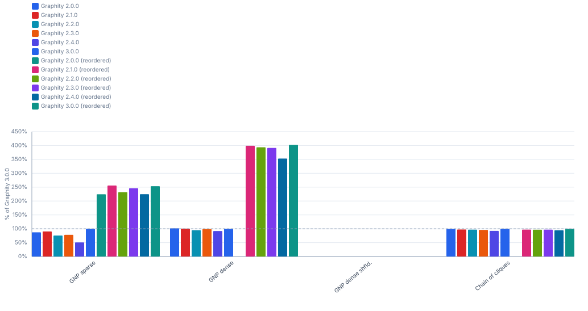

#### Times @ 10M nodes (ms/op, lower is better)

| Shape | Graphity 2.0.0 | Graphity 2.1.0 | Graphity 2.2.0 | Graphity 2.3.0 | Graphity 2.4.0 | Graphity 3.0.0 | Graphity 2.0.0<br>(reordered) | Graphity 2.1.0<br>(reordered) | Graphity 2.2.0<br>(reordered) | Graphity 2.3.0<br>(reordered) | Graphity 2.4.0<br>(reordered) | Graphity 3.0.0<br>(reordered) |
|---|---:|---:|---:|---:|---:|---:|---:|---:|---:|---:|---:|---:|
| GNP sparse<br><sub>10M nodes, 30M edges</sub> | 2629.9 ms (1.1×) | 2492.1 ms (1.0×) | 2557.2 ms (1.0×) | 2500.9 ms (1.0×) | 2524.1 ms (1.0×) | 2499.3 ms | 422.5 ms (0.2×) | 414.7 ms (0.2×) | 447.1 ms (0.2×) | 411.7 ms (0.2×) | 425.6 ms (0.2×) | 409.2 ms (0.2×) |
| GNP dense<br><sub>10M nodes, 299.6M edges</sub> | 4515.8 ms (1.0×) | 4552.4 ms (1.0×) | 4861.4 ms (1.1×) | 4606.3 ms (1.0×) | 4540.2 ms (1.0×) | 4470.3 ms | — | 1515.5 ms (0.3×) | 1624.0 ms (0.4×) | 1435.0 ms (0.3×) | 1449.5 ms (0.3×) | 1244.1 ms (0.3×) |
| GNP dense shfld.<br><sub>10M nodes, 299.6M edges</sub> | 4526.0 ms | 4492.7 ms | 4853.4 ms | — | — | — | 1383.2 ms | 1393.9 ms | 1557.3 ms | — | — | — |
| Chain of cliques<br><sub>10M nodes, 310.8M edges</sub> | 276.6 ms (1.0×) | 281.8 ms (1.0×) | 336.4 ms (1.2×) | 278.7 ms (1.0×) | 281.0 ms (1.0×) | 271.6 ms | — | 275.9 ms (1.0×) | 284.6 ms (1.0×) | 279.7 ms (1.0×) | 282.8 ms (1.0×) | 273.3 ms (1.0×) |

#### Throughput @ 10M nodes (op/s, higher is better)

| Shape | Graphity 2.0.0 | Graphity 2.1.0 | Graphity 2.2.0 | Graphity 2.3.0 | Graphity 2.4.0 | Graphity 3.0.0 | Graphity 2.0.0<br>(reordered) | Graphity 2.1.0<br>(reordered) | Graphity 2.2.0<br>(reordered) | Graphity 2.3.0<br>(reordered) | Graphity 2.4.0<br>(reordered) | Graphity 3.0.0<br>(reordered) |
|---|---:|---:|---:|---:|---:|---:|---:|---:|---:|---:|---:|---:|
| GNP sparse<br><sub>10M nodes, 30M edges</sub> | 0.380 op/s (95.0%) | 0.401 op/s (100%) | 0.391 op/s (97.7%) | 0.400 op/s (99.9%) | 0.396 op/s (99.0%) | 0.400 op/s | 2.367 op/s (592%) | 2.411 op/s (603%) | 2.237 op/s (559%) | 2.429 op/s (607%) | 2.350 op/s (587%) | 2.444 op/s (611%) |
| GNP dense<br><sub>10M nodes, 299.6M edges</sub> | 0.221 op/s (99.0%) | 0.220 op/s (98.2%) | 0.206 op/s (92.0%) | 0.217 op/s (97.0%) | 0.220 op/s (98.5%) | 0.224 op/s | — | 0.660 op/s (295%) | 0.616 op/s (275%) | 0.697 op/s (312%) | 0.690 op/s (308%) | 0.804 op/s (359%) |
| GNP dense shfld.<br><sub>10M nodes, 299.6M edges</sub> | 0.221 op/s | 0.223 op/s | 0.206 op/s | — | — | — | 0.723 op/s | 0.717 op/s | 0.642 op/s | — | — | — |
| Chain of cliques<br><sub>10M nodes, 310.8M edges</sub> | 3.615 op/s (98.2%) | 3.549 op/s (96.4%) | 2.973 op/s (80.7%) | 3.588 op/s (97.5%) | 3.559 op/s (96.7%) | 3.682 op/s | — | 3.625 op/s (98.4%) | 3.514 op/s (95.4%) | 3.575 op/s (97.1%) | 3.536 op/s (96.0%) | 3.659 op/s (99.4%) |

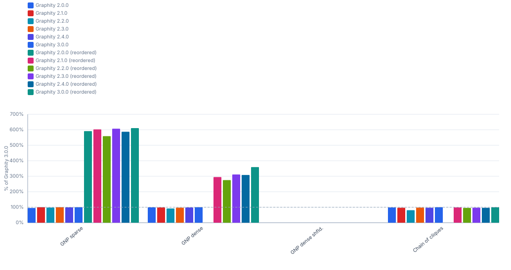

#### Times @ 100M nodes (ms/op, lower is better)

| Shape | Graphity 2.0.0 | Graphity 2.1.0 | Graphity 2.2.0 | Graphity 2.3.0 | Graphity 2.4.0 | Graphity 3.0.0 | Graphity 2.0.0<br>(reordered) | Graphity 2.1.0<br>(reordered) | Graphity 2.2.0<br>(reordered) | Graphity 2.3.0<br>(reordered) | Graphity 2.4.0<br>(reordered) | Graphity 3.0.0<br>(reordered) |
|---|---:|---:|---:|---:|---:|---:|---:|---:|---:|---:|---:|---:|
| GNP sparse<br><sub>100M nodes, 300M edges</sub> | 31792 ms (1.0×) | 31282 ms (1.0×) | 32754 ms (1.0×) | 31640 ms (1.0×) | 31522 ms (1.0×) | 31445 ms | 7181.5 ms (0.2×) | 6992.4 ms (0.2×) | 7210.5 ms (0.2×) | 6770.4 ms (0.2×) | 6892.8 ms (0.2×) | 6870.6 ms (0.2×) |

#### Throughput @ 100M nodes (op/s, higher is better)

| Shape | Graphity 2.0.0 | Graphity 2.1.0 | Graphity 2.2.0 | Graphity 2.3.0 | Graphity 2.4.0 | Graphity 3.0.0 | Graphity 2.0.0<br>(reordered) | Graphity 2.1.0<br>(reordered) | Graphity 2.2.0<br>(reordered) | Graphity 2.3.0<br>(reordered) | Graphity 2.4.0<br>(reordered) | Graphity 3.0.0<br>(reordered) |
|---|---:|---:|---:|---:|---:|---:|---:|---:|---:|---:|---:|---:|
| GNP sparse<br><sub>100M nodes, 300M edges</sub> | 0.031 op/s (98.9%) | 0.032 op/s (101%) | 0.031 op/s (96.0%) | 0.032 op/s (99.4%) | 0.032 op/s (99.8%) | 0.032 op/s | 0.139 op/s (438%) | 0.143 op/s (450%) | 0.139 op/s (436%) | 0.148 op/s (464%) | 0.145 op/s (456%) | 0.146 op/s (458%) |

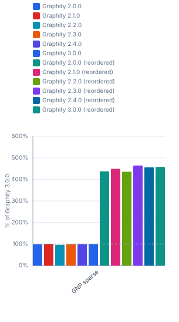

### 1.12 Reorder (DFS-preorder) cost

#### Times @ 10k nodes (ms/op, lower is better)

| Shape | Graphity 2.0.0 | Graphity 2.1.0 | Graphity 2.2.0 | Graphity 2.3.0 | Graphity 2.4.0 | Graphity 3.0.0 |
|---|---:|---:|---:|---:|---:|---:|
| Path<br><sub>10k nodes, 10k edges</sub> | 0.121 ms (1.1×) | 0.110 ms (1.0×) | 0.110 ms (1.0×) | 0.112 ms (1.0×) | 0.108 ms (1.0×) | 0.109 ms |
| Path shfld.<br><sub>10k nodes, 10k edges</sub> | 0.145 ms (1.1×) | 0.133 ms (1.0×) | 0.130 ms (1.0×) | 0.124 ms (0.9×) | 0.135 ms (1.0×) | 0.135 ms |
| Tree<br><sub>10k nodes, 10k edges</sub> | 0.185 ms (1.9×) | 0.087 ms (0.9×) | 0.090 ms (0.9×) | 0.084 ms (0.9×) | 0.093 ms (1.0×) | 0.095 ms |
| GNP sparse<br><sub>10k nodes, 30k edges</sub> | 0.483 ms (1.3×) | 0.386 ms (1.0×) | 0.385 ms (1.0×) | 0.380 ms (1.0×) | 0.373 ms (1.0×) | 0.368 ms |
| GNP dense<br><sub>10k nodes, 299.6k edges</sub> | 1.127 ms (1.4×) | 0.821 ms (1.0×) | 0.818 ms (1.0×) | 0.811 ms (1.0×) | 0.827 ms (1.0×) | 0.803 ms |
| GNP dense shfld.<br><sub>10k nodes, 299.6k edges</sub> | 1.114 ms | 0.812 ms | 0.817 ms | — | — | — |
| Chain of cliques<br><sub>10k nodes, 310.8k edges</sub> | 0.715 ms (1.4×) | 0.532 ms (1.0×) | 0.533 ms (1.0×) | 0.519 ms (1.0×) | 0.525 ms (1.0×) | 0.521 ms |
| Chain of cliques shfld.<br><sub>10k nodes, 310.8k edges</sub> | 0.867 ms (1.4×) | 0.612 ms (1.0×) | 0.618 ms (1.0×) | 0.614 ms (1.0×) | 0.631 ms (1.0×) | 0.619 ms |

#### Throughput @ 10k nodes (op/s, higher is better)

| Shape | Graphity 2.0.0 | Graphity 2.1.0 | Graphity 2.2.0 | Graphity 2.3.0 | Graphity 2.4.0 | Graphity 3.0.0 |
|---|---:|---:|---:|---:|---:|---:|
| Path<br><sub>10k nodes, 10k edges</sub> | 8 264 op/s (90.1%) | 9 091 op/s (99.1%) | 9 091 op/s (99.1%) | 8 929 op/s (97.3%) | 9 259 op/s (101%) | 9 174 op/s |
| Path shfld.<br><sub>10k nodes, 10k edges</sub> | 6 897 op/s (93.1%) | 7 519 op/s (102%) | 7 692 op/s (104%) | 8 065 op/s (109%) | 7 407 op/s (100%) | 7 407 op/s |
| Tree<br><sub>10k nodes, 10k edges</sub> | 5 405 op/s (51.4%) | 11 494 op/s (109%) | 11 111 op/s (106%) | 11 905 op/s (113%) | 10 753 op/s (102%) | 10 526 op/s |
| GNP sparse<br><sub>10k nodes, 30k edges</sub> | 2 070 op/s (76.2%) | 2 591 op/s (95.3%) | 2 597 op/s (95.6%) | 2 632 op/s (96.8%) | 2 681 op/s (98.7%) | 2 717 op/s |
| GNP dense<br><sub>10k nodes, 299.6k edges</sub> | 887.3 op/s (71.3%) | 1 218 op/s (97.8%) | 1 222 op/s (98.2%) | 1 233 op/s (99.0%) | 1 209 op/s (97.1%) | 1 245 op/s |
| GNP dense shfld.<br><sub>10k nodes, 299.6k edges</sub> | 897.7 op/s | 1 232 op/s | 1 224 op/s | — | — | — |
| Chain of cliques<br><sub>10k nodes, 310.8k edges</sub> | 1 399 op/s (72.9%) | 1 880 op/s (97.9%) | 1 876 op/s (97.7%) | 1 927 op/s (100%) | 1 905 op/s (99.2%) | 1 919 op/s |
| Chain of cliques shfld.<br><sub>10k nodes, 310.8k edges</sub> | 1 153 op/s (71.4%) | 1 634 op/s (101%) | 1 618 op/s (100%) | 1 629 op/s (101%) | 1 585 op/s (98.1%) | 1 616 op/s |

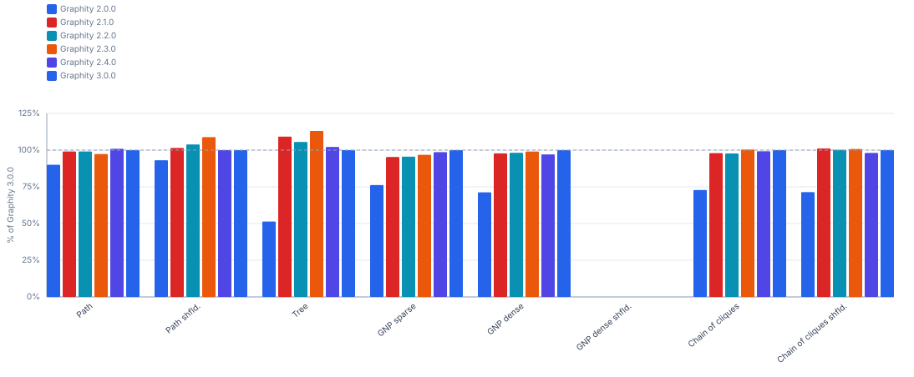

#### Times @ 100k nodes (ms/op, lower is better)

| Shape | Graphity 2.0.0 | Graphity 2.1.0 | Graphity 2.2.0 | Graphity 2.3.0 | Graphity 2.4.0 | Graphity 3.0.0 |
|---|---:|---:|---:|---:|---:|---:|
| Path<br><sub>100k nodes, 100k edges</sub> | 1.259 ms (1.1×) | 1.033 ms (0.9×) | 1.043 ms (0.9×) | 1.099 ms (1.0×) | 1.113 ms (1.0×) | 1.108 ms |
| Path shfld.<br><sub>100k nodes, 100k edges</sub> | 2.144 ms (1.2×) | 1.929 ms (1.1×) | 2.016 ms (1.1×) | 2.113 ms (1.2×) | 2.096 ms (1.2×) | 1.768 ms |
| Tree<br><sub>100k nodes, 100k edges</sub> | 3.144 ms (1.3×) | 2.215 ms (0.9×) | 2.314 ms (1.0×) | 2.463 ms (1.0×) | 2.501 ms (1.1×) | 2.366 ms |
| GNP sparse<br><sub>100k nodes, 300k edges</sub> | 6.609 ms (1.2×) | 5.411 ms (1.0×) | 5.436 ms (1.0×) | 5.407 ms (1.0×) | 5.441 ms (1.0×) | 5.415 ms |
| GNP dense<br><sub>100k nodes, 3M edges</sub> | 15.07 ms (1.4×) | 10.81 ms (1.0×) | 11.74 ms (1.1×) | 11.16 ms (1.1×) | 12.03 ms (1.1×) | 10.60 ms |
| GNP dense shfld.<br><sub>100k nodes, 3M edges</sub> | 15.00 ms | 10.87 ms | 11.77 ms | — | — | — |
| Chain of cliques<br><sub>100k nodes, 3.1M edges</sub> | 7.332 ms (1.3×) | 5.374 ms (1.0×) | 5.406 ms (1.0×) | 5.367 ms (1.0×) | 5.510 ms (1.0×) | 5.544 ms |
| Chain of cliques shfld.<br><sub>100k nodes, 3.1M edges</sub> | 11.95 ms (1.4×) | 8.836 ms (1.0×) | 9.153 ms (1.1×) | 9.224 ms (1.1×) | 10.30 ms (1.2×) | 8.652 ms |

#### Throughput @ 100k nodes (op/s, higher is better)

| Shape | Graphity 2.0.0 | Graphity 2.1.0 | Graphity 2.2.0 | Graphity 2.3.0 | Graphity 2.4.0 | Graphity 3.0.0 |
|---|---:|---:|---:|---:|---:|---:|
| Path<br><sub>100k nodes, 100k edges</sub> | 794.3 op/s (88.0%) | 968.1 op/s (107%) | 958.8 op/s (106%) | 909.9 op/s (101%) | 898.5 op/s (99.6%) | 902.5 op/s |
| Path shfld.<br><sub>100k nodes, 100k edges</sub> | 466.4 op/s (82.5%) | 518.4 op/s (91.7%) | 496.0 op/s (87.7%) | 473.3 op/s (83.7%) | 477.1 op/s (84.4%) | 565.6 op/s |
| Tree<br><sub>100k nodes, 100k edges</sub> | 318.1 op/s (75.3%) | 451.5 op/s (107%) | 432.2 op/s (102%) | 406.0 op/s (96.1%) | 399.8 op/s (94.6%) | 422.7 op/s |
| GNP sparse<br><sub>100k nodes, 300k edges</sub> | 151.3 op/s (81.9%) | 184.8 op/s (100%) | 184.0 op/s (99.6%) | 184.9 op/s (100%) | 183.8 op/s (99.5%) | 184.7 op/s |
| GNP dense<br><sub>100k nodes, 3M edges</sub> | 66.37 op/s (70.3%) | 92.53 op/s (98.1%) | 85.17 op/s (90.3%) | 89.61 op/s (95.0%) | 83.13 op/s (88.1%) | 94.36 op/s |
| GNP dense shfld.<br><sub>100k nodes, 3M edges</sub> | 66.66 op/s | 92.00 op/s | 84.97 op/s | — | — | — |
| Chain of cliques<br><sub>100k nodes, 3.1M edges</sub> | 136.4 op/s (75.6%) | 186.1 op/s (103%) | 185.0 op/s (103%) | 186.3 op/s (103%) | 181.5 op/s (101%) | 180.4 op/s |
| Chain of cliques shfld.<br><sub>100k nodes, 3.1M edges</sub> | 83.70 op/s (72.4%) | 113.2 op/s (97.9%) | 109.3 op/s (94.5%) | 108.4 op/s (93.8%) | 97.06 op/s (84.0%) | 115.6 op/s |

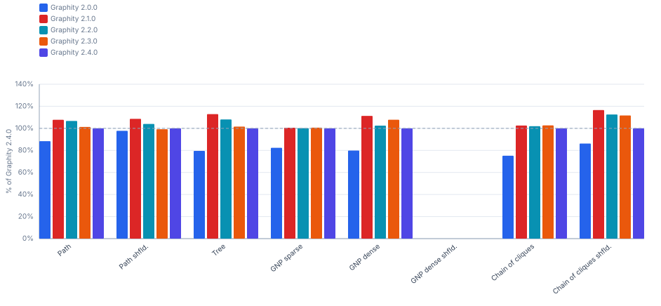

#### Times @ 1M nodes (ms/op, lower is better)

| Shape | Graphity 2.0.0 | Graphity 2.1.0 | Graphity 2.2.0 | Graphity 2.3.0 | Graphity 2.4.0 | Graphity 3.0.0 |
|---|---:|---:|---:|---:|---:|---:|
| GNP sparse<br><sub>1M nodes, 3M edges</sub> | 95.36 ms (1.3×) | 79.17 ms (1.1×) | 84.36 ms (1.1×) | 87.61 ms (1.2×) | 127.2 ms (1.7×) | 74.73 ms |
| GNP dense shfld.<br><sub>1M nodes, 30M edges</sub> | 414.3 ms | 315.0 ms | 336.1 ms | — | — | — |
| GNP dense<br><sub>1M nodes, 30M edges</sub> | — | 317.2 ms (1.0×) | 336.7 ms (1.1×) | 318.2 ms (1.0×) | 328.2 ms (1.1×) | 312.5 ms |
| Chain of cliques<br><sub>1M nodes, 31.1M edges</sub> | — | 52.67 ms (1.0×) | 53.13 ms (1.0×) | 52.32 ms (1.0×) | 54.61 ms (1.0×) | 54.81 ms |

#### Throughput @ 1M nodes (op/s, higher is better)

| Shape | Graphity 2.0.0 | Graphity 2.1.0 | Graphity 2.2.0 | Graphity 2.3.0 | Graphity 2.4.0 | Graphity 3.0.0 |
|---|---:|---:|---:|---:|---:|---:|
| GNP sparse<br><sub>1M nodes, 3M edges</sub> | 10.49 op/s (78.4%) | 12.63 op/s (94.4%) | 11.85 op/s (88.6%) | 11.41 op/s (85.3%) | 7.862 op/s (58.8%) | 13.38 op/s |
| GNP dense shfld.<br><sub>1M nodes, 30M edges</sub> | 2.414 op/s | 3.175 op/s | 2.975 op/s | — | — | — |
| GNP dense<br><sub>1M nodes, 30M edges</sub> | — | 3.153 op/s (98.5%) | 2.970 op/s (92.8%) | 3.143 op/s (98.2%) | 3.047 op/s (95.2%) | 3.200 op/s |
| Chain of cliques<br><sub>1M nodes, 31.1M edges</sub> | — | 18.99 op/s (104%) | 18.82 op/s (103%) | 19.11 op/s (105%) | 18.31 op/s (100%) | 18.25 op/s |

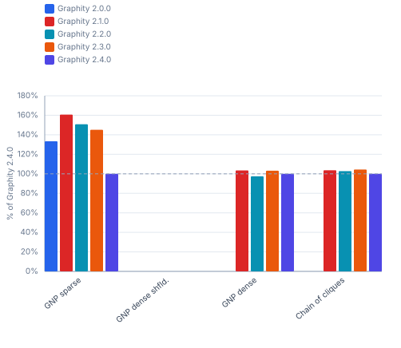

#### Times @ 10M nodes (ms/op, lower is better)

| Shape | Graphity 2.0.0 | Graphity 2.1.0 | Graphity 2.2.0 | Graphity 2.3.0 | Graphity 2.4.0 | Graphity 3.0.0 |
|---|---:|---:|---:|---:|---:|---:|
| GNP sparse<br><sub>10M nodes, 30M edges</sub> | 4011.1 ms (1.2×) | 3263.5 ms (1.0×) | 3401.7 ms (1.0×) | 3194.6 ms (1.0×) | 3228.1 ms (1.0×) | 3260.0 ms |
| GNP dense shfld.<br><sub>10M nodes, 299.6M edges</sub> | 10805 ms | 7613.8 ms | 7838.8 ms | — | — | — |
| GNP dense<br><sub>10M nodes, 299.6M edges</sub> | — | 7509.7 ms (1.0×) | 7782.3 ms (1.1×) | 7202.3 ms (1.0×) | 7233.0 ms (1.0×) | 7334.3 ms |
| Chain of cliques<br><sub>10M nodes, 310.8M edges</sub> | — | 617.1 ms (1.1×) | 622.8 ms (1.1×) | 543.0 ms (1.0×) | 548.8 ms (1.0×) | 566.8 ms |

#### Throughput @ 10M nodes (op/s, higher is better)

| Shape | Graphity 2.0.0 | Graphity 2.1.0 | Graphity 2.2.0 | Graphity 2.3.0 | Graphity 2.4.0 | Graphity 3.0.0 |
|---|---:|---:|---:|---:|---:|---:|
| GNP sparse<br><sub>10M nodes, 30M edges</sub> | 0.249 op/s (81.3%) | 0.306 op/s (99.9%) | 0.294 op/s (95.8%) | 0.313 op/s (102%) | 0.310 op/s (101%) | 0.307 op/s |
| GNP dense shfld.<br><sub>10M nodes, 299.6M edges</sub> | 0.093 op/s | 0.131 op/s | 0.128 op/s | — | — | — |
| GNP dense<br><sub>10M nodes, 299.6M edges</sub> | — | 0.133 op/s (97.7%) | 0.128 op/s (94.2%) | 0.139 op/s (102%) | 0.138 op/s (101%) | 0.136 op/s |
| Chain of cliques<br><sub>10M nodes, 310.8M edges</sub> | — | 1.620 op/s (91.8%) | 1.606 op/s (91.0%) | 1.842 op/s (104%) | 1.822 op/s (103%) | 1.764 op/s |

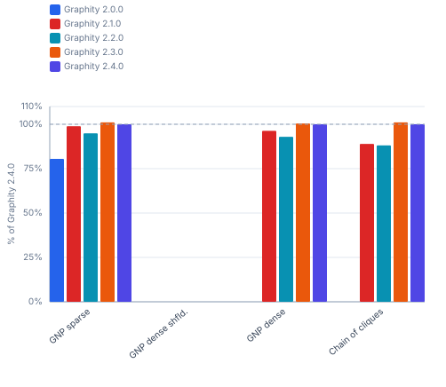

#### Times @ 100M nodes (ms/op, lower is better)

| Shape | Graphity 2.0.0 | Graphity 2.1.0 | Graphity 2.2.0 | Graphity 2.3.0 | Graphity 2.4.0 | Graphity 3.0.0 |
|---|---:|---:|---:|---:|---:|---:|
| GNP sparse<br><sub>100M nodes, 300M edges</sub> | 49550 ms (1.2×) | 41091 ms (1.0×) | 41896 ms (1.0×) | 40225 ms (1.0×) | 40274 ms (1.0×) | 41292 ms |

#### Throughput @ 100M nodes (op/s, higher is better)

| Shape | Graphity 2.0.0 | Graphity 2.1.0 | Graphity 2.2.0 | Graphity 2.3.0 | Graphity 2.4.0 | Graphity 3.0.0 |
|---|---:|---:|---:|---:|---:|---:|
| GNP sparse<br><sub>100M nodes, 300M edges</sub> | 0.020 op/s (83.3%) | 0.024 op/s (100%) | 0.024 op/s (98.6%) | 0.025 op/s (103%) | 0.025 op/s (103%) | 0.024 op/s |

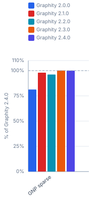

### 1.13 BiAdjacency (in-adjacency) cost

#### Times @ 10k nodes (ms/op, lower is better)

| Shape | Graphity 2.1.0 | Graphity 2.2.0 | Graphity 2.3.0 | Graphity 2.4.0 | Graphity 3.0.0 |
|---|---:|---:|---:|---:|---:|
| Path<br><sub>10k nodes, 10k edges</sub> | 0.022 ms (1.2×) | 0.022 ms (1.2×) | 0.015 ms (0.8×) | 0.022 ms (1.2×) | 0.019 ms |
| Path shfld.<br><sub>10k nodes, 10k edges</sub> | 0.018 ms (0.9×) | 0.022 ms (1.1×) | 0.023 ms (1.1×) | 0.023 ms (1.1×) | 0.020 ms |
| Tree<br><sub>10k nodes, 10k edges</sub> | 0.016 ms (0.9×) | 0.023 ms (1.4×) | 0.023 ms (1.4×) | 0.024 ms (1.4×) | 0.017 ms |
| GNP sparse<br><sub>10k nodes, 30k edges</sub> | 0.058 ms (1.5×) | 0.058 ms (1.5×) | 0.057 ms (1.5×) | 0.059 ms (1.6×) | 0.038 ms |
| GNP dense<br><sub>10k nodes, 299.6k edges</sub> | 0.546 ms (1.6×) | 0.548 ms (1.6×) | 0.544 ms (1.6×) | 0.551 ms (1.6×) | 0.335 ms |
| GNP dense shfld.<br><sub>10k nodes, 299.6k edges</sub> | 0.544 ms | 0.547 ms | — | — | — |
| Chain of cliques<br><sub>10k nodes, 310.8k edges</sub> | 0.545 ms (1.6×) | 0.542 ms (1.6×) | 0.542 ms (1.6×) | 0.547 ms (1.6×) | 0.336 ms |
| Chain of cliques shfld.<br><sub>10k nodes, 310.8k edges</sub> | 0.548 ms (1.5×) | 0.547 ms (1.5×) | 0.544 ms (1.5×) | 0.551 ms (1.5×) | 0.368 ms |

#### Throughput @ 10k nodes (op/s, higher is better)

| Shape | Graphity 2.1.0 | Graphity 2.2.0 | Graphity 2.3.0 | Graphity 2.4.0 | Graphity 3.0.0 |
|---|---:|---:|---:|---:|---:|
| Path<br><sub>10k nodes, 10k edges</sub> | 45 455 op/s (86.4%) | 45 455 op/s (86.4%) | 66 667 op/s (127%) | 45 455 op/s (86.4%) | 52 632 op/s |
| Path shfld.<br><sub>10k nodes, 10k edges</sub> | 55 556 op/s (111%) | 45 455 op/s (90.9%) | 43 478 op/s (87.0%) | 43 478 op/s (87.0%) | 50 000 op/s |
| Tree<br><sub>10k nodes, 10k edges</sub> | 62 500 op/s (106%) | 43 478 op/s (73.9%) | 43 478 op/s (73.9%) | 41 667 op/s (70.8%) | 58 824 op/s |
| GNP sparse<br><sub>10k nodes, 30k edges</sub> | 17 241 op/s (65.5%) | 17 241 op/s (65.5%) | 17 544 op/s (66.7%) | 16 949 op/s (64.4%) | 26 316 op/s |
| GNP dense<br><sub>10k nodes, 299.6k edges</sub> | 1 832 op/s (61.4%) | 1 825 op/s (61.1%) | 1 838 op/s (61.6%) | 1 815 op/s (60.8%) | 2 985 op/s |
| GNP dense shfld.<br><sub>10k nodes, 299.6k edges</sub> | 1 838 op/s | 1 828 op/s | — | — | — |
| Chain of cliques<br><sub>10k nodes, 310.8k edges</sub> | 1 835 op/s (61.7%) | 1 845 op/s (62.0%) | 1 845 op/s (62.0%) | 1 828 op/s (61.4%) | 2 976 op/s |
| Chain of cliques shfld.<br><sub>10k nodes, 310.8k edges</sub> | 1 825 op/s (67.2%) | 1 828 op/s (67.3%) | 1 838 op/s (67.6%) | 1 815 op/s (66.8%) | 2 717 op/s |

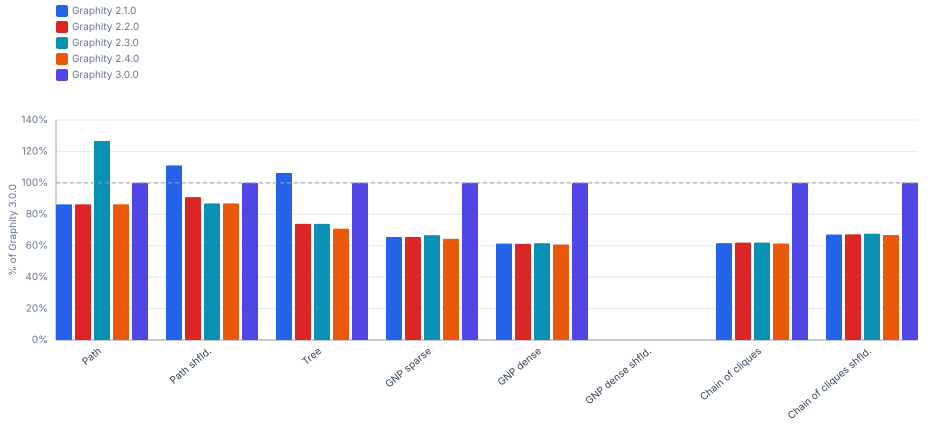

#### Times @ 100k nodes (ms/op, lower is better)

| Shape | Graphity 2.1.0 | Graphity 2.2.0 | Graphity 2.3.0 | Graphity 2.4.0 | Graphity 3.0.0 |
|---|---:|---:|---:|---:|---:|
| Path<br><sub>100k nodes, 100k edges</sub> | 0.185 ms (1.0×) | 0.204 ms (1.1×) | 0.203 ms (1.1×) | 0.206 ms (1.1×) | 0.182 ms |
| Path shfld.<br><sub>100k nodes, 100k edges</sub> | 0.238 ms (1.0×) | 0.236 ms (1.0×) | 0.236 ms (1.0×) | 0.241 ms (1.0×) | 0.239 ms |
| Tree<br><sub>100k nodes, 100k edges</sub> | 0.612 ms (1.2×) | 0.613 ms (1.2×) | 0.606 ms (1.2×) | 0.618 ms (1.2×) | 0.505 ms |
| GNP sparse<br><sub>100k nodes, 300k edges</sub> | 0.837 ms (0.9×) | 1.423 ms (1.6×) | 1.408 ms (1.6×) | 1.418 ms (1.6×) | 0.906 ms |
| GNP dense<br><sub>100k nodes, 3M edges</sub> | 7.148 ms (1.2×) | 7.932 ms (1.3×) | 7.385 ms (1.2×) | 7.949 ms (1.3×) | 6.177 ms |
| GNP dense shfld.<br><sub>100k nodes, 3M edges</sub> | 7.216 ms | 7.744 ms | — | — | — |
| Chain of cliques<br><sub>100k nodes, 3.1M edges</sub> | 5.559 ms (2.1×) | 5.555 ms (2.1×) | 5.548 ms (2.1×) | 4.611 ms (1.7×) | 2.667 ms |
| Chain of cliques shfld.<br><sub>100k nodes, 3.1M edges</sub> | 6.951 ms (1.1×) | 7.824 ms (1.2×) | 7.574 ms (1.2×) | 8.096 ms (1.3×) | 6.284 ms |

#### Throughput @ 100k nodes (op/s, higher is better)

| Shape | Graphity 2.1.0 | Graphity 2.2.0 | Graphity 2.3.0 | Graphity 2.4.0 | Graphity 3.0.0 |
|---|---:|---:|---:|---:|---:|
| Path<br><sub>100k nodes, 100k edges</sub> | 5 405 op/s (98.4%) | 4 902 op/s (89.2%) | 4 926 op/s (89.7%) | 4 854 op/s (88.3%) | 5 495 op/s |
| Path shfld.<br><sub>100k nodes, 100k edges</sub> | 4 202 op/s (100%) | 4 237 op/s (101%) | 4 237 op/s (101%) | 4 149 op/s (99.2%) | 4 184 op/s |
| Tree<br><sub>100k nodes, 100k edges</sub> | 1 634 op/s (82.5%) | 1 631 op/s (82.4%) | 1 650 op/s (83.3%) | 1 618 op/s (81.7%) | 1 980 op/s |
| GNP sparse<br><sub>100k nodes, 300k edges</sub> | 1 195 op/s (108%) | 702.7 op/s (63.7%) | 710.2 op/s (64.3%) | 705.2 op/s (63.9%) | 1 104 op/s |
| GNP dense<br><sub>100k nodes, 3M edges</sub> | 139.9 op/s (86.4%) | 126.1 op/s (77.9%) | 135.4 op/s (83.6%) | 125.8 op/s (77.7%) | 161.9 op/s |
| GNP dense shfld.<br><sub>100k nodes, 3M edges</sub> | 138.6 op/s | 129.1 op/s | — | — | — |
| Chain of cliques<br><sub>100k nodes, 3.1M edges</sub> | 179.9 op/s (48.0%) | 180.0 op/s (48.0%) | 180.2 op/s (48.1%) | 216.9 op/s (57.8%) | 375.0 op/s |
| Chain of cliques shfld.<br><sub>100k nodes, 3.1M edges</sub> | 143.9 op/s (90.4%) | 127.8 op/s (80.3%) | 132.0 op/s (83.0%) | 123.5 op/s (77.6%) | 159.1 op/s |

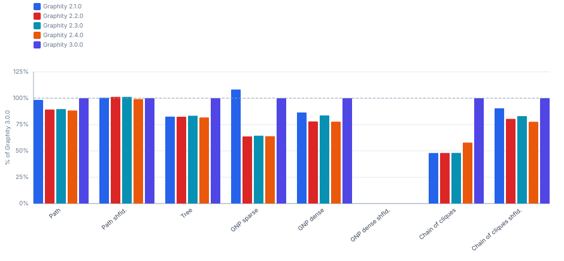

### 1.14 Dominators

#### Times @ 10k nodes (ms/op, lower is better)

| Shape | Graphity 2.2.0 | Graphity 2.3.0 | Graphity 2.4.0 | Graphity 3.0.0 |
|---|---:|---:|---:|---:|
| Structured | 0.168 ms (1.0×) | 0.165 ms (1.0×) | 0.177 ms (1.1×) | 0.162 ms |
| Irreducible | 0.178 ms (1.0×) | 0.164 ms (0.9×) | 0.174 ms (1.0×) | 0.181 ms |
| Ladder | 0.155 ms (1.0×) | 0.159 ms (1.0×) | 0.157 ms (1.0×) | 0.154 ms |
| Chain | 0.114 ms (1.0×) | 0.113 ms (1.0×) | 0.117 ms (1.0×) | 0.115 ms |
| Fan behind chain | 0.144 ms (1.0×) | 0.143 ms (1.0×) | 0.143 ms (1.0×) | 0.140 ms |
| Small methods | 0.201 ms (1.0×) | 0.184 ms (0.9×) | 0.183 ms (0.9×) | 0.202 ms |

#### Throughput @ 10k nodes (op/s, higher is better)

| Shape | Graphity 2.2.0 | Graphity 2.3.0 | Graphity 2.4.0 | Graphity 3.0.0 |
|---|---:|---:|---:|---:|
| Structured | 5 952 op/s (96.4%) | 6 061 op/s (98.2%) | 5 650 op/s (91.5%) | 6 173 op/s |
| Irreducible | 5 618 op/s (102%) | 6 098 op/s (110%) | 5 747 op/s (104%) | 5 525 op/s |
| Ladder | 6 452 op/s (99.4%) | 6 289 op/s (96.9%) | 6 369 op/s (98.1%) | 6 494 op/s |
| Chain | 8 772 op/s (101%) | 8 850 op/s (102%) | 8 547 op/s (98.3%) | 8 696 op/s |
| Fan behind chain | 6 944 op/s (97.2%) | 6 993 op/s (97.9%) | 6 993 op/s (97.9%) | 7 143 op/s |
| Small methods | 4 975 op/s (100%) | 5 435 op/s (110%) | 5 464 op/s (110%) | 4 950 op/s |

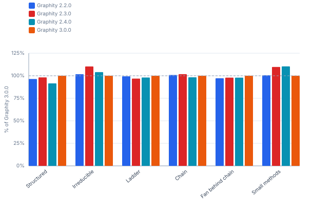

#### Times @ 100k nodes (ms/op, lower is better)

| Shape | Graphity 2.2.0 | Graphity 2.3.0 | Graphity 2.4.0 | Graphity 3.0.0 |
|---|---:|---:|---:|---:|
| Structured | 3.606 ms (1.0×) | 3.546 ms (1.0×) | 3.727 ms (1.1×) | 3.446 ms |
| Irreducible | 3.848 ms (1.1×) | 3.771 ms (1.1×) | 4.013 ms (1.1×) | 3.583 ms |
| Ladder | 1.528 ms (1.0×) | 1.465 ms (1.0×) | 1.540 ms (1.0×) | 1.500 ms |
| Chain | 1.098 ms (1.0×) | 1.096 ms (1.0×) | 1.119 ms (1.0×) | 1.096 ms |
| Fan behind chain | 1.469 ms (1.1×) | 1.459 ms (1.1×) | 1.414 ms (1.0×) | 1.381 ms |
| Small methods | 2.946 ms (1.0×) | 2.900 ms (1.0×) | 2.925 ms (1.0×) | 2.912 ms |

#### Throughput @ 100k nodes (op/s, higher is better)

| Shape | Graphity 2.2.0 | Graphity 2.3.0 | Graphity 2.4.0 | Graphity 3.0.0 |
|---|---:|---:|---:|---:|
| Structured | 277.3 op/s (95.6%) | 282.0 op/s (97.2%) | 268.3 op/s (92.5%) | 290.2 op/s |
| Irreducible | 259.9 op/s (93.1%) | 265.2 op/s (95.0%) | 249.2 op/s (89.3%) | 279.1 op/s |
| Ladder | 654.5 op/s (98.2%) | 682.6 op/s (102%) | 649.4 op/s (97.4%) | 666.7 op/s |
| Chain | 910.7 op/s (99.8%) | 912.4 op/s (100%) | 893.7 op/s (97.9%) | 912.4 op/s |
| Fan behind chain | 680.7 op/s (94.0%) | 685.4 op/s (94.7%) | 707.2 op/s (97.7%) | 724.1 op/s |
| Small methods | 339.4 op/s (98.8%) | 344.8 op/s (100%) | 341.9 op/s (99.6%) | 343.4 op/s |

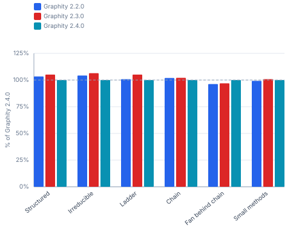

### 1.15 Dominance frontiers

#### Times @ 10k nodes (ms/op, lower is better)

| Shape | Graphity 2.2.0 | Graphity 2.3.0 | Graphity 2.4.0 | Graphity 3.0.0 |
|---|---:|---:|---:|---:|
| Structured | 0.069 ms (0.6×) | 0.069 ms (0.6×) | 0.069 ms (0.6×) | 0.111 ms |
| Irreducible | 0.083 ms (0.5×) | 0.080 ms (0.5×) | 0.081 ms (0.5×) | 0.159 ms |
| Ladder | 45.91 ms (0.9×) | 45.03 ms (0.9×) | 45.78 ms (0.9×) | 50.65 ms |
| Chain | 0.037 ms (0.9×) | 0.036 ms (0.9×) | 0.037 ms (0.9×) | 0.042 ms |
| Fan behind chain | 105.8 ms (0.9×) | 103.3 ms (0.9×) | 107.1 ms (0.9×) | 114.2 ms |
| Small methods | 0.057 ms (0.7×) | 0.055 ms (0.6×) | 0.056 ms (0.6×) | 0.087 ms |

#### Throughput @ 10k nodes (op/s, higher is better)

| Shape | Graphity 2.2.0 | Graphity 2.3.0 | Graphity 2.4.0 | Graphity 3.0.0 |
|---|---:|---:|---:|---:|
| Structured | 14 493 op/s (161%) | 14 493 op/s (161%) | 14 493 op/s (161%) | 9 009 op/s |
| Irreducible | 12 048 op/s (192%) | 12 500 op/s (199%) | 12 346 op/s (196%) | 6 289 op/s |
| Ladder | 21.78 op/s (110%) | 22.21 op/s (112%) | 21.84 op/s (111%) | 19.74 op/s |
| Chain | 27 027 op/s (114%) | 27 778 op/s (117%) | 27 027 op/s (114%) | 23 810 op/s |
| Fan behind chain | 9.452 op/s (108%) | 9.681 op/s (111%) | 9.337 op/s (107%) | 8.757 op/s |
| Small methods | 17 544 op/s (153%) | 18 182 op/s (158%) | 17 857 op/s (155%) | 11 494 op/s |

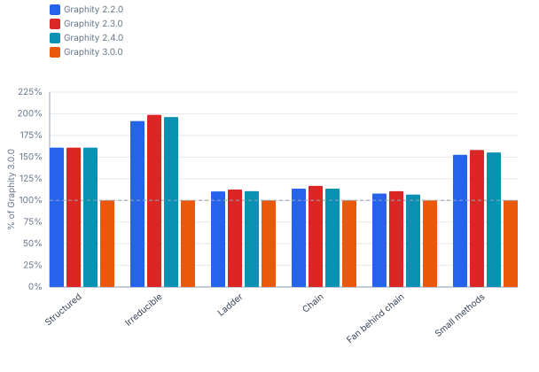

#### Times @ 100k nodes (ms/op, lower is better)

| Shape | Graphity 2.2.0 | Graphity 2.3.0 | Graphity 2.4.0 | Graphity 3.0.0 |
|---|---:|---:|---:|---:|
| Structured | 1.991 ms (0.9×) | 1.957 ms (0.8×) | 1.980 ms (0.9×) | 2.322 ms |
| Irreducible | 2.347 ms (0.9×) | 2.310 ms (0.8×) | 2.293 ms (0.8×) | 2.761 ms |
| Chain | 0.368 ms (0.9×) | 0.358 ms (0.9×) | 0.368 ms (0.9×) | 0.407 ms |
| Small methods | 1.455 ms (0.8×) | 1.425 ms (0.8×) | 1.424 ms (0.8×) | 1.820 ms |

#### Throughput @ 100k nodes (op/s, higher is better)

| Shape | Graphity 2.2.0 | Graphity 2.3.0 | Graphity 2.4.0 | Graphity 3.0.0 |
|---|---:|---:|---:|---:|
| Structured | 502.3 op/s (117%) | 511.0 op/s (119%) | 505.1 op/s (117%) | 430.7 op/s |
| Irreducible | 426.1 op/s (118%) | 432.9 op/s (120%) | 436.1 op/s (120%) | 362.2 op/s |
| Chain | 2 717 op/s (111%) | 2 793 op/s (114%) | 2 717 op/s (111%) | 2 457 op/s |
| Small methods | 687.3 op/s (125%) | 701.8 op/s (128%) | 702.2 op/s (128%) | 549.5 op/s |

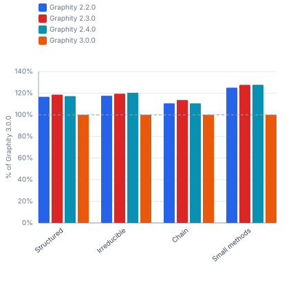

### 1.16 Iterated dominance frontier (build + one query per variable)

#### Times @ 10k nodes (ms/op, lower is better)

| Shape | Graphity 2.2.0 | Graphity 2.3.0 | Graphity 2.4.0 | Graphity 3.0.0 |
|---|---:|---:|---:|---:|
| Structured | 30.88 ms (1.0×) | 30.80 ms (1.0×) | 30.64 ms (1.0×) | 30.90 ms |
| Irreducible | 42.61 ms (1.0×) | 41.67 ms (1.0×) | 41.00 ms (1.0×) | 41.03 ms |
| Ladder | 36.01 ms (1.0×) | 35.74 ms (1.0×) | 36.06 ms (1.0×) | 36.18 ms |
| Chain | 21.29 ms (1.0×) | 20.90 ms (1.0×) | 21.12 ms (1.0×) | 21.14 ms |
| Fan behind chain | 33.67 ms (1.0×) | 33.78 ms (1.0×) | 33.82 ms (1.0×) | 34.53 ms |
| Small methods | 0.432 ms (1.0×) | 0.435 ms (1.0×) | 0.427 ms (1.0×) | 0.424 ms |

#### Throughput @ 10k nodes (op/s, higher is better)

| Shape | Graphity 2.2.0 | Graphity 2.3.0 | Graphity 2.4.0 | Graphity 3.0.0 |
|---|---:|---:|---:|---:|
| Structured | 32.38 op/s (100%) | 32.47 op/s (100%) | 32.64 op/s (101%) | 32.36 op/s |
| Irreducible | 23.47 op/s (96.3%) | 24.00 op/s (98.5%) | 24.39 op/s (100%) | 24.37 op/s |
| Ladder | 27.77 op/s (100%) | 27.98 op/s (101%) | 27.73 op/s (100%) | 27.64 op/s |
| Chain | 46.96 op/s (99.3%) | 47.85 op/s (101%) | 47.34 op/s (100%) | 47.30 op/s |
| Fan behind chain | 29.70 op/s (103%) | 29.61 op/s (102%) | 29.56 op/s (102%) | 28.96 op/s |
| Small methods | 2 315 op/s (98.1%) | 2 299 op/s (97.5%) | 2 342 op/s (99.3%) | 2 358 op/s |

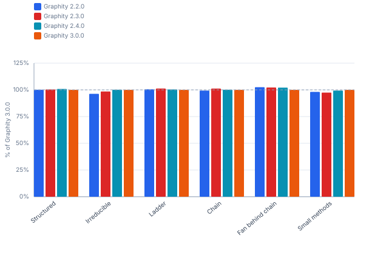

#### Times @ 100k nodes (ms/op, lower is better)

| Shape | Graphity 2.2.0 | Graphity 2.3.0 | Graphity 2.4.0 | Graphity 3.0.0 |
|---|---:|---:|---:|---:|
| Structured | 438.1 ms (1.0×) | 433.1 ms (1.0×) | 432.0 ms (1.0×) | 431.4 ms |
| Irreducible | 572.2 ms (1.0×) | 557.4 ms (1.0×) | 559.8 ms (1.0×) | 575.3 ms |
| Ladder | 375.5 ms (1.0×) | 364.3 ms (1.0×) | 369.3 ms (1.0×) | 373.0 ms |
| Chain | 231.5 ms (1.0×) | 228.3 ms (1.0×) | 234.4 ms (1.0×) | 226.4 ms |
| Fan behind chain | 405.6 ms (1.0×) | 404.0 ms (1.0×) | 402.3 ms (1.0×) | 411.1 ms |
| Small methods | 4.535 ms (1.1×) | 4.420 ms (1.0×) | 4.475 ms (1.0×) | 4.318 ms |

#### Throughput @ 100k nodes (op/s, higher is better)

| Shape | Graphity 2.2.0 | Graphity 2.3.0 | Graphity 2.4.0 | Graphity 3.0.0 |
|---|---:|---:|---:|---:|
| Structured | 2.283 op/s (98.5%) | 2.309 op/s (99.6%) | 2.315 op/s (99.9%) | 2.318 op/s |
| Irreducible | 1.748 op/s (101%) | 1.794 op/s (103%) | 1.786 op/s (103%) | 1.738 op/s |
| Ladder | 2.663 op/s (99.3%) | 2.745 op/s (102%) | 2.708 op/s (101%) | 2.681 op/s |
| Chain | 4.320 op/s (97.8%) | 4.380 op/s (99.2%) | 4.266 op/s (96.6%) | 4.417 op/s |
| Fan behind chain | 2.465 op/s (101%) | 2.475 op/s (102%) | 2.486 op/s (102%) | 2.432 op/s |
| Small methods | 220.5 op/s (95.2%) | 226.2 op/s (97.7%) | 223.5 op/s (96.5%) | 231.6 op/s |

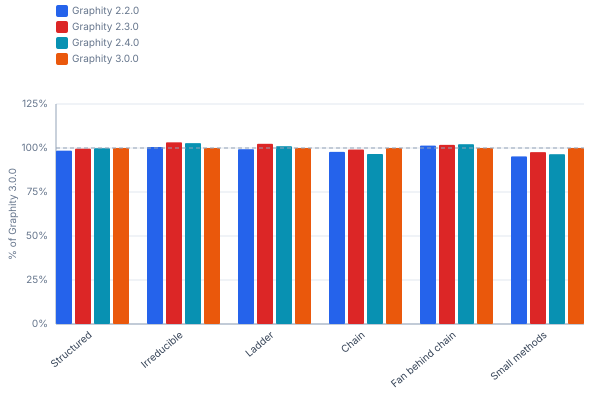

### 1.17 Loops

#### Times @ 10k nodes (ms/op, lower is better)

| Shape | Graphity 2.2.0 | Graphity 2.3.0 | Graphity 2.4.0 | Graphity 3.0.0 |
|---|---:|---:|---:|---:|
| Structured | 0.400 ms (1.0×) | 0.395 ms (1.0×) | 0.400 ms (1.0×) | 0.388 ms |
| Irreducible | 0.420 ms (1.0×) | 0.422 ms (1.0×) | 0.423 ms (1.0×) | 0.413 ms |
| Ladder | 0.102 ms (1.0×) | 0.101 ms (1.0×) | 0.107 ms (1.1×) | 0.100 ms |
| Chain | 0.103 ms (1.0×) | 0.102 ms (1.0×) | 0.105 ms (1.0×) | 0.101 ms |
| Fan behind chain | 0.103 ms (1.0×) | 0.102 ms (1.0×) | 0.105 ms (1.0×) | 0.101 ms |
| Small methods | 0.465 ms (1.0×) | 0.464 ms (1.0×) | 0.461 ms (1.0×) | 0.452 ms |

#### Throughput @ 10k nodes (op/s, higher is better)

| Shape | Graphity 2.2.0 | Graphity 2.3.0 | Graphity 2.4.0 | Graphity 3.0.0 |
|---|---:|---:|---:|---:|
| Structured | 2 500 op/s (97.0%) | 2 532 op/s (98.2%) | 2 500 op/s (97.0%) | 2 577 op/s |
| Irreducible | 2 381 op/s (98.3%) | 2 370 op/s (97.9%) | 2 364 op/s (97.6%) | 2 421 op/s |
| Ladder | 9 804 op/s (98.0%) | 9 901 op/s (99.0%) | 9 346 op/s (93.5%) | 10 000 op/s |
| Chain | 9 709 op/s (98.1%) | 9 804 op/s (99.0%) | 9 524 op/s (96.2%) | 9 901 op/s |
| Fan behind chain | 9 709 op/s (98.1%) | 9 804 op/s (99.0%) | 9 524 op/s (96.2%) | 9 901 op/s |
| Small methods | 2 151 op/s (97.2%) | 2 155 op/s (97.4%) | 2 169 op/s (98.0%) | 2 212 op/s |

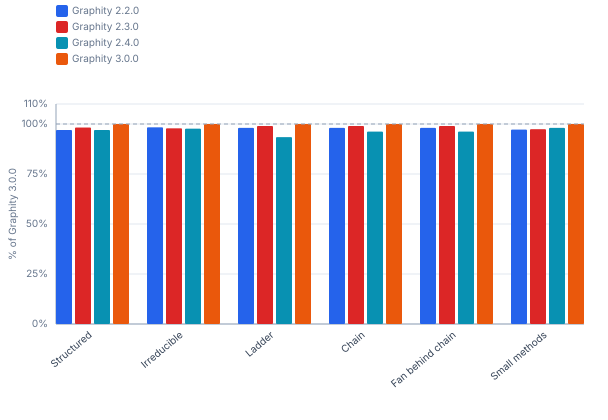

#### Times @ 100k nodes (ms/op, lower is better)

| Shape | Graphity 2.2.0 | Graphity 2.3.0 | Graphity 2.4.0 | Graphity 3.0.0 |
|---|---:|---:|---:|---:|
| Structured | 5.543 ms (1.0×) | 5.751 ms (1.1×) | 5.993 ms (1.1×) | 5.422 ms |
| Irreducible | 7.337 ms (1.0×) | 7.272 ms (1.0×) | 7.556 ms (1.1×) | 7.059 ms |
| Ladder | 1.035 ms (1.0×) | 1.020 ms (1.0×) | 1.063 ms (1.1×) | 0.997 ms |
| Chain | 0.992 ms (1.0×) | 0.994 ms (1.0×) | 1.025 ms (1.1×) | 0.974 ms |
| Fan behind chain | 1.005 ms (1.0×) | 0.997 ms (1.0×) | 1.029 ms (1.0×) | 0.984 ms |
| Small methods | 4.997 ms (1.0×) | 4.844 ms (1.0×) | 4.950 ms (1.0×) | 4.925 ms |

#### Throughput @ 100k nodes (op/s, higher is better)

| Shape | Graphity 2.2.0 | Graphity 2.3.0 | Graphity 2.4.0 | Graphity 3.0.0 |
|---|---:|---:|---:|---:|
| Structured | 180.4 op/s (97.8%) | 173.9 op/s (94.3%) | 166.9 op/s (90.5%) | 184.4 op/s |
| Irreducible | 136.3 op/s (96.2%) | 137.5 op/s (97.1%) | 132.3 op/s (93.4%) | 141.7 op/s |
| Ladder | 966.2 op/s (96.3%) | 980.4 op/s (97.7%) | 940.7 op/s (93.8%) | 1 003 op/s |
| Chain | 1 008 op/s (98.2%) | 1 006 op/s (98.0%) | 975.6 op/s (95.0%) | 1 027 op/s |
| Fan behind chain | 995.0 op/s (97.9%) | 1 003 op/s (98.7%) | 971.8 op/s (95.6%) | 1 016 op/s |
| Small methods | 200.1 op/s (98.6%) | 206.4 op/s (102%) | 202.0 op/s (99.5%) | 203.0 op/s |

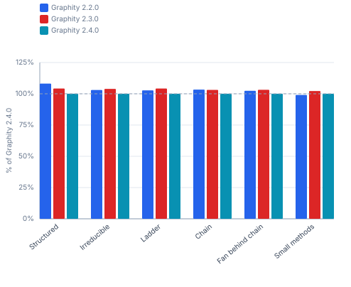

### 1.18 Ancestry of the dominator tree

#### Times @ 10k nodes (ms/op, lower is better)

| Shape | Graphity 2.2.0 | Graphity 2.3.0 | Graphity 2.4.0 | Graphity 3.0.0 |
|---|---:|---:|---:|---:|
| Structured | 0.065 ms (1.1×) | 0.065 ms (1.1×) | 0.058 ms (1.0×) | 0.058 ms |
| Irreducible | 0.067 ms (1.1×) | 0.066 ms (1.1×) | 0.068 ms (1.2×) | 0.059 ms |
| Ladder | 0.052 ms (1.1×) | 0.045 ms (1.0×) | 0.053 ms (1.1×) | 0.047 ms |
| Chain | 0.056 ms (1.1×) | 0.056 ms (1.1×) | 0.049 ms (1.0×) | 0.049 ms |
| Fan behind chain | 0.052 ms (1.2×) | 0.051 ms (1.2×) | 0.052 ms (1.2×) | 0.044 ms |
| Small methods | 0.058 ms (1.1×) | 0.057 ms (1.1×) | 0.059 ms (1.1×) | 0.053 ms |

#### Throughput @ 10k nodes (op/s, higher is better)

| Shape | Graphity 2.2.0 | Graphity 2.3.0 | Graphity 2.4.0 | Graphity 3.0.0 |
|---|---:|---:|---:|---:|
| Structured | 15 385 op/s (89.2%) | 15 385 op/s (89.2%) | 17 241 op/s (100%) | 17 241 op/s |
| Irreducible | 14 925 op/s (88.1%) | 15 152 op/s (89.4%) | 14 706 op/s (86.8%) | 16 949 op/s |
| Ladder | 19 231 op/s (90.4%) | 22 222 op/s (104%) | 18 868 op/s (88.7%) | 21 277 op/s |
| Chain | 17 857 op/s (87.5%) | 17 857 op/s (87.5%) | 20 408 op/s (100%) | 20 408 op/s |
| Fan behind chain | 19 231 op/s (84.6%) | 19 608 op/s (86.3%) | 19 231 op/s (84.6%) | 22 727 op/s |
| Small methods | 17 241 op/s (91.4%) | 17 544 op/s (93.0%) | 16 949 op/s (89.8%) | 18 868 op/s |

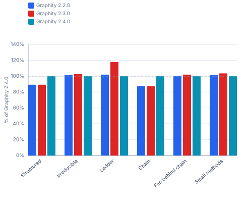

#### Times @ 100k nodes (ms/op, lower is better)

| Shape | Graphity 2.2.0 | Graphity 2.3.0 | Graphity 2.4.0 | Graphity 3.0.0 |
|---|---:|---:|---:|---:|
| Structured | 1.897 ms (1.1×) | 1.792 ms (1.0×) | 1.816 ms (1.1×) | 1.720 ms |
| Irreducible | 1.727 ms (1.0×) | 1.718 ms (1.0×) | 1.814 ms (1.1×) | 1.713 ms |
| Ladder | 0.504 ms (1.2×) | 0.488 ms (1.2×) | 0.506 ms (1.2×) | 0.406 ms |
| Chain | 0.559 ms (1.2×) | 0.553 ms (1.2×) | 0.566 ms (1.2×) | 0.462 ms |
| Fan behind chain | 0.543 ms (1.3×) | 0.490 ms (1.2×) | 0.513 ms (1.3×) | 0.406 ms |
| Small methods | 1.591 ms (1.0×) | 1.564 ms (1.0×) | 1.577 ms (1.0×) | 1.546 ms |

#### Throughput @ 100k nodes (op/s, higher is better)

| Shape | Graphity 2.2.0 | Graphity 2.3.0 | Graphity 2.4.0 | Graphity 3.0.0 |
|---|---:|---:|---:|---:|
| Structured | 527.1 op/s (90.7%) | 558.0 op/s (96.0%) | 550.7 op/s (94.7%) | 581.4 op/s |
| Irreducible | 579.0 op/s (99.2%) | 582.1 op/s (99.7%) | 551.3 op/s (94.4%) | 583.8 op/s |
| Ladder | 1 984 op/s (80.6%) | 2 049 op/s (83.2%) | 1 976 op/s (80.2%) | 2 463 op/s |
| Chain | 1 789 op/s (82.6%) | 1 808 op/s (83.5%) | 1 767 op/s (81.6%) | 2 165 op/s |
| Fan behind chain | 1 842 op/s (74.8%) | 2 041 op/s (82.9%) | 1 949 op/s (79.1%) | 2 463 op/s |
| Small methods | 628.5 op/s (97.2%) | 639.4 op/s (98.8%) | 634.1 op/s (98.0%) | 646.8 op/s |

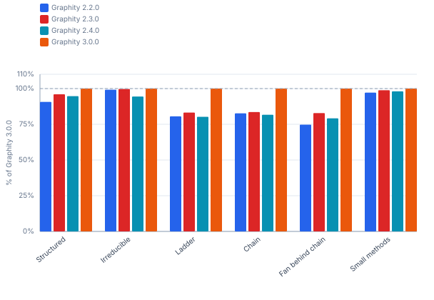

### 1.19 PreorderAncestry of the dominator tree

#### Times @ 10k nodes (ms/op, lower is better)

| Shape | Graphity 2.2.0 | Graphity 2.3.0 | Graphity 2.4.0 | Graphity 3.0.0 |
|---|---:|---:|---:|---:|
| Structured | 0.052 ms (1.0×) | 0.051 ms (1.0×) | 0.053 ms (1.0×) | 0.053 ms |
| Irreducible | 0.052 ms (1.0×) | 0.051 ms (1.0×) | 0.053 ms (1.0×) | 0.052 ms |
| Ladder | 0.045 ms (1.0×) | 0.044 ms (1.0×) | 0.045 ms (1.0×) | 0.045 ms |
| Chain | 0.046 ms (1.0×) | 0.046 ms (1.0×) | 0.047 ms (1.0×) | 0.047 ms |
| Fan behind chain | 0.044 ms (1.0×) | 0.045 ms (1.0×) | 0.046 ms (1.0×) | 0.045 ms |
| Small methods | 0.050 ms (1.0×) | 0.048 ms (1.0×) | 0.049 ms (1.0×) | 0.048 ms |

#### Throughput @ 10k nodes (op/s, higher is better)

| Shape | Graphity 2.2.0 | Graphity 2.3.0 | Graphity 2.4.0 | Graphity 3.0.0 |
|---|---:|---:|---:|---:|
| Structured | 19 231 op/s (102%) | 19 608 op/s (104%) | 18 868 op/s (100%) | 18 868 op/s |
| Irreducible | 19 231 op/s (100%) | 19 608 op/s (102%) | 18 868 op/s (98.1%) | 19 231 op/s |
| Ladder | 22 222 op/s (100%) | 22 727 op/s (102%) | 22 222 op/s (100%) | 22 222 op/s |
| Chain | 21 739 op/s (102%) | 21 739 op/s (102%) | 21 277 op/s (100%) | 21 277 op/s |
| Fan behind chain | 22 727 op/s (102%) | 22 222 op/s (100%) | 21 739 op/s (97.8%) | 22 222 op/s |
| Small methods | 20 000 op/s (96.0%) | 20 833 op/s (100%) | 20 408 op/s (98.0%) | 20 833 op/s |

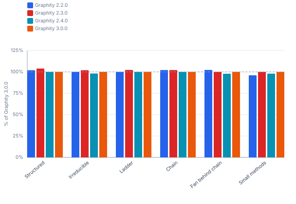

#### Times @ 100k nodes (ms/op, lower is better)

| Shape | Graphity 2.2.0 | Graphity 2.3.0 | Graphity 2.4.0 | Graphity 3.0.0 |
|---|---:|---:|---:|---:|
| Structured | 1.072 ms (1.0×) | 1.094 ms (1.0×) | 1.079 ms (1.0×) | 1.063 ms |
| Irreducible | 1.051 ms (1.0×) | 1.055 ms (1.0×) | 1.168 ms (1.1×) | 1.040 ms |
| Ladder | 0.378 ms (1.1×) | 0.346 ms (1.0×) | 0.364 ms (1.0×) | 0.358 ms |
| Chain | 0.426 ms (1.0×) | 0.411 ms (1.0×) | 0.424 ms (1.0×) | 0.425 ms |
| Fan behind chain | 0.376 ms (1.0×) | 0.401 ms (1.1×) | 0.363 ms (1.0×) | 0.361 ms |
| Small methods | 0.868 ms (1.0×) | 0.846 ms (1.0×) | 0.858 ms (1.0×) | 0.836 ms |

#### Throughput @ 100k nodes (op/s, higher is better)

| Shape | Graphity 2.2.0 | Graphity 2.3.0 | Graphity 2.4.0 | Graphity 3.0.0 |
|---|---:|---:|---:|---:|
| Structured | 932.8 op/s (99.2%) | 914.1 op/s (97.2%) | 926.8 op/s (98.5%) | 940.7 op/s |
| Irreducible | 951.5 op/s (99.0%) | 947.9 op/s (98.6%) | 856.2 op/s (89.0%) | 961.5 op/s |
| Ladder | 2 646 op/s (94.7%) | 2 890 op/s (103%) | 2 747 op/s (98.4%) | 2 793 op/s |
| Chain | 2 347 op/s (99.8%) | 2 433 op/s (103%) | 2 358 op/s (100%) | 2 353 op/s |
| Fan behind chain | 2 660 op/s (96.0%) | 2 494 op/s (90.0%) | 2 755 op/s (99.4%) | 2 770 op/s |
| Small methods | 1 152 op/s (96.3%) | 1 182 op/s (98.8%) | 1 166 op/s (97.4%) | 1 196 op/s |

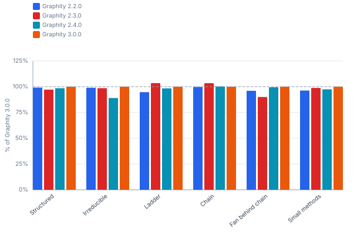

## 2 Memory Footprint

Retained heap in bytes for a fully built graph. Lower is better. Baseline (= 100%): **Graphity 3.0.0**, or the newest version present in a table it is missing from.

### 2.1 Total Graph Size

**Memory footprint in bytes (lower is better)**

| Shape | Graphity 1.0 | Graphity 2.0.0 | Graphity 2.1.0 | Graphity 2.2.0 | Graphity 2.3.0 | Graphity 2.4.0 | Graphity 3.0.0 |
|---|---:|---:|---:|---:|---:|---:|---:|
| Path<br><sub>10k nodes, 10k edges</sub> | 80.1 kB (100%) | 80.1 kB (100%) | 80.1 kB (100%) | 80.1 kB (100%) | 80.1 kB (100%) | 80.1 kB (100%) | 80.1 kB |
| Path shfld.<br><sub>10k nodes, 10k edges</sub> | 80.1 kB (100%) | 80.1 kB (100%) | 80.1 kB (100%) | 80.1 kB (100%) | 80.1 kB (100%) | 80.1 kB (100%) | 80.1 kB |
| Tree<br><sub>10k nodes, 10k edges</sub> | 80.1 kB (100%) | 80.1 kB (100%) | 80.1 kB (100%) | 80.1 kB (100%) | 80.1 kB (100%) | 80.1 kB (100%) | 80.1 kB |
| GNP sparse<br><sub>10k nodes, 30k edges</sub> | 160 kB (100%) | 160 kB (100%) | 160 kB (100%) | 160 kB (100%) | 160 kB (100%) | 160 kB (100%) | 160 kB |
| GNP dense<br><sub>10k nodes, 299.6k edges</sub> | 1.2 MB (100%) | 1.2 MB (100%) | 1.2 MB (100%) | 1.2 MB (100%) | 1.2 MB (100%) | 1.2 MB (100%) | 1.2 MB |
| GNP dense shfld.<br><sub>10k nodes, 299.6k edges</sub> | 1.2 MB | 1.2 MB | 1.2 MB | 1.2 MB | — | — | — |
| Chain of cliques<br><sub>10k nodes, 310.8k edges</sub> | 1.3 MB (100%) | 1.3 MB (100%) | 1.3 MB (100%) | 1.3 MB (100%) | 1.3 MB (100%) | 1.3 MB (100%) | 1.3 MB |
| Chain of cliques shfld.<br><sub>10k nodes, 310.8k edges</sub> | 1.3 MB (100%) | 1.3 MB (100%) | 1.3 MB (100%) | 1.3 MB (100%) | 1.3 MB (100%) | 1.3 MB (100%) | 1.3 MB |
| Path<br><sub>100k nodes, 100k edges</sub> | 800 kB (100%) | 800 kB (100%) | 800 kB (100%) | 800 kB (100%) | 800 kB (100%) | 800 kB (100%) | 800 kB |
| Path shfld.<br><sub>100k nodes, 100k edges</sub> | 800 kB (100%) | 800 kB (100%) | 800 kB (100%) | 800 kB (100%) | 800 kB (100%) | 800 kB (100%) | 800 kB |
| Tree<br><sub>100k nodes, 100k edges</sub> | 800 kB (100%) | 800 kB (100%) | 800 kB (100%) | 800 kB (100%) | 800 kB (100%) | 800 kB (100%) | 800 kB |
| GNP sparse<br><sub>100k nodes, 300k edges</sub> | 1.6 MB (100%) | 1.6 MB (100%) | 1.6 MB (100%) | 1.6 MB (100%) | 1.6 MB (100%) | 1.6 MB (100%) | 1.6 MB |
| GNP dense<br><sub>100k nodes, 3M edges</sub> | 12.4 MB (100%) | 12.4 MB (100%) | 12.4 MB (100%) | 12.4 MB (100%) | 12.4 MB (100%) | 12.4 MB (100%) | 12.4 MB |
| GNP dense shfld.<br><sub>100k nodes, 3M edges</sub> | 12.4 MB | 12.4 MB | 12.4 MB | 12.4 MB | — | — | — |
| Chain of cliques<br><sub>100k nodes, 3.1M edges</sub> | 12.8 MB (100%) | 12.8 MB (100%) | 12.8 MB (100%) | 12.8 MB (100%) | 12.8 MB (100%) | 12.8 MB (100%) | 12.8 MB |
| Chain of cliques shfld.<br><sub>100k nodes, 3.1M edges</sub> | 12.8 MB (100%) | 12.8 MB (100%) | 12.8 MB (100%) | 12.8 MB (100%) | 12.8 MB (100%) | 12.8 MB (100%) | 12.8 MB |
| GNP sparse<br><sub>1M nodes, 3M edges</sub> | — | 16.0 MB (100%) | 16.0 MB (100%) | 16.0 MB (100%) | 16.0 MB (100%) | 16.0 MB (100%) | 16.0 MB |
| GNP sparse<br><sub>10M nodes, 30M edges</sub> | — | 160 MB (100%) | 160 MB (100%) | 160 MB (100%) | 160 MB (100%) | 160 MB (100%) | 160 MB |
| GNP sparse<br><sub>100M nodes, 300M edges</sub> | — | 1600 MB (100%) | 1600 MB (100%) | 1600 MB (100%) | 1600 MB (100%) | 1600 MB (100%) | 1600 MB |


### 2.2 Bytes per Element  `totalBytes / (Nodes + Edges)`

**Memory footprint in bytes (lower is better)**

| Shape | Graphity 1.0 | Graphity 2.0.0 | Graphity 2.1.0 | Graphity 2.2.0 | Graphity 2.3.0 | Graphity 2.4.0 | Graphity 3.0.0 |
|---|---:|---:|---:|---:|---:|---:|---:|
| Path<br><sub>10k nodes, 10k edges</sub> | 4 B (100%) | 4 B (100%) | 4 B (100%) | 4 B (100%) | 4 B (100%) | 4 B (100%) | 4 B |
| Path shfld.<br><sub>10k nodes, 10k edges</sub> | 4 B (100%) | 4 B (100%) | 4 B (100%) | 4 B (100%) | 4 B (100%) | 4 B (100%) | 4 B |
| Tree<br><sub>10k nodes, 10k edges</sub> | 4 B (100%) | 4 B (100%) | 4 B (100%) | 4 B (100%) | 4 B (100%) | 4 B (100%) | 4 B |
| GNP sparse<br><sub>10k nodes, 30k edges</sub> | 4 B (100%) | 4 B (100%) | 4 B (100%) | 4 B (100%) | 4 B (100%) | 4 B (100%) | 4 B |
| GNP dense<br><sub>10k nodes, 299.6k edges</sub> | 4 B (100%) | 4 B (100%) | 4 B (100%) | 4 B (100%) | 4 B (100%) | 4 B (100%) | 4 B |
| GNP dense shfld.<br><sub>10k nodes, 299.6k edges</sub> | 4 B | 4 B | 4 B | 4 B | — | — | — |
| Chain of cliques<br><sub>10k nodes, 310.8k edges</sub> | 4 B (100%) | 4 B (100%) | 4 B (100%) | 4 B (100%) | 4 B (100%) | 4 B (100%) | 4 B |
| Chain of cliques shfld.<br><sub>10k nodes, 310.8k edges</sub> | 4 B (100%) | 4 B (100%) | 4 B (100%) | 4 B (100%) | 4 B (100%) | 4 B (100%) | 4 B |
| Path<br><sub>100k nodes, 100k edges</sub> | 4 B (100%) | 4 B (100%) | 4 B (100%) | 4 B (100%) | 4 B (100%) | 4 B (100%) | 4 B |
| Path shfld.<br><sub>100k nodes, 100k edges</sub> | 4 B (100%) | 4 B (100%) | 4 B (100%) | 4 B (100%) | 4 B (100%) | 4 B (100%) | 4 B |
| Tree<br><sub>100k nodes, 100k edges</sub> | 4 B (100%) | 4 B (100%) | 4 B (100%) | 4 B (100%) | 4 B (100%) | 4 B (100%) | 4 B |
| GNP sparse<br><sub>100k nodes, 300k edges</sub> | 4 B (100%) | 4 B (100%) | 4 B (100%) | 4 B (100%) | 4 B (100%) | 4 B (100%) | 4 B |
| GNP dense<br><sub>100k nodes, 3M edges</sub> | 4 B (100%) | 4 B (100%) | 4 B (100%) | 4 B (100%) | 4 B (100%) | 4 B (100%) | 4 B |
| GNP dense shfld.<br><sub>100k nodes, 3M edges</sub> | 4 B | 4 B | 4 B | 4 B | — | — | — |
| Chain of cliques<br><sub>100k nodes, 3.1M edges</sub> | 4 B (100%) | 4 B (100%) | 4 B (100%) | 4 B (100%) | 4 B (100%) | 4 B (100%) | 4 B |
| Chain of cliques shfld.<br><sub>100k nodes, 3.1M edges</sub> | 4 B (100%) | 4 B (100%) | 4 B (100%) | 4 B (100%) | 4 B (100%) | 4 B (100%) | 4 B |
| GNP sparse<br><sub>1M nodes, 3M edges</sub> | — | 4 B (100%) | 4 B (100%) | 4 B (100%) | 4 B (100%) | 4 B (100%) | 4 B |
| GNP sparse<br><sub>10M nodes, 30M edges</sub> | — | 4 B (100%) | 4 B (100%) | 4 B (100%) | 4 B (100%) | 4 B (100%) | 4 B |
| GNP sparse<br><sub>100M nodes, 300M edges</sub> | — | 4 B (100%) | 4 B (100%) | 4 B (100%) | 4 B (100%) | 4 B (100%) | 4 B |


## 3 Allocations

Bytes allocated per algorithm invocation (JMH `-prof gc`). Lower is better. Baseline (= 100%): **Graphity 3.0.0**, or the newest version present in a table it is missing from.

### 3.1 Build

**Allocations @ 10k nodes in bytes (lower is better)**

| Shape | Graphity 1.0 | Graphity 2.0.0 | Graphity 2.1.0 | Graphity 2.2.0 | Graphity 2.3.0 | Graphity 2.4.0 | Graphity 3.0.0 |
|---|---:|---:|---:|---:|---:|---:|---:|
| Path<br><sub>10k nodes, 10k edges</sub> | 458 kB (100.0%) | 458 kB (100.0%) | 458 kB (100%) | 458 kB (100%) | 458 kB (100%) | — | 458 kB |
| Path shfld.<br><sub>10k nodes, 10k edges</sub> | 458 kB (100.0%) | 458 kB (100.0%) | 458 kB (100%) | 458 kB (100%) | 458 kB (100%) | — | 458 kB |
| Tree<br><sub>10k nodes, 10k edges</sub> | 458 kB (100.0%) | 458 kB (100.0%) | 458 kB (100%) | 458 kB (100%) | 458 kB (100%) | — | 458 kB |
| GNP sparse<br><sub>10k nodes, 30k edges</sub> | 960 kB (100.0%) | 960 kB (100.0%) | 960 kB (100.0%) | 960 kB (100.0%) | 960 kB (100%) | — | 960 kB |
| GNP dense<br><sub>10k nodes, 299.6k edges</sub> | 9.9 MB (100.0%) | 9.9 MB (100.0%) | 9.9 MB (100.0%) | 9.9 MB (100.0%) | 9.9 MB (100.0%) | — | 9.9 MB |
| GNP dense shfld.<br><sub>10k nodes, 299.6k edges</sub> | 9.9 MB | 9.9 MB | 9.9 MB | 9.9 MB | — | — | — |
| Chain of cliques<br><sub>10k nodes, 310.8k edges</sub> | 10.0 MB (100.0%) | 10.0 MB (100.0%) | 10.0 MB (100.0%) | 10.0 MB (100.0%) | 10.0 MB (100%) | — | 10.0 MB |
| Chain of cliques shfld.<br><sub>10k nodes, 310.8k edges</sub> | 10.0 MB (100.0%) | 10.0 MB (100.0%) | 10.0 MB (100.0%) | 10.0 MB (100.0%) | 10.0 MB (100%) | — | 10.0 MB |


**Allocations @ 100k nodes in bytes (lower is better)**

| Shape | Graphity 1.0 | Graphity 2.0.0 | Graphity 2.1.0 | Graphity 2.2.0 | Graphity 2.3.0 | Graphity 2.4.0 | Graphity 3.0.0 |
|---|---:|---:|---:|---:|---:|---:|---:|
| Path<br><sub>100k nodes, 100k edges</sub> | 3.8 MB (100.0%) | 3.8 MB (100.0%) | 3.8 MB (100.0%) | 3.8 MB (100.0%) | 3.8 MB (100%) | — | 3.8 MB |
| Path shfld.<br><sub>100k nodes, 100k edges</sub> | 3.8 MB (100.0%) | 3.8 MB (100.0%) | 3.8 MB (100.0%) | 3.8 MB (100.0%) | 3.8 MB (100%) | — | 3.8 MB |
| Tree<br><sub>100k nodes, 100k edges</sub> | 3.8 MB (100.0%) | 3.8 MB (100.0%) | 3.8 MB (100.0%) | 3.8 MB (100.0%) | 3.8 MB (100%) | — | 3.8 MB |
| GNP sparse<br><sub>100k nodes, 300k edges</sub> | 10.6 MB (100.0%) | 10.6 MB (100.0%) | 10.6 MB (100.0%) | 10.6 MB (100.0%) | 10.6 MB (100.0%) | — | 10.6 MB |
| GNP dense<br><sub>100k nodes, 3M edges</sub> | 111 MB (100.0%) | 111 MB (100.0%) | 111 MB (100.0%) | 111 MB (100.0%) | 111 MB (100%) | — | 111 MB |
| GNP dense shfld.<br><sub>100k nodes, 3M edges</sub> | 111 MB | 111 MB | 111 MB | 111 MB | — | — | — |
| Chain of cliques<br><sub>100k nodes, 3.1M edges</sub> | 112 MB (100.0%) | 112 MB (100.0%) | 112 MB (100.0%) | 112 MB (100.0%) | 112 MB (100%) | — | 112 MB |
| Chain of cliques shfld.<br><sub>100k nodes, 3.1M edges</sub> | 112 MB (100.0%) | 112 MB (100.0%) | 112 MB (100.0%) | 112 MB (100.0%) | 112 MB (100%) | — | 112 MB |


### 3.2 SCC

**Allocations @ 10k nodes in bytes (lower is better)**

| Shape | Graphity 1.0 | Graphity 2.0.0 | Graphity 2.1.0 | Graphity 2.2.0 | Graphity 2.3.0 | Graphity 2.4.0 | Graphity 3.0.0 |
|---|---:|---:|---:|---:|---:|---:|---:|
| Path<br><sub>10k nodes, 10k edges</sub> | 283 kB (58.5%) | 544 kB (113%) | 534 kB (111%) | 534 kB (111%) | 534 kB (111%) | 483 kB (100%) | 483 kB |
| Path shfld.<br><sub>10k nodes, 10k edges</sub> | 283 kB (58.5%) | 544 kB (113%) | 534 kB (111%) | 534 kB (111%) | 534 kB (111%) | 483 kB (100%) | 483 kB |
| Tree<br><sub>10k nodes, 10k edges</sub> | 283 kB (98.1%) | 288 kB (100%) | 288 kB (100%) | 288 kB (100%) | 288 kB (100%) | 288 kB (100%) | 288 kB |
| GNP sparse<br><sub>10k nodes, 30k edges</sub> | 250 kB (67.5%) | 356 kB (96.0%) | 371 kB (100.0%) | 371 kB (100.0%) | 371 kB (100%) | 371 kB (100%) | 371 kB |
| GNP dense<br><sub>10k nodes, 299.6k edges</sub> | 246 kB (55.1%) | 507 kB (114%) | 498 kB (111%) | 498 kB (111%) | 498 kB (111%) | 446 kB (100%) | 446 kB |
| GNP dense shfld.<br><sub>10k nodes, 299.6k edges</sub> | 246 kB | 507 kB | 497 kB | 497 kB | — | — | — |
| Chain of cliques<br><sub>10k nodes, 310.8k edges</sub> | 244 kB (54.9%) | 505 kB (114%) | 495 kB (111%) | 495 kB (111%) | 496 kB (111%) | 444 kB (100%) | 444 kB |
| Chain of cliques shfld.<br><sub>10k nodes, 310.8k edges</sub> | 244 kB (67.0%) | 350 kB (95.9%) | 364 kB (100.0%) | 364 kB (100.0%) | 364 kB (100%) | 364 kB (100%) | 364 kB |

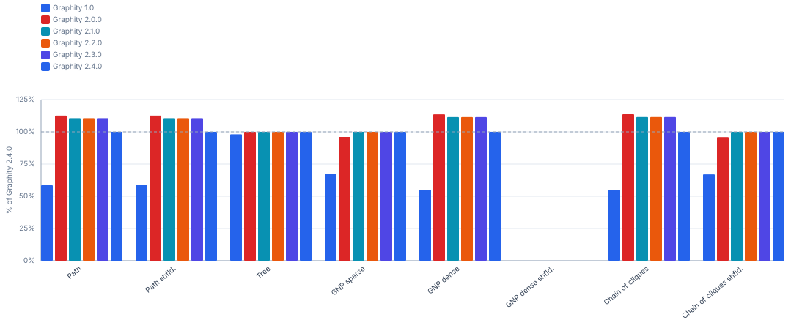

**Allocations @ 100k nodes in bytes (lower is better)**

| Shape | Graphity 1.0 | Graphity 2.0.0 | Graphity 2.1.0 | Graphity 2.2.0 | Graphity 2.3.0 | Graphity 2.4.0 | Graphity 3.0.0 |
|---|---:|---:|---:|---:|---:|---:|---:|
| Path<br><sub>100k nodes, 100k edges</sub> | — | 6.0 MB (129%) | 4.9 MB (105%) | 4.9 MB (105%) | 4.9 MB (105%) | 4.6 MB (100%) | 4.6 MB |
| Path shfld.<br><sub>100k nodes, 100k edges</sub> | 2.8 MB (60.9%) | 4.9 MB (106%) | 4.9 MB (105%) | 4.9 MB (105%) | 4.9 MB (105%) | 4.6 MB (100%) | 4.6 MB |
| Tree<br><sub>100k nodes, 100k edges</sub> | 2.8 MB (101%) | 2.8 MB (100.0%) | 2.8 MB (100.0%) | 2.8 MB (100.0%) | 2.8 MB (100%) | 2.8 MB (100%) | 2.8 MB |
| GNP sparse<br><sub>100k nodes, 300k edges</sub> | 2.5 MB (71.1%) | 3.9 MB (110%) | 3.5 MB (100.0%) | 3.5 MB (100.0%) | 3.5 MB (100%) | 3.5 MB (100%) | 3.5 MB |
| GNP dense<br><sub>100k nodes, 3M edges</sub> | 2.5 MB (57.5%) | 5.6 MB (131%) | 4.5 MB (106%) | 4.5 MB (106%) | 4.5 MB (106%) | 4.3 MB (100%) | 4.3 MB |
| GNP dense shfld.<br><sub>100k nodes, 3M edges</sub> | 2.5 MB | 5.6 MB | 4.5 MB | 4.5 MB | — | — | — |
| Chain of cliques<br><sub>100k nodes, 3.1M edges</sub> | 2.4 MB (57.3%) | 5.6 MB (131%) | 4.5 MB (106%) | 4.5 MB (106%) | 4.5 MB (106%) | 4.3 MB (100%) | 4.3 MB |
| Chain of cliques shfld.<br><sub>100k nodes, 3.1M edges</sub> | 2.4 MB (70.6%) | 3.3 MB (96.7%) | 3.5 MB (100.0%) | 3.5 MB (100.0%) | 3.5 MB (100%) | 3.5 MB (100%) | 3.5 MB |

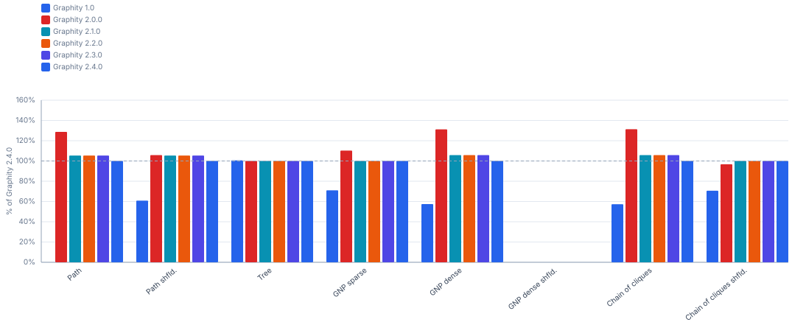

### 3.3 WCC

**Allocations @ 10k nodes in bytes (lower is better)**

| Shape | Graphity 1.0 | Graphity 2.0.0 | Graphity 2.1.0 | Graphity 2.2.0 | Graphity 2.3.0 | Graphity 2.4.0 | Graphity 3.0.0 |
|---|---:|---:|---:|---:|---:|---:|---:|
| Path<br><sub>10k nodes, 10k edges</sub> | 200 kB (118%) | 200 kB (118%) | 200 kB (118%) | 200 kB (118%) | 200 kB (118%) | 200 kB (118%) | 170 kB |
| Path shfld.<br><sub>10k nodes, 10k edges</sub> | 200 kB (118%) | 200 kB (118%) | 200 kB (118%) | 200 kB (118%) | 200 kB (118%) | 200 kB (118%) | 170 kB |
| Tree<br><sub>10k nodes, 10k edges</sub> | 200 kB (118%) | 200 kB (118%) | 200 kB (118%) | 200 kB (118%) | 200 kB (118%) | 200 kB (118%) | 170 kB |
| GNP sparse<br><sub>10k nodes, 30k edges</sub> | 200 kB (118%) | 200 kB (118%) | 200 kB (118%) | 200 kB (118%) | 200 kB (118%) | 200 kB (118%) | 170 kB |
| GNP dense<br><sub>10k nodes, 299.6k edges</sub> | 200 kB (118%) | 200 kB (118%) | 200 kB (118%) | 200 kB (118%) | 200 kB (118%) | 200 kB (118%) | 170 kB |
| GNP dense shfld.<br><sub>10k nodes, 299.6k edges</sub> | 200 kB | 200 kB | 200 kB | 200 kB | — | — | — |
| Chain of cliques<br><sub>10k nodes, 310.8k edges</sub> | 200 kB (118%) | 200 kB (118%) | 200 kB (118%) | 200 kB (118%) | 200 kB (118%) | 200 kB (118%) | 170 kB |
| Chain of cliques shfld.<br><sub>10k nodes, 310.8k edges</sub> | 200 kB (118%) | 200 kB (118%) | 200 kB (118%) | 200 kB (118%) | 200 kB (118%) | 200 kB (118%) | 170 kB |


**Allocations @ 100k nodes in bytes (lower is better)**

| Shape | Graphity 1.0 | Graphity 2.0.0 | Graphity 2.1.0 | Graphity 2.2.0 | Graphity 2.3.0 | Graphity 2.4.0 | Graphity 3.0.0 |
|---|---:|---:|---:|---:|---:|---:|---:|
| Path<br><sub>100k nodes, 100k edges</sub> | 2.0 MB (118%) | 2.0 MB (118%) | 2.0 MB (118%) | 2.0 MB (118%) | 2.0 MB (118%) | 2.0 MB (118%) | 1.7 MB |
| Path shfld.<br><sub>100k nodes, 100k edges</sub> | 2.0 MB (118%) | 2.0 MB (118%) | 2.0 MB (118%) | 2.0 MB (118%) | 2.0 MB (118%) | 2.0 MB (118%) | 1.7 MB |
| Tree<br><sub>100k nodes, 100k edges</sub> | 2.0 MB (118%) | 2.0 MB (118%) | 2.0 MB (118%) | 2.0 MB (118%) | 2.0 MB (118%) | 2.0 MB (118%) | 1.7 MB |
| GNP sparse<br><sub>100k nodes, 300k edges</sub> | 2.0 MB (118%) | 2.0 MB (118%) | 2.0 MB (118%) | 2.0 MB (118%) | 2.0 MB (118%) | 2.0 MB (118%) | 1.7 MB |
| GNP dense<br><sub>100k nodes, 3M edges</sub> | 2.0 MB (118%) | 2.0 MB (118%) | 2.0 MB (118%) | 2.0 MB (118%) | 2.0 MB (118%) | 2.0 MB (118%) | 1.7 MB |
| GNP dense shfld.<br><sub>100k nodes, 3M edges</sub> | 2.0 MB | 2.0 MB | 2.0 MB | 2.0 MB | — | — | — |
| Chain of cliques<br><sub>100k nodes, 3.1M edges</sub> | 2.0 MB (118%) | 2.0 MB (118%) | 2.0 MB (118%) | 2.0 MB (118%) | 2.0 MB (118%) | 2.0 MB (118%) | 1.7 MB |
| Chain of cliques shfld.<br><sub>100k nodes, 3.1M edges</sub> | 2.0 MB (118%) | 2.0 MB (118%) | 2.0 MB (118%) | 2.0 MB (118%) | 2.0 MB (118%) | 2.0 MB (118%) | 1.7 MB |


### 3.4 CCs

**Allocations @ 10k nodes in bytes (lower is better)**

| Shape | Graphity 1.0 | Graphity 2.0.0 | Graphity 2.1.0 | Graphity 2.2.0 | Graphity 2.3.0 | Graphity 2.4.0 | Graphity 3.0.0 |
|---|---:|---:|---:|---:|---:|---:|---:|
| Path<br><sub>10k nodes, 10k edges</sub> | 200 kB (118%) | 200 kB (118%) | 200 kB (118%) | 200 kB (118%) | 200 kB (118%) | 200 kB (118%) | 170 kB |
| Path shfld.<br><sub>10k nodes, 10k edges</sub> | 200 kB (118%) | 200 kB (118%) | 200 kB (118%) | 200 kB (118%) | 200 kB (118%) | 200 kB (118%) | 170 kB |
| Tree<br><sub>10k nodes, 10k edges</sub> | 200 kB (118%) | 200 kB (118%) | 200 kB (118%) | 200 kB (118%) | 200 kB (118%) | 200 kB (118%) | 170 kB |
| GNP sparse<br><sub>10k nodes, 30k edges</sub> | 200 kB (118%) | 200 kB (118%) | 200 kB (118%) | 200 kB (118%) | 200 kB (118%) | 200 kB (118%) | 170 kB |
| GNP dense<br><sub>10k nodes, 299.6k edges</sub> | 200 kB (118%) | 200 kB (118%) | 200 kB (118%) | 200 kB (118%) | 200 kB (118%) | 200 kB (118%) | 170 kB |
| GNP dense shfld.<br><sub>10k nodes, 299.6k edges</sub> | 200 kB | 200 kB | 200 kB | 200 kB | — | — | — |
| Chain of cliques<br><sub>10k nodes, 310.8k edges</sub> | 200 kB (118%) | 200 kB (118%) | 200 kB (118%) | 200 kB (118%) | 200 kB (118%) | 200 kB (118%) | 170 kB |
| Chain of cliques shfld.<br><sub>10k nodes, 310.8k edges</sub> | 200 kB (118%) | 200 kB (118%) | 200 kB (118%) | 200 kB (118%) | 200 kB (118%) | 200 kB (118%) | 170 kB |


**Allocations @ 100k nodes in bytes (lower is better)**

| Shape | Graphity 1.0 | Graphity 2.0.0 | Graphity 2.1.0 | Graphity 2.2.0 | Graphity 2.3.0 | Graphity 2.4.0 | Graphity 3.0.0 |
|---|---:|---:|---:|---:|---:|---:|---:|
| Path<br><sub>100k nodes, 100k edges</sub> | 2.0 MB (118%) | 2.0 MB (118%) | 2.0 MB (118%) | 2.0 MB (118%) | 2.0 MB (118%) | 2.0 MB (118%) | 1.7 MB |
| Path shfld.<br><sub>100k nodes, 100k edges</sub> | 2.0 MB (118%) | 2.0 MB (118%) | 2.0 MB (118%) | 2.0 MB (118%) | 2.0 MB (118%) | 2.0 MB (118%) | 1.7 MB |
| Tree<br><sub>100k nodes, 100k edges</sub> | 2.0 MB (118%) | 2.0 MB (118%) | 2.0 MB (118%) | 2.0 MB (118%) | 2.0 MB (118%) | 2.0 MB (118%) | 1.7 MB |
| GNP sparse<br><sub>100k nodes, 300k edges</sub> | 2.0 MB (118%) | 2.0 MB (118%) | 2.0 MB (118%) | 2.0 MB (118%) | 2.0 MB (118%) | 2.0 MB (118%) | 1.7 MB |
| GNP dense<br><sub>100k nodes, 3M edges</sub> | 2.0 MB (118%) | 2.0 MB (118%) | 2.0 MB (118%) | 2.0 MB (118%) | 2.0 MB (118%) | 2.0 MB (118%) | 1.7 MB |
| GNP dense shfld.<br><sub>100k nodes, 3M edges</sub> | 2.0 MB | 2.0 MB | 2.0 MB | 2.0 MB | — | — | — |
| Chain of cliques<br><sub>100k nodes, 3.1M edges</sub> | 2.0 MB (118%) | 2.0 MB (118%) | 2.0 MB (118%) | 2.0 MB (118%) | 2.0 MB (118%) | 2.0 MB (118%) | 1.7 MB |
| Chain of cliques shfld.<br><sub>100k nodes, 3.1M edges</sub> | 2.0 MB (118%) | 2.0 MB (118%) | 2.0 MB (118%) | 2.0 MB (118%) | 2.0 MB (118%) | 2.0 MB (118%) | 1.7 MB |

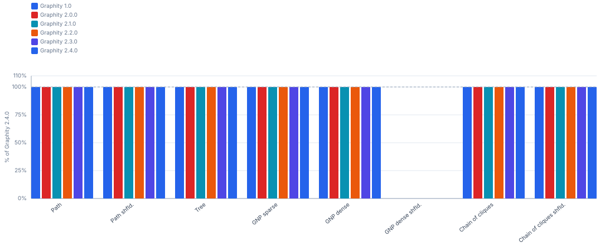

### 3.5 Condense

**Allocations @ 1k nodes in bytes (lower is better)**

| Shape | Graphity 1.0 | Graphity 2.0.0 | Graphity 2.1.0 | Graphity 2.2.0 | Graphity 2.3.0 | Graphity 2.4.0 | Graphity 3.0.0 |
|---|---:|---:|---:|---:|---:|---:|---:|
| Path<br><sub>1k nodes, 1k edges</sub> | — | — | 23.2 kB (100%) | 23.2 kB (100.0%) | 23.2 kB (100%) | 23.2 kB (100%) | 23.2 kB |
| GNP dense<br><sub>1k nodes, 30k edges</sub> | — | — | 96 B (99.0%) | 96 B (99.0%) | 97 B (100%) | 97 B (100%) | 97 B |
| Chain of cliques<br><sub>1k nodes, 31.1k edges</sub> | — | — | 760 B (99.7%) | 760 B (99.7%) | 761 B (99.9%) | 761 B (99.9%) | 762 B |
| DAG GNP sparse<br><sub>1k nodes</sub> | — | — | 66.4 kB (100.0%) | 66.4 kB (100.0%) | 66.4 kB (100%) | 66.4 kB (100%) | 66.4 kB |

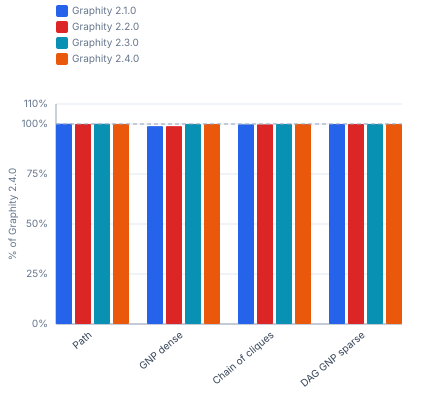

**Allocations @ 10k nodes in bytes (lower is better)**

| Shape | Graphity 1.0 | Graphity 2.0.0 | Graphity 2.1.0 | Graphity 2.2.0 | Graphity 2.3.0 | Graphity 2.4.0 | Graphity 3.0.0 |
|---|---:|---:|---:|---:|---:|---:|---:|
| Path<br><sub>10k nodes, 10k edges</sub> | — | — | 250 kB (100.0%) | 250 kB (100.0%) | 250 kB (100%) | 250 kB (100%) | 250 kB |
| GNP dense<br><sub>10k nodes, 299.6k edges</sub> | — | — | 97 B (95.1%) | 97 B (95.1%) | 103 B (101%) | 103 B (101%) | 102 B |
| Chain of cliques<br><sub>10k nodes, 310.8k edges</sub> | — | — | 7.2 kB (99.8%) | 7.2 kB (99.8%) | 7.2 kB (100%) | 7.2 kB (100%) | 7.2 kB |
| DAG GNP sparse<br><sub>10k nodes</sub> | — | — | 541 kB (100.0%) | 541 kB (100.0%) | 541 kB (100%) | 541 kB (100%) | 541 kB |

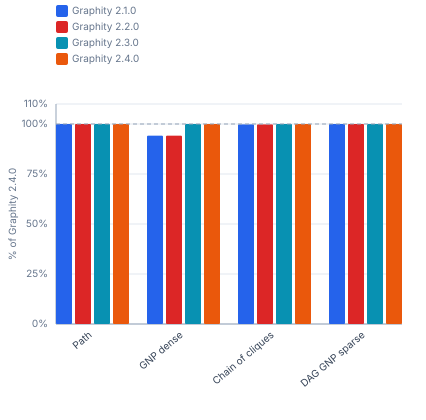

**Allocations @ 100k nodes in bytes (lower is better)**

| Shape | Graphity 1.0 | Graphity 2.0.0 | Graphity 2.1.0 | Graphity 2.2.0 | Graphity 2.3.0 | Graphity 2.4.0 | Graphity 3.0.0 |
|---|---:|---:|---:|---:|---:|---:|---:|
| Path<br><sub>100k nodes, 100k edges</sub> | — | — | 2.1 MB (100.0%) | 2.1 MB (100.0%) | 2.1 MB (100%) | 2.1 MB (100%) | 2.1 MB |
| GNP dense<br><sub>100k nodes, 3M edges</sub> | — | — | 107 B (52.7%) | 107 B (52.7%) | 205 B (101%) | 217 B (107%) | 203 B |
| Chain of cliques<br><sub>100k nodes, 3.1M edges</sub> | — | — | 75.7 kB (99.8%) | 75.7 kB (99.8%) | 75.8 kB (100.0%) | 75.9 kB (100.0%) | 75.9 kB |
| DAG GNP sparse<br><sub>100k nodes</sub> | — | — | 5.9 MB (100.0%) | 5.9 MB (100.0%) | 5.9 MB (100%) | 5.9 MB (100%) | 5.9 MB |

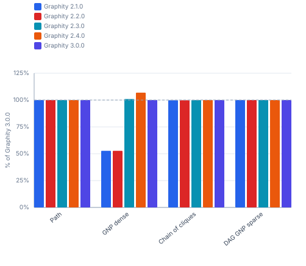

### 3.6 TopOrder

**Allocations @ 10k nodes in bytes (lower is better)**

| Shape | Graphity 1.0 | Graphity 2.0.0 | Graphity 2.1.0 | Graphity 2.2.0 | Graphity 2.3.0 | Graphity 2.4.0 | Graphity 3.0.0 |
|---|---:|---:|---:|---:|---:|---:|---:|
| Path<br><sub>10k nodes, 10k edges</sub> | 42.7 kB (17.4%) | 306 kB (125%) | 297 kB (121%) | 297 kB (121%) | 297 kB (121%) | 246 kB (100%) | 246 kB |
| Path shfld.<br><sub>10k nodes, 10k edges</sub> | 42.7 kB (17.4%) | 306 kB (125%) | 297 kB (121%) | 297 kB (121%) | 297 kB (121%) | 246 kB (100%) | 246 kB |
| Tree<br><sub>10k nodes, 10k edges</sub> | 42.7 kB (84.1%) | 50.8 kB (100%) | 50.8 kB (100%) | 50.8 kB (100%) | 50.8 kB (100%) | 50.8 kB (100%) | 50.8 kB |
| Tree shfld.<br><sub>10k nodes</sub> | 42.7 kB (84.1%) | 50.8 kB (100%) | 50.8 kB (100%) | 50.8 kB (100%) | 50.8 kB (100%) | 50.8 kB (100%) | 50.8 kB |
| DAG GNP sparse<br><sub>10k nodes</sub> | 42.7 kB (84.1%) | 50.8 kB (100%) | 50.8 kB (100%) | 50.8 kB (100%) | 50.8 kB (100%) | 50.8 kB (100%) | 50.8 kB |
| DAG GNP dense<br><sub>10k nodes</sub> | 42.7 kB (84.0%) | 50.8 kB (100.0%) | 50.8 kB (100.0%) | 50.8 kB (100.0%) | 50.8 kB (100.0%) | 50.8 kB (100%) | 50.8 kB |
| DAG GNP dense shfld.<br><sub>10k nodes</sub> | 42.7 kB (84.0%) | 50.8 kB (100.0%) | 50.8 kB (100.0%) | 50.8 kB (100.0%) | 50.9 kB (100%) | 50.9 kB (100%) | 50.9 kB |

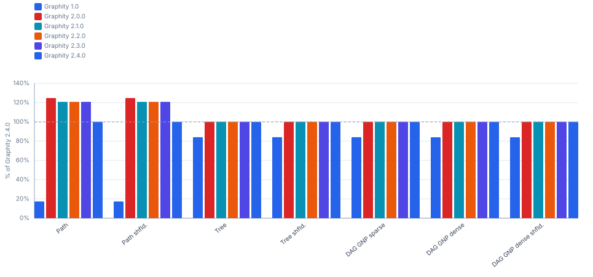

**Allocations @ 100k nodes in bytes (lower is better)**

| Shape | Graphity 1.0 | Graphity 2.0.0 | Graphity 2.1.0 | Graphity 2.2.0 | Graphity 2.3.0 | Graphity 2.4.0 | Graphity 3.0.0 |
|---|---:|---:|---:|---:|---:|---:|---:|
| Path<br><sub>100k nodes, 100k edges</sub> | 425 kB (18.8%) | 3.6 MB (159%) | 2.5 MB (111%) | 2.5 MB (111%) | 2.5 MB (111%) | 2.3 MB (100.0%) | 2.3 MB |
| Path shfld.<br><sub>100k nodes, 100k edges</sub> | 425 kB (18.8%) | 2.5 MB (112%) | 2.5 MB (111%) | 2.5 MB (111%) | 2.5 MB (111%) | 2.3 MB (100.0%) | 2.3 MB |
| Tree<br><sub>100k nodes, 100k edges</sub> | 425 kB (98.1%) | 433 kB (100.0%) | 433 kB (100.0%) | 433 kB (100.0%) | 433 kB (100%) | 433 kB (100%) | 433 kB |
| Tree shfld.<br><sub>100k nodes</sub> | 425 kB (98.1%) | 433 kB (100.0%) | 433 kB (100.0%) | 433 kB (100.0%) | 433 kB (100%) | 433 kB (100%) | 433 kB |
| DAG GNP sparse<br><sub>100k nodes</sub> | 425 kB (98.1%) | 433 kB (100.0%) | 433 kB (100.0%) | 433 kB (100.0%) | 433 kB (100%) | 433 kB (100%) | 433 kB |
| DAG GNP dense<br><sub>100k nodes</sub> | 425 kB (98.1%) | 433 kB (99.9%) | 433 kB (99.9%) | 433 kB (99.9%) | 434 kB (100%) | 434 kB (100%) | 434 kB |
| DAG GNP dense shfld.<br><sub>100k nodes</sub> | 425 kB (98.1%) | 433 kB (99.9%) | 433 kB (99.9%) | 433 kB (99.9%) | 434 kB (100%) | 434 kB (100%) | 434 kB |

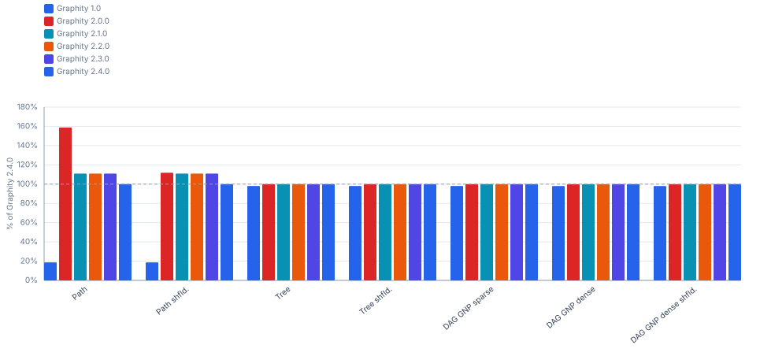

### 3.7 TopOrderAndLevels

**Allocations @ 10k nodes in bytes (lower is better)**

| Shape | Graphity 1.0 | Graphity 2.0.0 | Graphity 2.1.0 | Graphity 2.2.0 | Graphity 2.3.0 | Graphity 2.4.0 | Graphity 3.0.0 | Graphity 2.1.0<br>(bi-adjacent) | Graphity 2.2.0<br>(bi-adjacent) | Graphity 2.3.0<br>(bi-adjacent) | Graphity 2.4.0<br>(bi-adjacent) | Graphity 3.0.0<br>(bi-adjacent) |
|---|---:|---:|---:|---:|---:|---:|---:|---:|---:|---:|---:|---:|
| Path<br><sub>10k nodes, 10k edges</sub> | 160 kB (100.0%) | 160 kB (100.0%) | 160 kB (100.0%) | 160 kB (100.0%) | 160 kB (100%) | 160 kB (100%) | 160 kB | 160 kB (100.0%) | 160 kB (100.0%) | 160 kB (100%) | 160 kB (100%) | 160 kB (100%) |
| Path shfld.<br><sub>10k nodes, 10k edges</sub> | 160 kB (100.0%) | 160 kB (100.0%) | 160 kB (100.0%) | 160 kB (100.0%) | 160 kB (100%) | 160 kB (100%) | 160 kB | 160 kB (100.0%) | 160 kB (100.0%) | 160 kB (100%) | 160 kB (100%) | 160 kB (100%) |
| Tree<br><sub>10k nodes, 10k edges</sub> | 160 kB (100.0%) | 160 kB (100.0%) | 160 kB (100.0%) | 160 kB (100.0%) | 160 kB (100%) | 160 kB (100%) | 160 kB | 160 kB (100.0%) | 160 kB (100.0%) | 160 kB (100%) | 160 kB (100%) | 160 kB (100%) |
| Tree shfld.<br><sub>10k nodes</sub> | 160 kB (100.0%) | 160 kB (100.0%) | 160 kB (100.0%) | 160 kB (100.0%) | 160 kB (100%) | 160 kB (100%) | 160 kB | 160 kB (100.0%) | 160 kB (100.0%) | 160 kB (100%) | 160 kB (100%) | 160 kB (100%) |
| DAG GNP sparse<br><sub>10k nodes</sub> | 160 kB (100.0%) | 160 kB (100.0%) | 160 kB (100.0%) | 160 kB (100.0%) | 160 kB (100%) | 160 kB (100%) | 160 kB | 160 kB (100.0%) | 160 kB (100.0%) | 160 kB (100.0%) | 160 kB (100.0%) | 160 kB (100.0%) |
| DAG GNP dense<br><sub>10k nodes</sub> | 160 kB (100.0%) | 160 kB (100.0%) | 160 kB (100.0%) | 160 kB (100.0%) | 160 kB (100.0%) | 160 kB (100.0%) | 160 kB | 160 kB (100.0%) | 160 kB (100.0%) | 160 kB (100.0%) | 160 kB (100.0%) | 160 kB (100.0%) |
| DAG GNP dense shfld.<br><sub>10k nodes</sub> | 160 kB (100.0%) | 160 kB (100.0%) | 160 kB (100.0%) | 160 kB (100.0%) | 160 kB (100.0%) | 160 kB (100.0%) | 160 kB | 160 kB (100.0%) | 160 kB (100.0%) | 160 kB (100.0%) | 160 kB (100.0%) | 160 kB (100.0%) |


**Allocations @ 100k nodes in bytes (lower is better)**

| Shape | Graphity 1.0 | Graphity 2.0.0 | Graphity 2.1.0 | Graphity 2.2.0 | Graphity 2.3.0 | Graphity 2.4.0 | Graphity 3.0.0 | Graphity 2.1.0<br>(bi-adjacent) | Graphity 2.2.0<br>(bi-adjacent) | Graphity 2.3.0<br>(bi-adjacent) | Graphity 2.4.0<br>(bi-adjacent) | Graphity 3.0.0<br>(bi-adjacent) |
|---|---:|---:|---:|---:|---:|---:|---:|---:|---:|---:|---:|---:|
| Path<br><sub>100k nodes, 100k edges</sub> | 1.6 MB (100.0%) | 1.6 MB (100.0%) | 1.6 MB (100.0%) | 1.6 MB (100.0%) | 1.6 MB (100.0%) | 1.6 MB (100%) | 1.6 MB | 1.6 MB (100.0%) | 1.6 MB (100.0%) | 1.6 MB (100.0%) | 1.6 MB (100.0%) | 1.6 MB (100.0%) |
| Path shfld.<br><sub>100k nodes, 100k edges</sub> | 1.6 MB (100.0%) | 1.6 MB (100.0%) | 1.6 MB (100.0%) | 1.6 MB (100.0%) | 1.6 MB (100%) | 1.6 MB (100%) | 1.6 MB | 1.6 MB (100.0%) | 1.6 MB (100.0%) | 1.6 MB (100.0%) | 1.6 MB (100.0%) | 1.6 MB (100.0%) |
| Tree<br><sub>100k nodes, 100k edges</sub> | 1.6 MB (100.0%) | 1.6 MB (100.0%) | 1.6 MB (100.0%) | 1.6 MB (100.0%) | 1.6 MB (100.0%) | 1.6 MB (100.0%) | 1.6 MB | 1.6 MB (100.0%) | 1.6 MB (100.0%) | 1.6 MB (100.0%) | 1.6 MB (100.0%) | 1.6 MB (100.0%) |
| Tree shfld.<br><sub>100k nodes</sub> | 1.6 MB (100.0%) | 1.6 MB (100.0%) | 1.6 MB (100.0%) | 1.6 MB (100.0%) | 1.6 MB (100.0%) | 1.6 MB (100%) | 1.6 MB | 1.6 MB (100.0%) | 1.6 MB (100.0%) | 1.6 MB (100.0%) | 1.6 MB (100.0%) | 1.6 MB (100.0%) |
| DAG GNP sparse<br><sub>100k nodes</sub> | 1.6 MB (100.0%) | 1.6 MB (100.0%) | 1.6 MB (100.0%) | 1.6 MB (100.0%) | 1.6 MB (100%) | 1.6 MB (100%) | 1.6 MB | 1.6 MB (100.0%) | 1.6 MB (100.0%) | 1.6 MB (100.0%) | 1.6 MB (100.0%) | 1.6 MB (100.0%) |
| DAG GNP dense<br><sub>100k nodes</sub> | 1.6 MB (100.0%) | 1.6 MB (100.0%) | 1.6 MB (100.0%) | 1.6 MB (100.0%) | 1.6 MB (100%) | 1.6 MB (100%) | 1.6 MB | 1.6 MB (100.0%) | 1.6 MB (100.0%) | 1.6 MB (100.0%) | 1.6 MB (100.0%) | 1.6 MB (100.0%) |
| DAG GNP dense shfld.<br><sub>100k nodes</sub> | 1.6 MB (100.0%) | 1.6 MB (100.0%) | 1.6 MB (100.0%) | 1.6 MB (100.0%) | 1.6 MB (100%) | 1.6 MB (100%) | 1.6 MB | 1.6 MB (100.0%) | 1.6 MB (100.0%) | 1.6 MB (100.0%) | 1.6 MB (100.0%) | 1.6 MB (100.0%) |

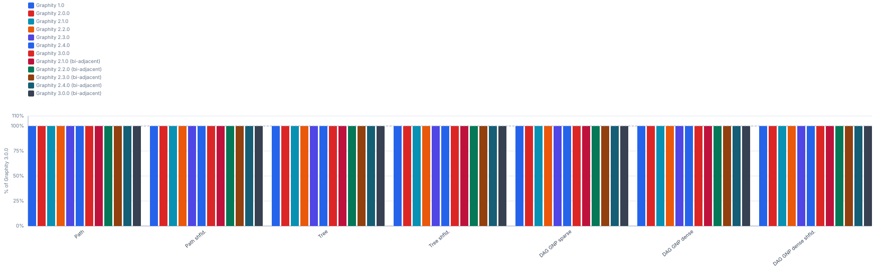

### 3.8 BackEdges

**Allocations @ 10k nodes in bytes (lower is better)**

| Shape | Graphity 1.0 | Graphity 2.0.0 | Graphity 2.1.0 | Graphity 2.2.0 | Graphity 2.3.0 | Graphity 2.4.0 | Graphity 3.0.0 |
|---|---:|---:|---:|---:|---:|---:|---:|
| Path<br><sub>10k nodes, 10k edges</sub> | 2.7 kB (1.3%) | 266 kB (129%) | 257 kB (125%) | 257 kB (125%) | 257 kB (125%) | 206 kB (100.0%) | 206 kB |
| Path shfld.<br><sub>10k nodes, 10k edges</sub> | 2.7 kB (1.3%) | 266 kB (129%) | 257 kB (125%) | 257 kB (125%) | 257 kB (125%) | 206 kB (100.0%) | 206 kB |
| Tree<br><sub>10k nodes, 10k edges</sub> | 2.7 kB (25.1%) | 10.9 kB (99.5%) | 10.9 kB (99.5%) | 10.9 kB (99.5%) | 10.9 kB (99.6%) | 10.9 kB (99.3%) | 10.9 kB |
| GNP sparse<br><sub>10k nodes, 30k edges</sub> | 228 kB (40.4%) | 336 kB (59.6%) | 351 kB (62.2%) | 351 kB (62.2%) | 351 kB (62.2%) | 351 kB (62.2%) | 564 kB |
| GNP dense<br><sub>10k nodes, 299.6k edges</sub> | 3.8 MB (49.6%) | 4.1 MB (53.0%) | 4.1 MB (52.8%) | 4.1 MB (52.8%) | 4.1 MB (52.8%) | 4.0 MB (52.2%) | 7.8 MB |
| GNP dense shfld.<br><sub>10k nodes, 299.6k edges</sub> | 3.8 MB | 4.1 MB | 4.1 MB | 4.1 MB | — | — | — |
| Chain of cliques<br><sub>10k nodes, 310.8k edges</sub> | 3.8 MB (49.1%) | 4.1 MB (52.5%) | 4.1 MB (52.3%) | 4.1 MB (52.3%) | 4.1 MB (52.3%) | 4.0 MB (51.7%) | 7.8 MB |
| Chain of cliques shfld.<br><sub>10k nodes, 310.8k edges</sub> | 3.8 MB (49.6%) | 4.0 MB (51.0%) | 4.0 MB (51.2%) | 4.0 MB (51.2%) | 4.0 MB (51.2%) | 4.0 MB (51.2%) | 7.8 MB |

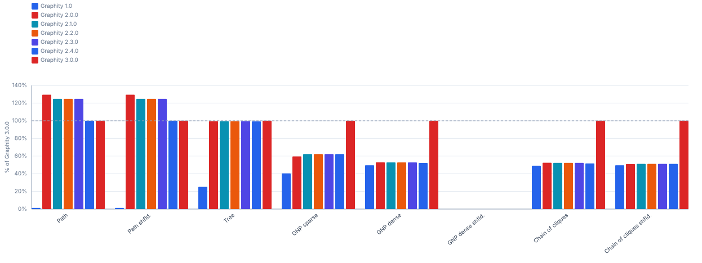

**Allocations @ 100k nodes in bytes (lower is better)**

| Shape | Graphity 1.0 | Graphity 2.0.0 | Graphity 2.1.0 | Graphity 2.2.0 | Graphity 2.3.0 | Graphity 2.4.0 | Graphity 3.0.0 |
|---|---:|---:|---:|---:|---:|---:|---:|
| Path<br><sub>100k nodes, 100k edges</sub> | 25.2 kB (1.4%) | 3.2 MB (171%) | 2.1 MB (113%) | 2.1 MB (113%) | 2.1 MB (113%) | 1.9 MB (100.0%) | 1.9 MB |
| Path shfld.<br><sub>100k nodes, 100k edges</sub> | 25.2 kB (1.4%) | 2.1 MB (114%) | 2.1 MB (113%) | 2.1 MB (113%) | 2.1 MB (113%) | 1.9 MB (100.0%) | 1.9 MB |
| Tree<br><sub>100k nodes, 100k edges</sub> | 25.3 kB (75.6%) | 33.4 kB (99.6%) | 33.4 kB (99.6%) | 33.4 kB (99.6%) | 33.5 kB (99.9%) | 33.5 kB (99.8%) | 33.5 kB |
| GNP sparse<br><sub>100k nodes, 300k edges</sub> | 2.6 MB (43.7%) | 4.0 MB (67.4%) | 3.6 MB (61.3%) | 3.6 MB (61.3%) | 3.6 MB (61.3%) | 3.6 MB (61.3%) | 5.9 MB |
| GNP dense<br><sub>100k nodes, 3M edges</sub> | 43.8 MB (51.3%) | 47.0 MB (55.0%) | 45.9 MB (53.7%) | 45.9 MB (53.7%) | 45.9 MB (53.7%) | 45.6 MB (53.4%) | 85.4 MB |
| GNP dense shfld.<br><sub>100k nodes, 3M edges</sub> | 43.8 MB | 47.0 MB | 45.9 MB | 45.9 MB | — | — | — |
| Chain of cliques<br><sub>100k nodes, 3.1M edges</sub> | 43.8 MB (50.8%) | 47.0 MB (54.5%) | 45.9 MB (53.3%) | 45.9 MB (53.3%) | 45.9 MB (53.3%) | 45.6 MB (53.0%) | 86.1 MB |
| Chain of cliques shfld.<br><sub>100k nodes, 3.1M edges</sub> | 43.8 MB (51.3%) | 44.7 MB (52.4%) | 44.8 MB (52.5%) | 44.8 MB (52.5%) | 44.8 MB (52.5%) | 44.8 MB (52.5%) | 85.3 MB |

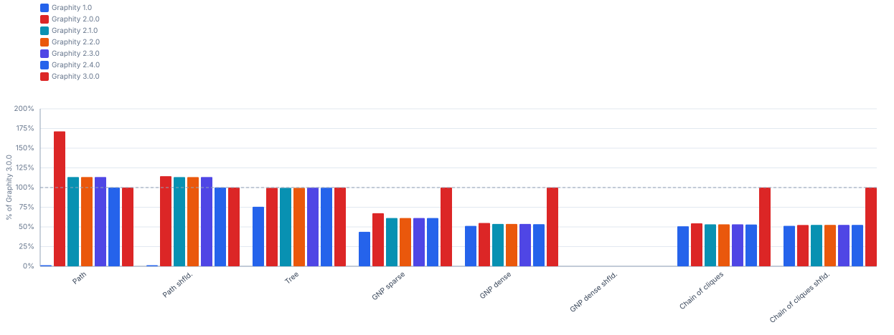

### 3.9 EdgeTypes

**Allocations @ 10k nodes in bytes (lower is better)**

| Shape | Graphity 1.0 | Graphity 2.0.0 | Graphity 2.1.0 | Graphity 2.2.0 | Graphity 2.3.0 | Graphity 2.4.0 | Graphity 3.0.0 |
|---|---:|---:|---:|---:|---:|---:|---:|
| Path<br><sub>10k nodes, 10k edges</sub> | 52.7 kB (20.6%) | 316 kB (124%) | 307 kB (120%) | 307 kB (120%) | 307 kB (120%) | 256 kB (100%) | 256 kB |
| Path shfld.<br><sub>10k nodes, 10k edges</sub> | 52.7 kB (20.6%) | 316 kB (124%) | 307 kB (120%) | 307 kB (120%) | 307 kB (120%) | 256 kB (100%) | 256 kB |
| Tree<br><sub>10k nodes, 10k edges</sub> | 52.7 kB (86.6%) | 60.8 kB (100.0%) | 60.8 kB (100.0%) | 60.8 kB (100.0%) | 60.8 kB (100%) | 60.8 kB (100%) | 60.8 kB |
| GNP sparse<br><sub>10k nodes, 30k edges</sub> | 72.7 kB (37.2%) | 181 kB (92.4%) | 196 kB (100.0%) | 196 kB (100.0%) | 196 kB (100%) | 196 kB (100%) | 196 kB |
| GNP dense<br><sub>10k nodes, 299.6k edges</sub> | 342 kB (62.8%) | 606 kB (111%) | 596 kB (109%) | 596 kB (109%) | 596 kB (109%) | 545 kB (100.0%) | 545 kB |
| GNP dense shfld.<br><sub>10k nodes, 299.6k edges</sub> | 342 kB | 606 kB | 596 kB | 596 kB | — | — | — |
| Chain of cliques<br><sub>10k nodes, 310.8k edges</sub> | 354 kB (63.5%) | 617 kB (111%) | 607 kB (109%) | 607 kB (109%) | 608 kB (109%) | 556 kB (100%) | 556 kB |
| Chain of cliques shfld.<br><sub>10k nodes, 310.8k edges</sub> | 354 kB (74.2%) | 462 kB (96.9%) | 476 kB (100.0%) | 476 kB (100.0%) | 476 kB (100%) | 476 kB (100%) | 476 kB |

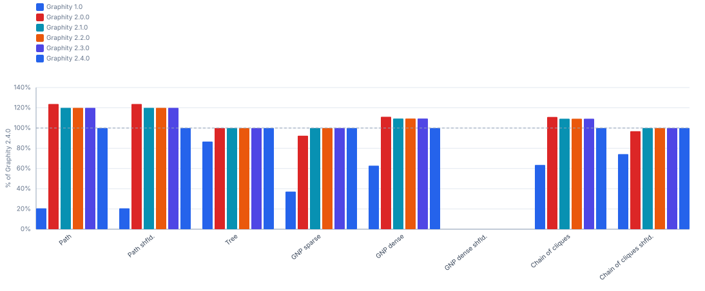

**Allocations @ 100k nodes in bytes (lower is better)**

| Shape | Graphity 1.0 | Graphity 2.0.0 | Graphity 2.1.0 | Graphity 2.2.0 | Graphity 2.3.0 | Graphity 2.4.0 | Graphity 3.0.0 |
|---|---:|---:|---:|---:|---:|---:|---:|
| Path<br><sub>100k nodes, 100k edges</sub> | 525 kB (22.2%) | 3.7 MB (156%) | 2.6 MB (111%) | 2.6 MB (111%) | 2.6 MB (111%) | 2.4 MB (100%) | 2.4 MB |
| Path shfld.<br><sub>100k nodes, 100k edges</sub> | 525 kB (22.2%) | 2.6 MB (111%) | 2.6 MB (111%) | 2.6 MB (111%) | 2.6 MB (111%) | 2.4 MB (100%) | 2.4 MB |
| Tree<br><sub>100k nodes, 100k edges</sub> | 525 kB (98.5%) | 533 kB (100.0%) | 533 kB (100.0%) | 533 kB (100.0%) | 533 kB (100%) | 533 kB (100%) | 533 kB |
| GNP sparse<br><sub>100k nodes, 300k edges</sub> | 725 kB (41.1%) | 2.1 MB (120%) | 1.8 MB (100.0%) | 1.8 MB (100.0%) | 1.8 MB (100.0%) | 1.8 MB (100%) | 1.8 MB |
| GNP dense<br><sub>100k nodes, 3M edges</sub> | 3.4 MB (65.0%) | 6.6 MB (125%) | 5.5 MB (105%) | 5.5 MB (105%) | 5.5 MB (105%) | 5.3 MB (100%) | 5.3 MB |
| GNP dense shfld.<br><sub>100k nodes, 3M edges</sub> | 3.4 MB | 6.6 MB | 5.5 MB | 5.5 MB | — | — | — |
| Chain of cliques<br><sub>100k nodes, 3.1M edges</sub> | 3.5 MB (65.7%) | 6.7 MB (125%) | 5.6 MB (105%) | 5.6 MB (105%) | 5.6 MB (105%) | 5.4 MB (100%) | 5.4 MB |
| Chain of cliques shfld.<br><sub>100k nodes, 3.1M edges</sub> | 3.5 MB (77.2%) | 4.5 MB (97.5%) | 4.6 MB (100.0%) | 4.6 MB (100.0%) | 4.6 MB (100%) | 4.6 MB (100%) | 4.6 MB |

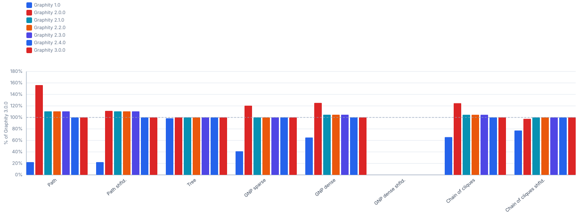

### 3.10 Dominators

**Allocations @ 10k nodes in bytes (lower is better)**

| Shape | Graphity 1.0 | Graphity 2.0.0 | Graphity 2.1.0 | Graphity 2.2.0 | Graphity 2.3.0 | Graphity 2.4.0 | Graphity 3.0.0 |
|---|---:|---:|---:|---:|---:|---:|---:|
| Structured<br><sub>10k nodes</sub> | — | — | — | 371 kB (100.0%) | 371 kB (100%) | 371 kB (100.0%) | 371 kB |
| Irreducible<br><sub>10k nodes</sub> | — | — | — | 371 kB (100.0%) | 371 kB (100%) | 371 kB (100%) | 371 kB |
| Ladder<br><sub>10k nodes</sub> | — | — | — | 486 kB (100.0%) | 486 kB (100%) | 486 kB (100%) | 486 kB |
| Chain<br><sub>10k nodes</sub> | — | — | — | 566 kB (100.0%) | 566 kB (100%) | 566 kB (100%) | 566 kB |
| Fan behind chain<br><sub>10k nodes</sub> | — | — | — | 486 kB (100.0%) | 486 kB (100%) | 486 kB (100%) | 486 kB |
| Small methods<br><sub>10k nodes</sub> | — | — | — | 475 kB (100.0%) | 475 kB (100.0%) | 475 kB (100.0%) | 475 kB |


**Allocations @ 100k nodes in bytes (lower is better)**

| Shape | Graphity 1.0 | Graphity 2.0.0 | Graphity 2.1.0 | Graphity 2.2.0 | Graphity 2.3.0 | Graphity 2.4.0 | Graphity 3.0.0 |
|---|---:|---:|---:|---:|---:|---:|---:|
| Structured<br><sub>100k nodes</sub> | — | — | — | 3.6 MB (100.0%) | 3.7 MB (100%) | 3.7 MB (100%) | 3.7 MB |
| Irreducible<br><sub>100k nodes</sub> | — | — | — | 3.7 MB (100.0%) | 3.7 MB (100%) | 3.7 MB (100%) | 3.7 MB |
| Ladder<br><sub>100k nodes</sub> | — | — | — | 4.7 MB (100.0%) | 4.7 MB (100.0%) | 4.7 MB (100%) | 4.7 MB |
| Chain<br><sub>100k nodes</sub> | — | — | — | 5.5 MB (100.0%) | 5.5 MB (100%) | 5.5 MB (100%) | 5.5 MB |
| Fan behind chain<br><sub>100k nodes</sub> | — | — | — | 4.7 MB (100.0%) | 4.7 MB (100%) | 4.7 MB (100%) | 4.7 MB |
| Small methods<br><sub>100k nodes</sub> | — | — | — | 4.7 MB (100.0%) | 4.7 MB (100%) | 4.7 MB (100%) | 4.7 MB |


### 3.11 Dominance frontiers

**Allocations @ 10k nodes in bytes (lower is better)**

| Shape | Graphity 1.0 | Graphity 2.0.0 | Graphity 2.1.0 | Graphity 2.2.0 | Graphity 2.3.0 | Graphity 2.4.0 | Graphity 3.0.0 |
|---|---:|---:|---:|---:|---:|---:|---:|
| Structured<br><sub>10k nodes</sub> | — | — | — | 134 kB (50.0%) | 134 kB (50.0%) | 134 kB (50.0%) | 268 kB |
| Irreducible<br><sub>10k nodes</sub> | — | — | — | 144 kB (50.0%) | 144 kB (50.0%) | 144 kB (50.0%) | 288 kB |
| Ladder<br><sub>10k nodes</sub> | — | — | — | 50.1 MB (50.0%) | 50.1 MB (50.0%) | 50.1 MB (50.0%) | 100 MB |
| Chain<br><sub>10k nodes</sub> | — | — | — | 80.1 kB (50.0%) | 80.1 kB (50.0%) | 80.1 kB (50.0%) | 160 kB |
| Fan behind chain<br><sub>10k nodes</sub> | — | — | — | 100 MB (50.0%) | 100 MB (50.0%) | 100 MB (50.0%) | 200 MB |
| Small methods<br><sub>10k nodes</sub> | — | — | — | 140 kB (50.4%) | 140 kB (50.4%) | 140 kB (50.4%) | 277 kB |

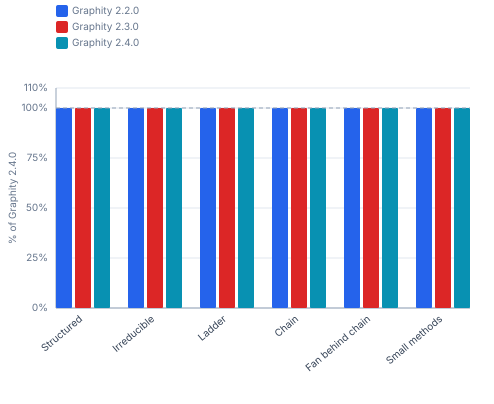

**Allocations @ 100k nodes in bytes (lower is better)**

| Shape | Graphity 1.0 | Graphity 2.0.0 | Graphity 2.1.0 | Graphity 2.2.0 | Graphity 2.3.0 | Graphity 2.4.0 | Graphity 3.0.0 |
|---|---:|---:|---:|---:|---:|---:|---:|
| Structured<br><sub>100k nodes</sub> | — | — | — | 1.3 MB (50.0%) | 1.3 MB (50.0%) | 1.3 MB (50.0%) | 2.7 MB |
| Irreducible<br><sub>100k nodes</sub> | — | — | — | 1.4 MB (50.0%) | 1.4 MB (50.0%) | 1.4 MB (50.0%) | 2.9 MB |
| Chain<br><sub>100k nodes</sub> | — | — | — | 800 kB (50.0%) | 800 kB (50.0%) | 800 kB (50.0%) | 1.6 MB |
| Small methods<br><sub>100k nodes</sub> | — | — | — | 1.4 MB (50.4%) | 1.4 MB (50.4%) | 1.4 MB (50.4%) | 2.7 MB |

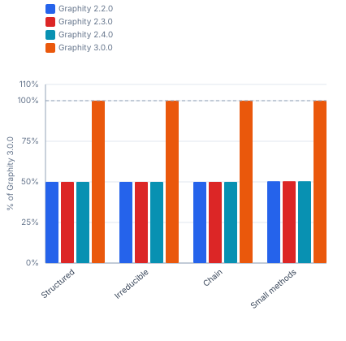

### 3.12 Iterated dominance frontier (build + one query per variable)

**Allocations @ 10k nodes in bytes (lower is better)**

| Shape | Graphity 1.0 | Graphity 2.0.0 | Graphity 2.1.0 | Graphity 2.2.0 | Graphity 2.3.0 | Graphity 2.4.0 | Graphity 3.0.0 |
|---|---:|---:|---:|---:|---:|---:|---:|
| Structured<br><sub>10k nodes</sub> | — | — | — | 25.4 MB (100.0%) | 25.4 MB (100%) | 25.4 MB (100%) | 25.4 MB |
| Irreducible<br><sub>10k nodes</sub> | — | — | — | 28.9 MB (100.0%) | 28.9 MB (100%) | 28.9 MB (100%) | 28.9 MB |
| Ladder<br><sub>10k nodes</sub> | — | — | — | 53.8 MB (100.0%) | 53.8 MB (100%) | 53.8 MB (100%) | 53.8 MB |
| Chain<br><sub>10k nodes</sub> | — | — | — | 21.4 MB (100.0%) | 21.4 MB (100%) | 21.4 MB (100%) | 21.4 MB |
| Fan behind chain<br><sub>10k nodes</sub> | — | — | — | 65.4 MB (100.0%) | 65.4 MB (100%) | 65.4 MB (100%) | 65.4 MB |
| Small methods<br><sub>10k nodes</sub> | — | — | — | 604 kB (100.0%) | 604 kB (100.0%) | 604 kB (100%) | 604 kB |


**Allocations @ 100k nodes in bytes (lower is better)**

| Shape | Graphity 1.0 | Graphity 2.0.0 | Graphity 2.1.0 | Graphity 2.2.0 | Graphity 2.3.0 | Graphity 2.4.0 | Graphity 3.0.0 |
|---|---:|---:|---:|---:|---:|---:|---:|
| Structured<br><sub>100k nodes</sub> | — | — | — | 370 MB (100.0%) | 370 MB (100%) | 370 MB (100%) | 370 MB |
| Irreducible<br><sub>100k nodes</sub> | — | — | — | 451 MB (100.0%) | 451 MB (100.0%) | 451 MB (100.0%) | 451 MB |
| Ladder<br><sub>100k nodes</sub> | — | — | — | 504 MB (100.0%) | 504 MB (100.0%) | 504 MB (100.0%) | 504 MB |
| Chain<br><sub>100k nodes</sub> | — | — | — | 198 MB (100.0%) | 198 MB (100%) | 198 MB (100%) | 198 MB |
| Fan behind chain<br><sub>100k nodes</sub> | — | — | — | 662 MB (100.0%) | 662 MB (100%) | 662 MB (100%) | 662 MB |
| Small methods<br><sub>100k nodes</sub> | — | — | — | 5.8 MB (100.0%) | 5.8 MB (100%) | 5.8 MB (100%) | 5.8 MB |


### 3.13 Loops

**Allocations @ 10k nodes in bytes (lower is better)**

| Shape | Graphity 1.0 | Graphity 2.0.0 | Graphity 2.1.0 | Graphity 2.2.0 | Graphity 2.3.0 | Graphity 2.4.0 | Graphity 3.0.0 |
|---|---:|---:|---:|---:|---:|---:|---:|
| Structured<br><sub>10k nodes</sub> | — | — | — | 772 kB (100.0%) | 772 kB (100%) | 772 kB (100%) | 772 kB |
| Irreducible<br><sub>10k nodes</sub> | — | — | — | 812 kB (100.0%) | 812 kB (100%) | 812 kB (100%) | 812 kB |
| Ladder<br><sub>10k nodes</sub> | — | — | — | 675 kB (100.0%) | 675 kB (100%) | 675 kB (100%) | 675 kB |
| Chain<br><sub>10k nodes</sub> | — | — | — | 735 kB (100.0%) | 735 kB (100%) | 735 kB (100%) | 735 kB |
| Fan behind chain<br><sub>10k nodes</sub> | — | — | — | 675 kB (100.0%) | 675 kB (100%) | 675 kB (100%) | 675 kB |
| Small methods<br><sub>10k nodes</sub> | — | — | — | 897 kB (100.0%) | 897 kB (100%) | 897 kB (100%) | 897 kB |


**Allocations @ 100k nodes in bytes (lower is better)**

| Shape | Graphity 1.0 | Graphity 2.0.0 | Graphity 2.1.0 | Graphity 2.2.0 | Graphity 2.3.0 | Graphity 2.4.0 | Graphity 3.0.0 |
|---|---:|---:|---:|---:|---:|---:|---:|
| Structured<br><sub>100k nodes</sub> | — | — | — | 7.5 MB (100.0%) | 7.5 MB (100%) | 7.5 MB (100%) | 7.5 MB |
| Irreducible<br><sub>100k nodes</sub> | — | — | — | 13.5 MB (100.0%) | 13.5 MB (100%) | 13.5 MB (100%) | 13.5 MB |
| Ladder<br><sub>100k nodes</sub> | — | — | — | 6.6 MB (100.0%) | 6.6 MB (100%) | 6.6 MB (100%) | 6.6 MB |
| Chain<br><sub>100k nodes</sub> | — | — | — | 7.2 MB (100.0%) | 7.2 MB (100%) | 7.2 MB (100%) | 7.2 MB |
| Fan behind chain<br><sub>100k nodes</sub> | — | — | — | 6.6 MB (100.0%) | 6.6 MB (100%) | 6.6 MB (100%) | 6.6 MB |
| Small methods<br><sub>100k nodes</sub> | — | — | — | 8.9 MB (100.0%) | 8.9 MB (100%) | 8.9 MB (100%) | 8.9 MB |


### 3.14 Ancestry of the dominator tree

**Allocations @ 10k nodes in bytes (lower is better)**

| Shape | Graphity 1.0 | Graphity 2.0.0 | Graphity 2.1.0 | Graphity 2.2.0 | Graphity 2.3.0 | Graphity 2.4.0 | Graphity 3.0.0 |
|---|---:|---:|---:|---:|---:|---:|---:|
| Structured<br><sub>10k nodes</sub> | — | — | — | 280 kB (100.0%) | 280 kB (100.0%) | 280 kB (100.0%) | 280 kB |
| Irreducible<br><sub>10k nodes</sub> | — | — | — | 280 kB (100.0%) | 280 kB (100.0%) | 280 kB (100.0%) | 280 kB |
| Ladder<br><sub>10k nodes</sub> | — | — | — | 280 kB (100.0%) | 280 kB (100.0%) | 280 kB (100.0%) | 280 kB |
| Chain<br><sub>10k nodes</sub> | — | — | — | 280 kB (100.0%) | 280 kB (100.0%) | 280 kB (100.0%) | 280 kB |
| Fan behind chain<br><sub>10k nodes</sub> | — | — | — | 280 kB (100.0%) | 280 kB (100.0%) | 280 kB (100.0%) | 280 kB |
| Small methods<br><sub>10k nodes</sub> | — | — | — | 297 kB (99.3%) | 297 kB (99.3%) | 297 kB (99.3%) | 299 kB |


**Allocations @ 100k nodes in bytes (lower is better)**

| Shape | Graphity 1.0 | Graphity 2.0.0 | Graphity 2.1.0 | Graphity 2.2.0 | Graphity 2.3.0 | Graphity 2.4.0 | Graphity 3.0.0 |
|---|---:|---:|---:|---:|---:|---:|---:|
| Structured<br><sub>100k nodes</sub> | — | — | — | 2.8 MB (100.0%) | 2.8 MB (100.0%) | 2.8 MB (100.0%) | 2.8 MB |
| Irreducible<br><sub>100k nodes</sub> | — | — | — | 2.8 MB (100.0%) | 2.8 MB (100.0%) | 2.8 MB (100%) | 2.8 MB |
| Ladder<br><sub>100k nodes</sub> | — | — | — | 2.8 MB (100.0%) | 2.8 MB (100.0%) | 2.8 MB (100.0%) | 2.8 MB |
| Chain<br><sub>100k nodes</sub> | — | — | — | 2.8 MB (100.0%) | 2.8 MB (100.0%) | 2.8 MB (100.0%) | 2.8 MB |
| Fan behind chain<br><sub>100k nodes</sub> | — | — | — | 2.8 MB (100.0%) | 2.8 MB (100%) | 2.8 MB (100.0%) | 2.8 MB |
| Small methods<br><sub>100k nodes</sub> | — | — | — | 2.9 MB (100.0%) | 2.9 MB (100%) | 2.9 MB (100%) | 2.9 MB |


### 3.15 PreorderAncestry of the dominator tree

**Allocations @ 10k nodes in bytes (lower is better)**

| Shape | Graphity 1.0 | Graphity 2.0.0 | Graphity 2.1.0 | Graphity 2.2.0 | Graphity 2.3.0 | Graphity 2.4.0 | Graphity 3.0.0 |
|---|---:|---:|---:|---:|---:|---:|---:|
| Structured<br><sub>10k nodes</sub> | — | — | — | 200 kB (100.0%) | 200 kB (100%) | 200 kB (100%) | 200 kB |
| Irreducible<br><sub>10k nodes</sub> | — | — | — | 200 kB (100.0%) | 200 kB (100%) | 200 kB (100%) | 200 kB |
| Ladder<br><sub>10k nodes</sub> | — | — | — | 200 kB (100.0%) | 200 kB (100%) | 200 kB (100%) | 200 kB |
| Chain<br><sub>10k nodes</sub> | — | — | — | 200 kB (100.0%) | 200 kB (100%) | 200 kB (100%) | 200 kB |
| Fan behind chain<br><sub>10k nodes</sub> | — | — | — | 200 kB (100.0%) | 200 kB (100%) | 200 kB (100%) | 200 kB |
| Small methods<br><sub>10k nodes</sub> | — | — | — | 216 kB (100.0%) | 216 kB (100%) | 216 kB (100%) | 216 kB |


**Allocations @ 100k nodes in bytes (lower is better)**

| Shape | Graphity 1.0 | Graphity 2.0.0 | Graphity 2.1.0 | Graphity 2.2.0 | Graphity 2.3.0 | Graphity 2.4.0 | Graphity 3.0.0 |
|---|---:|---:|---:|---:|---:|---:|---:|
| Structured<br><sub>100k nodes</sub> | — | — | — | 2.0 MB (100.0%) | 2.0 MB (100%) | 2.0 MB (100%) | 2.0 MB |
| Irreducible<br><sub>100k nodes</sub> | — | — | — | 2.0 MB (100.0%) | 2.0 MB (100%) | 2.0 MB (100%) | 2.0 MB |
| Ladder<br><sub>100k nodes</sub> | — | — | — | 2.0 MB (100.0%) | 2.0 MB (100.0%) | 2.0 MB (100%) | 2.0 MB |
| Chain<br><sub>100k nodes</sub> | — | — | — | 2.0 MB (100.0%) | 2.0 MB (100.0%) | 2.0 MB (100%) | 2.0 MB |
| Fan behind chain<br><sub>100k nodes</sub> | — | — | — | 2.0 MB (100.0%) | 2.0 MB (100%) | 2.0 MB (100%) | 2.0 MB |
| Small methods<br><sub>100k nodes</sub> | — | — | — | 2.1 MB (100.0%) | 2.1 MB (100%) | 2.1 MB (100%) | 2.1 MB |


